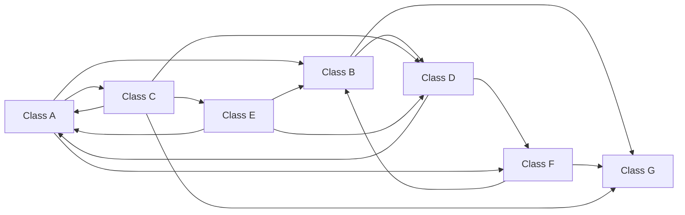
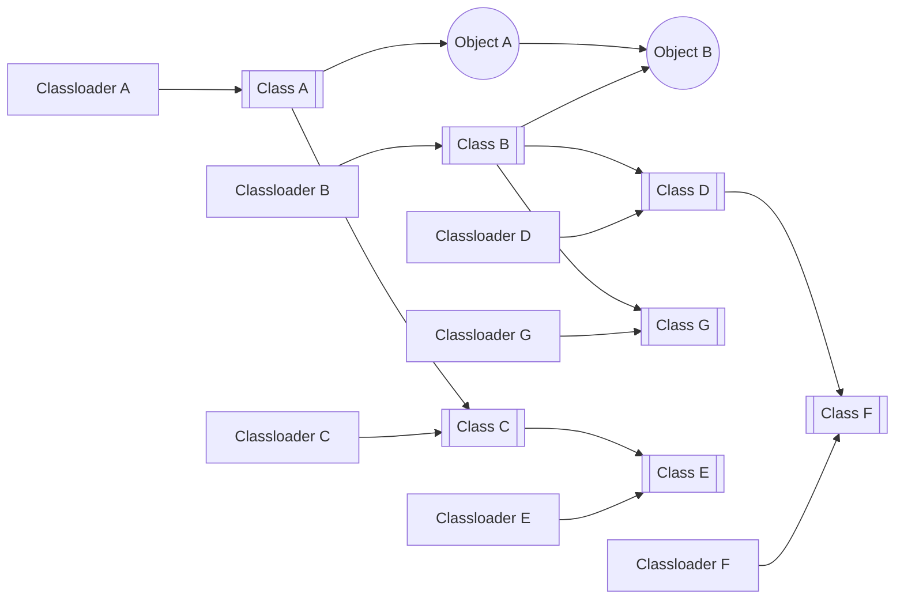
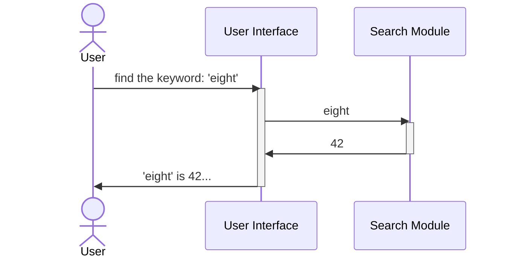
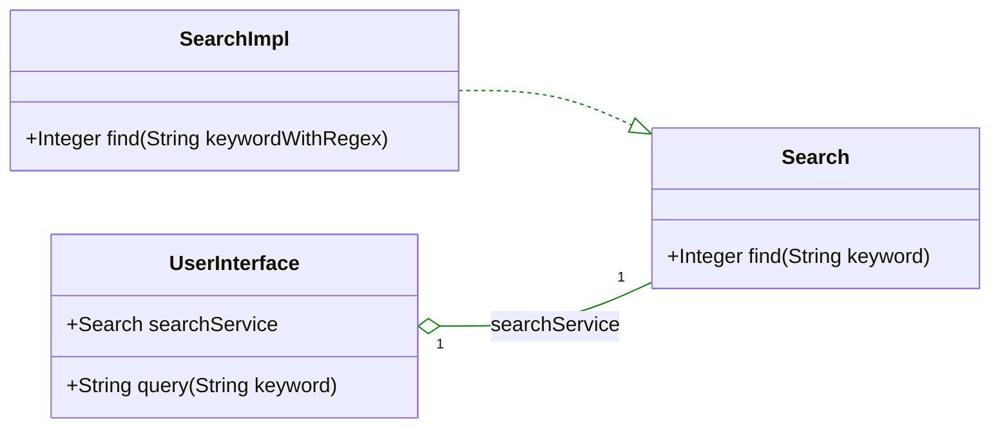
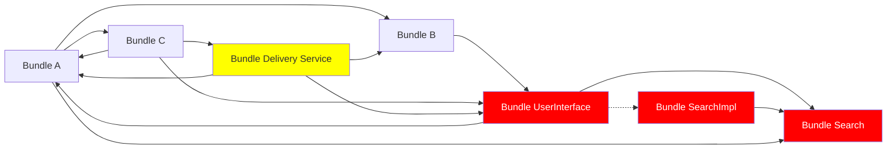
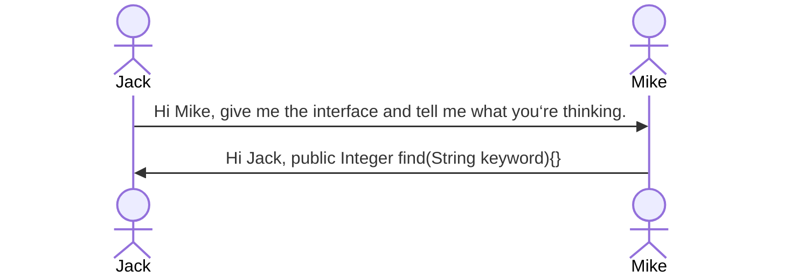

In this chapter, we will gradually explore the philosophy of Eight through some simple examples, experiencing its uniqueness, understanding its concepts and worldview, and also getting a preliminary understanding of its basic design and development model.

### Why Dynamic Systems Are Difficult to Implement
One of Eight's characteristics is its complete dynamism, allowing the system change at will. This gives rise to new system forms. However, this is just one of the external manifestations of its unique philosophy.

Here's an interesting question: If such a system is so effective, why hasn't it been implemented before? What has hindered us from building such a dynamic system?

Speaking of dynamic module loading, we think of an old technology that was popular 20 years ago. Yes, OSGi, which is one of the core technological base that enable Eight's dynamism. This technology is still used in some fields, such as IDEs (like Eclipse) and application servers (WebSphere, Geronimo, GlassFish, etc.), but it is far less prominent now and cannot compare with the new technologies prevalent in today's service-oriented and containerised trends. Modern technologies like GoLang and Rust are designed for rapid development and convenient service deployment, making them more suited to the container eco-system and becoming prominent in application layer development. OSGi has gradually faded from memory.

So, if dynamic modular technologies like OSGi could achieve the effects described in the previous chapter, why have they fallen into obscurity? Furthermore, OSGi is much older than the currently popular technologies; if it were sufficient to solve the `problem`{:.error}, those subsequent technologies would not have been necessary.

To discuss this matter, let's first outline what the `problem`{:.error} refers to: it refers to the driving factors behind the system's move towards service orientation and the emergence of containerization, which can be summarised as follows:
- Systems are becoming increasingly large and complex, requiring many people to develop in parallel. The domains and iteration patterns of each module vary, making it unlikely to manage them with traditional organizational methods, necessitating segmentation and division;
- Rapid business changes require the system to respond quickly. An integrated system cannot be updated for local changes, necessitating segmentation;
- The system faces large and unpredictable computing scales, requiring easy dynamic scaling. The computation hotspots within the system are not evenly distributed, so segmentation is necessary for on-demand scaling;
- Business and data need to be interconnected. After segmentation into services, it becomes easier for different businesses to share the same services and data.

There are many other reasons, but the main ones are the above. These points continually emphasize segmentation, leading to the system being segmented into a bunch of services. To facilitate the assembly of these services into an overall system, containerization technology emerged. To develop services quickly and efficiently in a container environment, languages like GoLang and Rust were created.

All this is a result of the decades-long trend of internet expansion, leading to the continuous growth of systems and data. This is the `story`{:.info} of the `problem`{:.error} and `solution`{:.success}.

However, if dynamic module loading technology could achieve what was described in the previous chapter, the `problem`{:.error} should not have existed in the first place. If the system could be freely segmented, even into smaller granules; if these granules could quickly propagate to hundreds or thousands of nodes and disappear the next second; if the system could be assembled without container support, saving a lot of network traffic for service calls and simplifying service chain tracking; if the system could follow business changes, segmenting even a few lines of code into modules, developing in an hour, and updating in milliseconds; if a dynamic environment could load and run multiple business modules, making service calls between multiple businesses equivalent to native calls...

If the `problem`{:.error} did not exist from the beginning, the subsequent `story`{:.info} would not have happened.

So, what went wrong? What has prevented the realization of dynamic systems?

### The Real ***Problem***
Let's revisit OSGi or similar technologies (such as Jigsaw). They all pursue modular and dynamic systems. But if you ask a developer why they wouldn't choose these technologies, the answers are often similar:
- The concepts are too complex, with a steep learning curve and some technical details that are difficult to grasp (of course, if the benefits are significant enough, these are not problems.);
- Playing with such complex things only to find that they can't solve any `problem`{:.error} is what makes people resentful. The ideas are beautiful, and the technology seems flawless, but modularization is always a mirage, and dynamism is even more out of reach.

What's going on here? Next, we can hear a bunch of complaints:
- The class loading mechanism is too complicated;
- Objects, classes and classLoaders quickly become 'a tangled mess';
- Modularization is useless. Once a module interface changes, all dependent modules must follow adjust, which is no different from being tied together;
- Dynamic loading is unplayable. If the dependent interface changes, the dependent must reload, and then those dependent on the dependent must also reload. Considering the tangled mess above, the scale of reloading is not small. More seriously, if you don't know which other module holds any object in this tangled mess, the entire mess cannot be released;
- Finally, you have to restart the whole system!

This is the tangled mess. The dynamic module technology pursued by OSGi is built on custom Classloaders. The Classloaders defined by OSGi no longer follow the parent-first loading order but treat each module (called a bundle in OSGi) as a unit, with all bundle Classloaders being peers. OSGi constructs this worldview to change the class-to-class relationship from a tree structure to a parallel network, facilitating dynamic loading, updating, and unloading of bundles. So, it's actually like this:

If bundles could depend on and cooperate with each other like human being while maintaining distance and surviving without each other, this model would be perfect. Unfortunately, this is not achievable. Bundles must establish some association, which in Java has two implications:
- Class level. For one bundle to use another, it must reference its classes or interfaces. When a Classloader loads a class, it must resolve the classes it references. Similarly, if the referenced class changes and needs to be reloaded, all classes referencing it must be reloaded. Traditional tree-like class dependency structures affect an entire subtree when one class changes. Cross-holding or circular dependencies are basically unsolvable. Although OSGi changes class loading to a network structure, a change in one part of the network inevitably affects the surrounding area, and this ripple effect quickly spreads, becoming another form of single point of failure;
- Object level. Even if one bundle doesn't reference another bundle's classes or interfaces, if an object from one bundle holds a reference to an object from another bundle at runtime, since any object holds a reference to its class, and the class holds a reference to the Classloader, objects with active references in Java are not collected and released. Classes are released and reloaded when their Classloader is released and reloads. Since the Classloader is referenced by all classes it loads, and each class is referenced by all its instances (consider what `getClass().getClassloader()`{:.warning} means), as long as any object generated by this Classloader is held by other active objects, dynamic loading and unloading of classes and objects become impossible mission.

So, if Object A references Object B, the actual situation might look like this, and we can see how serious it is.

For the smallest adjustment, you will most likely need to recompile and restart the entire system, which is no different from not using modular technology. It adds development difficulty without much benefit.

Should we blame the OSGi framework? Did it organize such a complex dependency network? Or should we blame Java, as its object-oriented system and class loading mechanism caused the problem? Blaming is easy but unfair. After all these years, no one has proposed a better framework or designed a better language that can do better in this regard. Perhaps, to some extent, everyone tacitly agrees that so-called dynamic systems are just illusions and should abandon this fantasy. Micro-operations are unlikely to succeed; the world changes too fast for meticulous work, and it is better to rebuild quickly. Ultimately, people had to find another way, shifting from internal application segmentation to external application segmentation, from pursuing modular development and dynamic deployment to agile development and rapid deployment (commonly known as fast and rough) to cope with changes. Thus, the new generation of programming focuses on how to build a service that can run anywhere as quickly as possible and be disposable (very consumerist, isn't it?), no longer emphasising modularization or even object-oriented programming.

But can we go a step further? How did all this happen? Why did it end up like this? Is it really a problem with the Java language? Or is there a fundamental issue with the object-oriented programming paradigm itself?

### How the Tangled Mess Was Formed
Let's start the next exploration with a simple example.

Imagine we are developing a search service: the user inputs a keyword, and the service searches through all files stored in a directory, counts the occurrences of the keyword, and outputs the result to the user.

Alright, this is too simple. For basic division, we split this function into two parts: one part handles user interaction for input and output, and the other part handles searching the file directory. The former part invokes the latter part's function through an interface.

So far, everything is OK. The Search Module only needs to define one method, for example:

~~~ java
public class Search
	public Integer find(String keyword){
		do something search...
	}
}
~~~

Next, the business changes a bit, and the user needs to input a regular expression for searching. Well, it's actually nothing much; a regular expression is just another String. The method definition doesn't need to change, just the implementation:

~~~ java
	public Integer find(String keywordWithRegex){
		do something regex...
	}
~~~

For statically compiled systems, this is enough. But for a dynamic system, since the User Interface module holds a reference to a class Search, the Search module cannot be released and dynamically updated. This isn't too difficult; since `public Integer find(String keyword)`{:.info} doesn't change, we can do interface-oriented programming.

Define an interface:

~~~ java
public interface Search {
	public Integer find(String keyword){}
}
~~~

Then implement it:

~~~ java
public class SearchImpl implements Search {
	public Integer find(String keywordWithRegex){
		do something regex...
	}
}
~~~

The UserInterface no longer needs to deal directly with SearchImpl; it only needs to know the Search interface. Changes in the implementation of the SearchImpl module won't affect it. For a dynamic framework, this means defining three modules: UserInterface referencing the Search module, and SearchImpl implementing the Search module. The changing part is SearchImpl, and no one references it in class dependencies, so it can be dynamically loaded and unloaded.

Wait, there's a problem! The UserInterface still holds an Object of SearchImpl, right? Although for it, it only knows it's a Search, but in reality, it's a SearchImpl. Well, this is a problem. So, our OSGi framework provides service registration and acquisition by interfaces. SearchImpl registers a Search service with the OSGi container, and UserInterface requests `getServiceByInterface(Search.class)`{:.info} from the container to get a dynamically registered SearchImpl.

Remember, after using the find method, the UserInterface must discard this object handle and fetch it again next time (of course, OSGi implementations often manage this centrally through dynamic binding of member variables by the container, but the essence is the same; references are disconnected during updates). This way, SearchImpl can be dynamically loaded.

This is why OSGi requires interface and service-oriented programming. Does it look familiar? Service, service registration and discovery, container, update and release. These concepts originally came from here; today's containerization technology is actually a large-scale OSGi implementation without class and object dependencies, but with higher costs.

It looks a bit cumbersome, but it solves the problem. We can load the regex functiona into the processing flow at any time, right? It seems perfect? Everyone knows what I'm going to say next, right? Yes, what if the Search interface changes? For example, business adjustments require the Search service to not only provide search for UserInterface but also for other services, with files stored in different directories. So, the Search service needs an additional parameter to specify which directory to search in. Like this:

~~~ java
public interface Search {
	public Integer find(String keyword, String dir){}
}
~~~

Then SearchImpl needs to be adjusted accordingly. The implementation is not difficult, but how to go online? The Search interface parameters have changed, so UserInterface, Search, and SearchImpl all need to be released and reloaded. It's equivalent to restarting this system. Fortunately, this update only affects these three modules, so the impact is not too significant. But what if the system looks like this?

As mentioned earlier, reloading a class means reloading a Classloader, which means reloading all classes in the entire bundle loaded by this Classloader, which means reloading all modules that directly or indirectly inherit or reference these classes, which means reloading all classes of all modules that directly or indirectly inherit or reference these reloaded modules, which means... the whole process is like experiencing a tsunami. Now, the trouble is big. I just wanted to change the search directory, but I found that even the delivering food to my mom had to stop working.

{:.rounded width="720px" style="display:block; margin-left:auto; margin-right:auto"}

At this point, what's the point?

### The Nature of Dependency
So, unless we define a Classloader for each class, nothing can effectively control the spread of changes, right? On second thought, defining a Classloader for each class doesn't help much, just a little better. So, systems using the OSGi framework still need to restart when encountering updates.

It seems there's no way out. But, give me one more minute! Let me ask a few more whys.

>Why does modifying Search need to affect UserInterface?
>>Isn't that obvious? UserInterface needs to use Search's service. We defined this interface, and then UserInterface and SearchImpl both extended it. Now the business changes, and it's over.

>So why does UserInterface need to use Search's service, and it must define an interface for it? If it didn't tell it anything, wouldn't this problem not exist?

At this point, everyone might regret wasting this minute.

>>If it doesn't know anything, how will it know how to call it?

Alright, wait a bit more, we're almost at the key point. This process is actually like this:

At this point, it's clear that this dependency was destined from the beginning, even before there was any code.

Technical frameworks and programming languages are just scapegoats. `Languages are merely expressions of people's subjective thoughts about the objective world; they do not make people's understanding of the world simpler or more complex.`{:.info} So, the fact is clear: this dependency is not rooted in classes, Classloaders, bundles, Java, or object-oriented programming but `rooted in our thinking and cognition`{:.error}. Our thoughts depend on others, and so does our code; changes in others' thoughts affect us, and so does our code; our thoughts change and continue to affect more people, and so does our code. The blame is on us.

This time, we've reached the epistemological level, but problem still seems unsolvable. So, what can we do? People depend on each other, and it's an objective fact that UserInterface depends on the Search service.

Alright, this minute is almost up: Do we have to depend on each other to survive?
