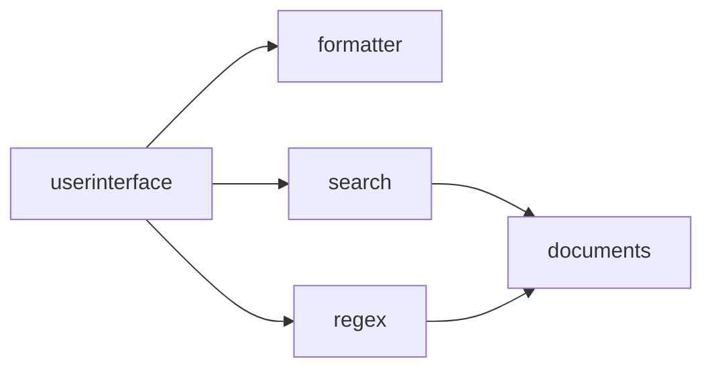

### SEARCH Application

Do you remember the small example about querying keywords from earlier? Let's load the SEARCH application and take a look.

After deploying the SEARCH application, let's open [http://localhost:7241/user/index.html](http://localhost:7241/user/index.html) locally. Note that the default port is 7241.

Regarding the ports for the HTTP(S) service, the following startup parameters can be set:

| Parameter | Meaning | Example | Additional Notes | 
| -- | -- | -- | -- |
| org.apache.felix.https.enable | Enable HTTPS protocol | org.apache.felix.https.enable=true | Disabled by default; when enabled, the default port is 7240. |
| org.apache.felix.http.enable | Enable HTTP protocol | org.apache.felix.http.enable=false | Enabled by default; can be disabled. |
| org.osgi.service.http.port.secure | HTTPS service port | org.osgi.service.http.port.secure=9999 | Default is 7240; can be set manually. |
| org.osgi.service.http.port | HTTP service port | org.osgi.service.http.port=8888 | Default is 7241; can be set manually. |

Subsequently, we can see the UI of this small SEARCH application.

The component structure of the SEARCH system is as follows:

The calling orders between components is:

- The userinterface component is the UI interface, which is the operation interface we see in the figure above.
- The userinterface selects to use search or regex for string retrieval based on the configuration, with different matching modes for the two algorithms.
- The search and regex components both connect to the documents component, which is responsible for providing the text needed by the former.
- The search and regex components return the retrieval results to userinterface.
- userinterface uses formatter to convert the result format and provide it to the user.

Let's look at the SEARCH system in the application management, where we can see the one-to-one correspondence of components.

We can also look at the configurations, where some are instances (runtime of components) and some are connections (linkers between instances). Components correspond to the component mentioned in the previous chapter, instances correspond to the instance, and connections correspond to the linkers.

As seen, besides instances and connections, we can also configure the system environment, such as opening two HTTP ports.

By clicking on the configuration `parameter`{:.info} of documents, we can see that the default `test.documents.base`{:.info} parameter is set to `scores`{:.info}. This is actually a configuration item exposed by the `documents` component, specifying a file directory. When configured as `scores`, it designates the `scores` directory under the `runtime directory`{:.info}. We place text files in this directory, and these files will be searched and counted. You can change the directory name and create the directory under the runtime directory.

Note that due to update frequency limitations, these changes will take effect within 5 minutes. At that time, you will see the output of component shutdown and restart in the console.

### Changing Output Format

After creating the directory and placing the files, we can try a keyword, for example:

The result of 1 is output in XML format. As mentioned earlier, the formatter component is responsible for formatting in this application. Let's modify the configuration of the instance corresponding to this component:

This instance has a configuration item `framework.formatter.mode`{:.info} which is false by default. Let's change it to true and see the effect.

The same result is now output in JSON format.

### Changing Algorithm Module

Besides changing instance configuration parameters to alter system behavior, we can also change connections at runtime, such as pointing it from `search` to `regex`.

At this point, the user interface changes, and the query results are different. This is due to the change in the system structure, with the system now using the `regex` algorithm module for queries.

### Changing Service Port

We can access https://localhost:9696/user/index.html and https://localhost:9898/user/index.html to use this application because we have enabled two HTTPS ports. The demo system does not provide operations to change port configurations, but we can enable and disable http-9696 and http-9898 to operate it.

When we disable one of these instances, we will find that the corresponding port is no longer accessible.

### Instance Scripts

Finally, the demo system also opens up some scripts. Scripts can be attached to instances and connections. Currently, instances have 10 script trigger points corresponding to various states and events of the instance, while connections also have 10 trigger points. Each trigger point can bind an event handling module, which can be a compiled class or jar package, or a script (currently supports Groovy).

The demo system provides only one instance and one connection script, corresponding to the `interface call`{:.warning} event. The demo system currently does not support uploading class and jar files but allows direct writing of Groovy scripts.

We can write a script for any instance, such as:

~~~ java
package eight.service;
import net.yeeyaa.eight.ITriProcessor;
import net.yeeyaa.eight.IProcessor;

class Proxy implements ITriProcessor {
    IProcessor context
	
	def operate(Object first, Object second, Object third) { 
		println "instance[" + context.process("hookid") + "] input: " + first + " " + second + " " + third;
		def ret = ((ITriProcessor)context.process("next")).operate(first, second, third)
		println "instance[" + context.process("hookid") + "] output: " + ret
		ret
	}
}
~~~

This script is very simple; it prints the input parameters and output results before and after the service call, similar to the functionality of AOP (Aspect-Oriented Programming). Therefore, when needed, we can configure this script for the corresponding modules to view the input and output of certain components.

In the figure below, we have configured scripts for documents and formatter in the application management configuration to view the input and output of these two parts during each call. Of course, other instances can also be configured.

After configuration, no changes are visible, but once a request occurs, we can see the input and output printed in the console or log (if the output is redirected to a log file).

From the output, we can see not only the parameters accepted and the output provided by `documents` and `formatter` respectively but also intuitively understand the call sequence of various parts of the system.

In principle, this script can do anything during the proxy interface access, even replacing the original module functionality. However, generally speaking, this point of action is used for logging, tracking, debugging, and triggering associated operations, and also for providing `stub modules`{:.info} during system development.

### Connection Scripts

Scripts for connections (linkers) have extraordinary significance. For a linker, the interfaces it proxies are not fixed, depending on the usage of instances at both ends of the linker. It appears more flexible and harder to grasp. But this is precisely the most important role of the linker.

Remember the changes in the connections between substances mentioned in the previous chapter? If a substance is to maintain its own stable `core`{:.info}, the connection needs to be established at runtime. However, the connections between different substances are variable, and the connection should `smooth out`{:.error} the incompatibilities between substances for them to work together.

Recall the previous example about `search`. If the components change and an additional parameter `dir`{:.info} is required to specify the directory to be queried, what should be done? From the previous analysis, we concluded that this `dir` parameter cannot be passed from the `userinterface` nor provided by `search`. This parameter exists within their connection.

Here, we finally have a suitable place to accommodate this change.

Suppose our `search` component is developed by another team, and they designed the query directory parameter not as a configuration parameter as we introduced above but required the upstream component to provide it. Then, we can attach the following script in the linker:

~~~ java
package eight.service;
import net.yeeyaa.eight.IBiProcessor;
import net.yeeyaa.eight.IProcessor;

class Proxy implements IProcessor {
    IProcessor context
	
	def process(Object keyword) { 
		def dir = "searchPath"
		def ret = ((IBiProcessor)context.process("next")).perfrom(keyword, dir)
		ret
	}
}
~~~

A very intuitive transformation connects two incompatible yet interrelated components. These two `substances`{:.info} are incompatible simply because the latter requires the query directory parameter by default during design, so it uses a binary process interface. The linker proxies as a unary process, only inputting the keyword. During the runtime connection, our real-time script provides the `dir` parameter value `searchPath`{:.info} to call downwards.

`This small example is of extraordinary significance. It means we can integrate countless independently developed, mutually unaware components into a unified system, and it also means that a large-scale distributed development component repository becomes possible.`{:.error}

In the next section, let's look at a relatively complex system.