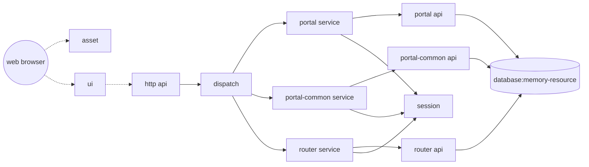

### Switching Applications

The process of switching applications on the Eight platform is quite straightforward. You can modify the application in the Node Management (or Application Management) section. For instance, let’s switch the application to demo:

After a short wait, you will notice that the original `SEARCH` user interface is no longer accessible. At this point, the original `SEARCH` related modules have been uninstalled, and the `DEMO` system modules have been loaded. The current system has now become a completely new application.

The `DEMO` system UI is available at [http://localhost:7241/ui/index](http://localhost:7241/ui/index), and its design is consistent with the online system:

I would like to extend my gratitude to my family for their unwavering support of Eight. The banner area features a logo designed by my seven-year-old daughter for Eight, with the original artwork here (authorised:blush:):

Click `Enter System`{:.success} to access the `DEMO` system. This is a backend management platform, essentially part of the online demonstration platform. Detailed functionality will not be elaborated here (as it is not the focus):

You can use this application for CRUD operations (Create, Read, Update, Delete). If you find it cumbersome, you can download this [configuration file](/eight/assets/images/router.config) and import it in the Service Management section.

Then, try performing various operations. Similarly, the DEMO system is composed of various components, and its general structure is as follows:

The general structure of the system is:
- The user's browser accesses the frontend, which is the operation interface we see in the figure above.
- The frontend consists of two components, where the asset component is a shared resource containing many commonly used static resources (such as js, css, images, etc.) with no association with other components.
- The ui component is the UI interface of the system, containing the controller and view, as well as the static resources used by this module.
- The ui component does not directly connect to other components but accesses the http api component through http(s) calls. The http component opens an http port to provide api interfaces for frontend-backend separation.
- The http api component's downstream is the dispatch component, which routes requests to different service modules.
- The service component is a general service module that generates three instances: portal service, common service, and router service, corresponding to the portal, common, and router business components.
- The router business component implements the routing management center business, including service management, routing management, server management, and script management functions, while the portal and common components manage users, menus, and function permissions.
- Each service component needs to connect to the session component to store session information.
- The portal, common, and router components need to connect to memory-resource, which contains some memory storage structures and even an in-memory database to provide a complete MVC system.
- To optimize the user experience, this system does not require the user to configure a database but provides an in-memory database without enabling database persistence. Therefore, `data will be lost when the JVM is shut down and restarted`{:.error}. Users can use the `export`{:.success} menu in service management for backup.

You can also view the components and configurations of the `DEMO` system.

Below are the configurations, including instances and linkers. In this case, the service component can help us better understand the relationship between components and instances: the service component, in this system, creates three instances: portal service, portal-common service, and router service, each with different parameters. These three instances are the actual operating units.

A suitable analogy: components correspond to classes, while instances correspond to objects. An object is a running class instantiated with parameters, whereas a class is the static structure of an object.

In the next section, we will control this system through various configuration operations.