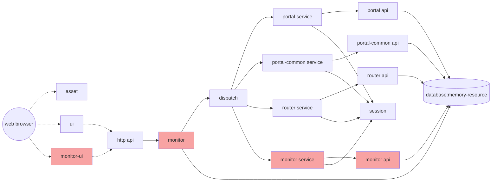

### Attaching Scripts to Dispatch

The `DEMO` system comprises significantly more components than `SEARCH`, and correspondingly, it has more configurable modules. As indicated in the previous system architecture diagram, `dispatch` serves as the routing distribution component, through which all API request inputs and outputs pass. By attaching the example script from the previous section to this component, we can monitor the query requests and invocation results of various services.

After binding the script to demo-dispatch, we can easily observe the various invocation processes and the input and output data throughout the system.

### Disabling SQL Output

Several database access components will print SQL statements for each database access, which is convenient for debugging but can also be verbose. When such output is no longer needed, it should be disabled. These operations are also completed through instance configuration options.

For the portal, portal-common, and router-api modules, setting the configuration parameter `framework.router.api.sessionFactory.hibernate.showsql`{:.info} to `false`{:.error} will disable SQL output, while setting it to `true`{:.success} will enable SQL output for debugging purposes.

Additionally, parameters such as `framework.router.api.dataSource.driver`{:.info}, `framework.router.api.server`{:.info}, and `framework.router.api.dataSource.url`{:.info} are clearly Hibernate database configuration parameters. Modifying these parameters allows connection to different databases.

Many parameters do not have default settings (e.g., database username and password, connection pool size, connection timeout, second-level cache, etc.), and these configuration options are exposed by each component as needed for flexible runtime configuration.

Configuration parameter conventions:
- Eight conventionally prefixes parameters with `framework` to distinguish them from other system parameters.
- The secondary namespace is the unique name of the current component (abbreviated if necessary), such as router-api using router.api as the secondary prefix.
- The subsequent name is the namespace within the component, which can be defined by the component itself. The recommended naming convention is: bean name -> parameter name within the bean.
- This naming convention ensures the uniqueness and recognizability of all parameters. However, Eight does not require parameter names to be unique across different components; in fact, identical parameter names do not affect the configuration and updating of Eight components.
- The benefit of unique parameter names is that all these parameters can be set at runtime through startup parameters (as previously discussed), and startup parameters have a higher priority than those set in the component configuration. However, startup parameters need to distinguish between different parameters, so it is still recommended to use a standard namespace.

By setting the parameters of each instance to `false` and performing operations, we can see that there is no longer any SQL output.

### Other Configurations

Through the configuration management page, we can see that many items can be configured within each instance, such as the port for the backend API interface in the `demo-http` instance. Note: If the port number is modified, the URL of `demo-ui` (corresponding service path) also needs to be modified accordingly.

In fact, `demo-http` is a general lightweight HTTP service with at least the following common parameters:

| Parameter | Meaning | Example | Additional Information | 
| -- | -- | -- | -- |
| framework.http.init.context | URI occupied by the service | /api | Default is /api |
| framework.http.wss.url | URI providing web service interface |  | Default is /wsapi |
| framework.http.byte2str.charset | Input and output character set | utf-8 |  |
| framework.http.httpServer.secure | Whether to enable HTTPS | true | Default is false |

For the frontend component `demo-ui`, its parameters are visible:

Among them, `framework.ui.server.url` points to `demo-http`. If `demo-http` modifies the port number or uses the HTTPS protocol, this should be modified accordingly.

The `framework.ui.alias` is the URI of the user interface. For example, if it is modified to `/test`, the original `/ui` will no longer be able to access the application, and it will need to be accessed using [http://localhost:7241/test/index](http://localhost:7241/test/index).

Other parameters are not recommended for user modification.

The `demo-session` can configure the session timeout for backend services (not frontend timeout, which uses JWT with a default of 1 hour, configured using `framework.ui.expire`):

The default is 300 seconds (5 minutes), which can be modified to other durations.

### Adding Functional Modules

New modules can typically be added to the application by adding new components, instances, and connections. To prevent unforeseen issues from damaging customer systems, the demonstration system does not allow users to upload and add or remove components themselves, but components or instances can be enabled/disabled to simulate addition and removal.

In `DEMO`, several components have been configured but disabled. We can activate them in the component management.

After activation, the application menu changes, and new functional modules are loaded into the existing platform. At this point, the system structure has changed as follows:

The red parts in the diagram represent the newly added `monitor` group of instances (monitor, monitor-ui, monitor-service, monitor-api) loaded into the system. This group of instances brings new functionality to the system: `the monitoring module`{:.info}.

- The core component is `monitor`, which selects the most appropriate entry point in the system: embedded between HTTP and dispatch, through which all system calls pass. It also connects to the database. Its function is to record and cache the status of method calls and write them to the database in batches.
- `Monitor-ui` is the monitoring management frontend, which is the new functional module that appears in the UI.
- `Monitor-service` and `monitor-api` are similar to `router`, providing backend APIs for CRUD operations of the `monitor` module.

After the system upgrade, we can perform some operations, and the number of calls, occurrence times, and durations will be recorded. We can then view the situation through the monitor UI:

When this module is no longer needed, we can disable it through component management or by disabling the corresponding `demo-monitor.ui`, `demo-service.monitor`, and `demo-monitor` in the configuration management. Note that if only the UI is to be uninstalled while continuing to maintain monitoring, the core component `monitor` does not need to be uninstalled.

### Others
- Another system example is essentially a combination of `SEARCH` and `DEMO`. After deployment, both `SEARCH` and `DEMO` functionalities run simultaneously on the same node. In principle, nodes and business systems are different levels of concepts; one node can run multiple businesses, and one business can be distributed across multiple nodes.
- Once the system is loaded, it becomes a purely local application, with all business conducted locally. Even if the network is disconnected, the JVM is shut down, or the computer hardware is restarted, the system remains in the state it was in the last time it was connected to the network until it reconnects to the server for updates.
- The online platform only showcases a limited number of restricted control functions to highlight the basic features of the Eight platform. The Eight platform itself has more extensive and flexible capabilities.
- The architecture of Eight encourages extensive reuse of code and modules, making the application relatively small compared to similar systems. For example, `DEMO`, as a complete backend management system, has an overall size of around 1.1M, with business-related components only about 400K, including frontend pages, controllers, business logic, database access layers, etc. This is beneficial for deployment and management in weak network environments.

