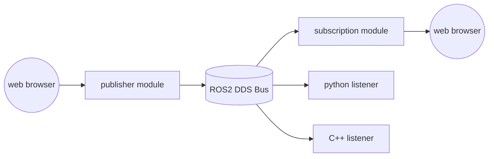
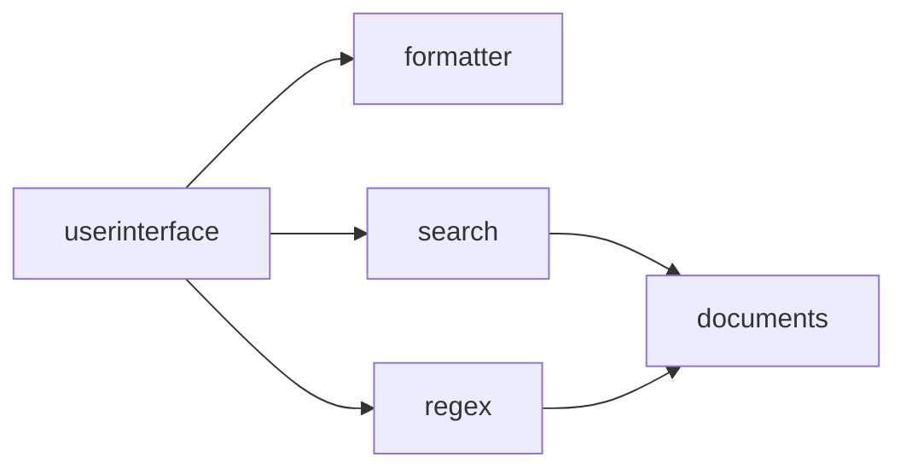
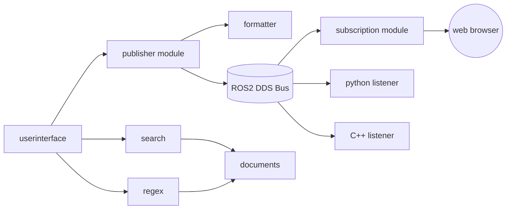
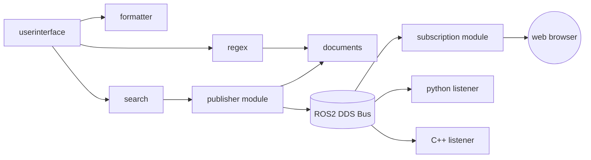

This chapter will provide a brief introduction to the application of Eight on the ROS2 (Robot Operating System) platform and offer several examples.

### A Brief Overview of ROS2
ROS2 is arguably one of the most popular operating systems for embedded intelligent devices today, essentially an open-source software framework and toolset. It is widely used in fields such as robotics, drones, and smart cars, providing information perception and data processing capabilities for numerous edge devices.

Since its release in 2007, ROS has provided the robotics community with a comprehensive set of middleware, tools, software, and communication interfaces and standards. With ROS, developers in the robotics industry can quickly develop system prototypes and conduct testing and validation. ROS2, the second generation of the Robot Operating System, is an upgraded version of ROS1, first released in the Arden version in 2017, addressing some of the issues present in ROS1.

Compared to ROS, ROS2 is more efficient, stable, and feature-rich, capable of meeting the needs of commercial scenarios. The core features of ROS2 are as follows:

- **Support for Multiple Operating Systems**: ROS2 is cross-platform, supporting Linux (Ubuntu / Debian / Fedora / ...), Windows, Mac OS, RTOS, etc.
- **Support for Multiple Programming Languages**: ROS2 natively supports development environments in C++ and Python. Through community and external projects, it also supports Java, Rust, C#, and more.
- **Distributed Communication Architecture**: DDS standard. Initially designed as a single-machine robot operating system, ROS1 used a Master-Slave architecture, where all sub-nodes (Slaves) communicated directly with the master node (Master). If the master node encountered an issue, all functionalities would fail. ROS2 significantly improved the communication architecture of ROS1 by adopting the DDS (Data Distribution Service) standard for distributed many-to-many data exchange. DDS was initially used by the US Navy to address compatibility issues in complex network environments on ships and has become a mandatory standard for the US Department of Defense. It is widely used in defense, civil aviation, industrial control, and other fields as a standard solution for data publishing/subscription in distributed real-time systems. The default in the ROS2 Humble release is Fast DDS, a C++ implementation of the DDS standard, providing efficient and reliable data distribution for real-time systems. Fast DDS uses the Real-Time Publish-Subscribe (RTPS) protocol at its core.
- **Real-Time Kernel**: ROS2 supports the Linux real-time kernel and can also run on native real-time systems like QNX and VxWorks, enhancing the timeliness of robot control.
- **Data Security**: Data security is crucial during the operation of intelligent devices. ROS2 uses the DDS-Security standard, an extension of the DDS standard for data security. In ROS2, three data security service plugin interfaces (SPI) are added: Authentication, Access Control, and Cryptographic, providing comprehensive protection for device data.

The core issue that middleware for intelligent devices needs to address is communication, i.e., the transmission and interaction of signals and data obtained by various subsystems of the overall device. Whether it's a robot or a car, the system contains numerous sensors and subsystems (called domains in cars). The transmission of information obtained by these systems and the issuance of commands are the core tasks of their operation. Middleware like ROS acts as the nervous system of the human body, streaming signals from various domains through communication channels for immediate, effective, and economical transmission, aggregating them to the core system for comprehensive processing, and then issuing the resulting instructions and feedback to various control components.

Compared to ROS, ROS2 has undergone significant changes in its fundamental architecture. The information layer uses a decentralized DDS bus, ensuring that devices can be added or removed from the bus network for message transmission without affecting other online nodes. Nodes can discover each other through DDS nodes, and all nodes are equal, capable of one-to-one, one-to-many, and many-to-many communication. Using DDS for communication enhances reliability and stability.

The left side of the above image shows the ROS architecture, while the right side shows the ROS2 architecture. It can be seen that ROS2, compared to ROS, removes the master node at the application layer, adopts the DDS bus at the middleware layer, and is compatible with Windows, macOS, and RTOS systems like QNX at the operating system platform level.

The above image shows the ROS message system architecture, while the below image shows the ROS2 message system. ROS2 uses the Data Distribution Service (DDS), a standard designed for real-time systems, essentially forming a peer-to-peer, masterless message network where each participant can share all topics within the network they join, sending and receiving information.

### Setting Up the ROS2 Environment

The officially recommended ROS2 environment setup is based on the Ubuntu system, with different versions of ROS2 corresponding to different versions of Ubuntu, as shown below.

| ROS2 Version | Release Date | End of Maintenance | Ubuntu Version | 
| -- | -- | -- | -- |
| Ardent Apalone | 2017.12 | 2018.12 | Ubuntu 16.04 (Xenial Xerus) |
| Bouncy Bolson | 2018.7 | 2019.7 | Ubuntu 16.04 (Xenial Xerus), Ubuntu 18.04 (Bionic Beaver) |
| Crystal Clemmys | 2018.12 | 2019.12 | Ubuntu 18.04 (Bionic Beaver) |
| Dashing Diademata | 2019.5 | 2021.5 | Ubuntu 18.04 (Bionic Beaver) |
| Eloquent Elusor | 2018.12 | 2019.12 | Ubuntu 18.04 (Bionic Beaver) |
| Foxy Fitzroy | 2020.6 | 2023.5 | Ubuntu 20.04 (Focal Fossa) |
| Galactic Geochelone | 2021.5 | 2022.11 | Ubuntu 20.04 (Focal Fossa) |
| Humble Hawksbill | 2022.5 | 2027.5 | Ubuntu 22.04 (Jammy Jellyfish) |
| Iron Irwini | 2023.5 | 2024.11 | Ubuntu 22.04 (Jammy Jellyfish) |

The latest version is Iron Irwini, running on Ubuntu 22.04. Commonly used versions are Galactic and Humble, with Humble being a recommended LTS release. Of course, ROS2 can be deployed on Windows, macOS, Fedora, and other systems, and it is not necessary to follow the recommended versions for installation. However, due to differences in dependency libraries, installation may bring additional complexities. Therefore, it is recommended to follow the official requirements for the test environment.

We can choose to install ROS2 on a virtual machine with a specified version of the operating system. The specific installation tutorial is available in the official documentation. The installation process varies slightly for different versions, such as the tutorial for installing Foxy, which can be found at [https://docs.ros.org/en/foxy/Installation.html](https://docs.ros.org/en/foxy/Installation.html).

ROS2 natively supports only C++ and Python 3. To use Eight, `rcljava` must be deployed. rcljava uses JNI to encapsulate ROS functionalities and service interfaces (mainly message interfaces) into Java libraries. Using rcljava, one can interact with other nodes on the ROS2 DDS bus on the Eight platform.

The rcljava project is available at [https://github.com/ros2-java/ros2_java](https://github.com/ros2-java/ros2_java), which also includes installation and configuration instructions on the project landing page. Note that for different ROS2 versions, rcljava has different branches, and the installation method varies accordingly. Refer to the readme of the respective branch.

This article does not focus on how to install and configure the ROS2 environment, so the installation steps will not be detailed here. For the convenience of readers, several versions of VBox virtual machine images are provided for direct download and use.

Available on [Baidu Cloud](https://pan.baidu.com/s/1n36sOWviHADT4HxKs9jFfw), extraction code: bo5c. There are three versions of virtual machines: ros_a_16.04, ros_g_20.04, and ros_h_22.04, corresponding to ROS2's Ardent, Galactic, and Humble versions, respectively. Note that the Ardent version, due to its historical age, cannot interact with the latest version's message nodes and is not recommended for use.

Available on [Alibaba Cloud](https://www.aliyundrive.com/s/ZmEdH8Zj3B4), extraction code: bvq0. There is ros_g_20.04. Alibaba Cloud download is relatively faster, and Galactic is the recommended deployment environment. Readers are recommended to download this image.

The image is a 7z compressed file. After downloading and decompressing, it can be directly installed as a VBox hard disk. The minimum VBox setting is 1c1g, and 2c2g is recommended to run all test projects. `It is recommended to copy more than one hard disk image to deploy multiple virtual machines, and deploy these virtual machines in the same host-only or internal subnet to enable network communication between them. Host-only or bridge networks are recommended because the subsequent operation of Eight nodes requires access to the external network.`{:.success}

The virtual machine username and password are both `ubuntu`{:.error}. After opening the virtual machine, open a console and run the official example:

~~~ shell
ros2 run demo_nodes_py talker
~~~

This starts a talker using the Python environment. Then, open another virtual machine on the same network and run:

~~~ shell
ros2 run demo_nodes_cpp listener
~~~

This is a listener developed based on C++. At this point, you should see sequential message information output on both consoles.

The above image shows the talker, and the below image shows the listener. It can be seen that messages are smoothly exchanged between different host systems in different development language environments, demonstrating the capabilities provided by ROS2.

### Running Eight in the ROS2 Environment

First, let's understand the ROS2 development architecture, as shown in the figure below:

The structure of ROS2 is quite simple:
- The lower layer is rmw (ROS middleware interface), a relatively low-level interface layer that directly interacts with DDS, implemented in C. It provides interfaces based on FastRTPS, RTI Conntext, and other environments, enabling message exchange in different operating system environments.
- The middle layer is rcl (ROS client libraries), an abstraction of the rmw layer, implemented in C/C++, providing standardized abstract service interfaces such as Services, Time, Logging, etc., for the upper layer.
- The upper layer consists of various programming language wrappers for lower-layer service interfaces, allowing the development of message bus programs in various languages. User programs are developed based on these APIs.
- Additionally, there is a ros_to_dds component that provides interfaces for the application layer to directly access the DDS layer.

The above image shows the ROS2 message development model. It can be seen that ROS2 development revolves around messages. Based on the supported data types, the message format is defined, and then the corresponding message format libraries are generated using a generator in various language environments, allowing development in the corresponding language. `ROS2 is generally a message-oriented development system`{:.error}, which is a significant feature of intelligent device development applications.

Deploying Eight on ROS2 is very simple, similar to other deployment modes of Eight, involving running a jar file in a Java environment. The specific hierarchical architecture is shown in the figure below:

{:.rounded width="360px" style="display:block; margin-left:auto; margin-right:auto"}

Next, let's look at the process of developing a module in the Eight (rcljava) environment. The sample code is kept as simple and clear as possible to highlight the key points.

~~~ java
package ros.test;

import javax.annotation.PostConstruct;
import javax.annotation.PreDestroy;

import org.ros2.rcljava.RCLJava;
import org.ros2.rcljava.node.BaseComposableNode;
import org.ros2.rcljava.publisher.Publisher;

public class Pub {
	private volatile Node node;
	private volatile boolean stop = false;

	private class Node extends BaseComposableNode {
		private int count;

		private Publisher<std_msgs.msg.String> publisher;

		public Node() {
			super("minimal_publisher");
			count = 0;
			// Publishers are type safe, make sure to pass the message type
			publisher = node.<std_msgs.msg.String> createPublisher(
					std_msgs.msg.String.class, "chatter");
		}

		public void onTimer() {
			std_msgs.msg.String message = new std_msgs.msg.String();
			message.setData("Hello, ros on eight! " + count);
			count++;
			// System.out.println("Publishing: [" + message.getData() + "]");
			publisher.publish(message);
		}

	}

	@PostConstruct
	public void initialize() {
		new Thread(new Runnable() {
			@Override
			public void run() {
				if (!RCLJava.isInitialized())
					RCLJava.rclJavaInit();
				node = new Node();
				while (RCLJava.ok()) if (stop) {
					if (node != null) {
						node.publisher.dispose();
						node.getNode().dispose();
						node = null;
					}
					break;
				} else try {
						node.onTimer();
						RCLJava.spinSome(node);
						Thread.sleep(500);
					} catch (Exception e) {
					}
			}
		}).start();
	}

	@PreDestroy
	public synchronized void destroy() {
		stop = true;
	}

	public static void main(String[] args) throws InterruptedException {
		new Sub().initialize();
	}
}
~~~

The above is a standard example of an rcljava Node. This class can run independently through the `main` method or be deployed to Eight for execution.

It imports a set of APIs provided by rcljava, where `RCLJava` is a utility class offering various operation interfaces in the ROS2 environment. `BaseComposableNode` is an abstract encapsulation of a node, and `Publisher` is a message-oriented publisher.

The code first initializes parameters and the environment using `RCLJava` in the `initialize` method, then creates and starts a `Node` class inheriting from `BaseComposableNode`, and then starts a thread to send messages to the message bus at regular intervals until the instance is destroyed, setting the stop member variable to 0.

In the Node class constructor, two things are done:
- A node named `minimal_publisher` is defined.
- A publisher is created to send messages to a topic named `chatter`.

In the `onTimer` method, a message is sent to `chatter` each time, and the counter is incremented.

To use this module, start the rcljava environment in the virtual machine. Open a terminal console in the `ros2_java_ws` folder on the desktop and run:

~~~ shell
. install/local_setup.sh
~~~

This script initializes the Java environment variables and imports the rcljava library into the classpath. Then, you can run the above class like a regular Java program, such as:

~~~ shell
. java ros.test.Pub
~~~

When running in the Eight environment, it is essentially the same as the methods introduced in previous chapters. Download the Eight seat, then initialize the classpath similarly:

~~~ shell
. install/local_setup.sh
~~~

Then, as previously introduced, directly input the startup parameters of the seat:

~~~ shell
java -Dframework.boot.scanner.node=nodeName -Dfile.encoding=UTF8 -Dframework.web.user=xxxx -Dframework.web.password=pppp -Dframework.web.url=https://www.yeeyaa.net/api -Djdk.util.zip.disableZip64ExtraFieldValidation=true -cp eight-seat-1.0.0.jar:$CLASSPATH aQute.launcher.pre.EmbeddedLauncher
~~~

In the online Eight management platform, several pre-configured applications are available. Readers can log in to their accounts, import the corresponding systems into application management, and then bind them to running nodes. Among them, `ros-publisher` is a message publisher, and `ros-subscription` is a subscriber. These can be deployed on different virtual machines.

After deploying the application, you can see that when ros-publisher is fully started, ros-subscription periodically outputs messages on the console.

Additionally, since chatter is a topic used in the ROS2 example, you can also start a C++ or Python listener on any virtual machine in the same network:

~~~ shell
ros2 run demo_nodes_cpp listener
ros2 run demo_nodes_py listener
~~~

It can be seen that all listeners hear the messages sent by Eight. Messages are transmitted across different nodes in different development language environments, just like using C++ or Python.

Now, let's discuss the coding of the `subscription`. It is not much different from the `publisher`, requiring only a few lines of code:

~~~ java
package ros.test;

import javax.annotation.PostConstruct;
import javax.annotation.PreDestroy;

import org.ros2.rcljava.RCLJava;
import org.ros2.rcljava.consumers.Consumer;
import org.ros2.rcljava.node.BaseComposableNode;
import org.ros2.rcljava.subscription.Subscription;

public class Pub {
	private volatile Node node;
	private volatile boolean stop = false;

	private class Node extends BaseComposableNode {
		private Subscription<std_msgs.msg.String> subscription;

		public Node() {
		    super("minimal_subscriber");
		    subscription = node.<std_msgs.msg.String>createSubscription(std_msgs.msg.String.class, "chatter",
		        new Consumer<std_msgs.msg.String>() {
					@Override
					public void accept(std_msgs.msg.String msg) {
						System.out.println("I heard: [" + msg.getData() + "]");
					}
				});
		}
	}

	@PostConstruct
	public void initialize() {
		new Thread(new Runnable() {
			@Override
			public void run() {
				if (!RCLJava.isInitialized())
					RCLJava.rclJavaInit();
				node = new Node();
				while (RCLJava.ok()) if (stop) {
					if (node != null) {
						node.subscription.dispose();
						node.getNode().dispose();
						node = null;
					}
					break;
				} else try {
						RCLJava.spinSome(node);
						Thread.sleep(500);
					} catch (Exception e) {
					}
			}
		}).start();
	}

	@PreDestroy
	public synchronized void destroy() {
		stop = true;
	}

	public static void main(String[] args) throws InterruptedException {
		new Pub().initialize();
	}
}
~~~

The `initialize` method is essentially the same, as it continuously receives messages in a loop. The `Node` only needs to initialize the node name in the constructor and then instantiate a `Subscription`. This subscriber accepts messages and outputs them to the console. The `main` method is used when running this class independently, but it is not required when running on the Eight platform. Using Eight to integrate with the ROS2 environment is a clean and convenient process.

Subsequently, we can perform dynamic updates as we would with any other Eight application. The online system provides two sets of publishers and subscriptions, namely `ros-publisher` and `ros-publisher2`, as well as `ros-subscription` and `ros-subscription2`. Their functionalities are essentially the same, with only minor differences in the output content to indicate an update. We can replace `ros-publisher` with `ros-publisher2` and `ros-subscription` with `ros-subscription2` by simply binding the current node to different applications on the online management platform.

As seen, when the `publisher` is upgraded, the content output by the `subscription` changes.

### Integrating ROS2 Components into the Eight System

Next, let's look at a slightly more complex ROS2 application built on Eight: outputting messages on a web page. For message processing, the most direct solution on the web is web-socket. Here, we have also pre-configured two modules for sending and receiving messages, namely `ros-pub-ui` and `ros-sub-ui`, and deployed them on two virtual machines.

Then, open ip1:7241/sub/ros.html and ip2:7241/pub/ros.html respectively.

You will see a login name is required, which is insignificant and only a requirement of the stomp protocol on the web-socket. Enter any name to log in.

Then, input various messages in the publisher's message input box, and you will see the corresponding output in the subscription. The output can also be seen in the C++ and Python listeners.

The overall process is straightforward and will not be elaborated further.

Next, let's see how to dynamically embed a ROS2 module into the Eight component system. Remember the small example of the query keyword? Its system structure is as follows:

If we cut the connection point between the `userinterface` and `formatter` components and embed a ROS2 `publisher` module, we can publish the results of all user queries in this system to a ROS2 topic. As follows:

This example is also pre-configured in the `ros-pub-ui-with-search` application. Bind it to an Eight node and then open the corresponding URL: http://your-node-ip:7241/user/index.html. The familiar interface will appear again.

The functionality is identical to the original SEARCH system, except that each time a query is made, the number of matched keywords will be propagated to various systems, as shown:

Similarly, we can embed the ROS information publishing module between the `search` or `regex` and `documents` channels. This way, the text content found in each query will be published to the ROS2 DDS network topic. As shown:

We did not modify any code of the `search` and `ros publisher`, but merely connected two unrelated systems through configuration and simple deployment. These systems dynamically updated to the node, achieving new functionalities. `Each part of the system can be closely integrated with the ROS message bus.`{:.error} This is the significance of deploying Eight on the ROS platform.