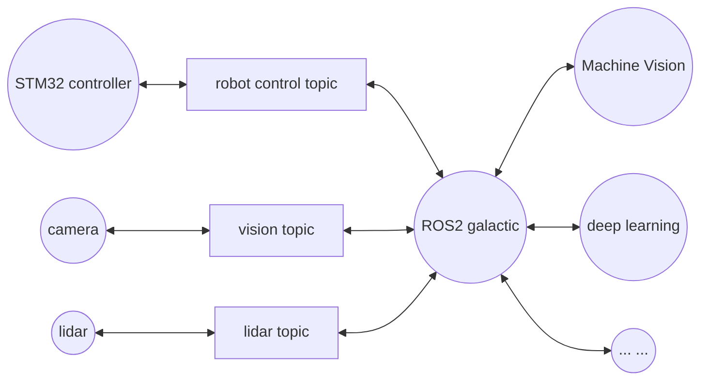
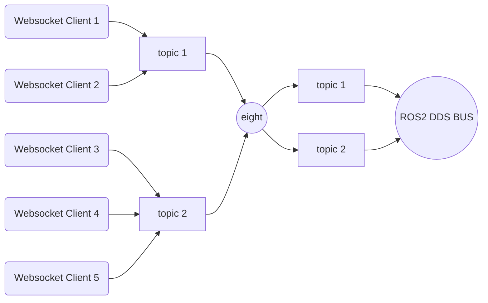
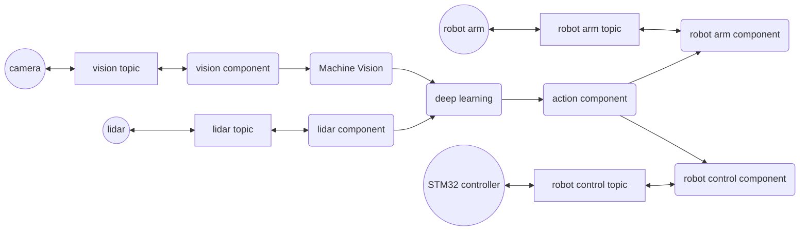

In this chapter, we will deploy the Eight system on a smart car. Let's first take a look at the main character of this deployment.

### Device Introduction and System Deployment

This domestically produced autonomous vehicle utilizes a Mecanum wheel chassis and is equipped with an STM32 controller running the ROS system, specifically the micro-ROS branch of ROS2. The vehicle's core control board is based on a domestic CPU, featuring a quad-core processor and 2GB of RAM, serving as the upper computer. The device offers multiple ROS and ROS2 images, and for this deployment, we have chosen a Galactic-based image running on Ubuntu 20.04.5.

Additionally, this CPU is equipped with a GPU core, enabling it to execute some deep learning algorithms locally, although its performance is limited, especially when compiling ROS2 and rcljava. However, it runs the Eight system very smoothly, as Eight has low resource requirements (it can run smoothly on a Pentium III single-core with Windows 98 and 64MB of RAM). Despite the seemingly low 2GB of memory, it is more than sufficient to run the entire ROS system and the Eight environment. Here is the device in its entirety.

The vehicle is equipped with a radar and a depth camera, enabling functionalities such as visual recognition, line following, and obstacle detection. It also has Wi-Fi for network control.

From the side, apart from the conspicuous 10,000mAh lithium battery, the most noticeable feature is a row of network cards and USB interfaces. There are four USB ports, three of which are already occupied, connected to the STM32 chassis lower computer, radar, and camera, respectively. The remaining port can be used for a robotic arm or other auxiliary equipment, providing adequate expandability. The STM32 communicates with the upper computer via the CH9102 serial port, while the radar uses the CH2102 serial port, and the camera uses UVC. Additionally, the device provides an HDMI output. When connected to a monitor, a standard Ubuntu UI is displayed.

ROS essentially functions as a message-oriented operating system. The overall structure on this device is as follows:

As seen, ROS acts as the central nervous system, connecting various sensory devices and passing the data to different algorithm modules (such as deep learning and machine vision) for processing. The data interaction is provided in the form of messages, propagated through topic subscription and publication.

The image provided by the vehicle already has the Galactic version of ROS2 deployed (some modules need to be recompiled with parameter adjustments based on hardware configuration, which is not detailed here). Next, we only need to install rcljava, following the process outlined at [https://github.com/ros2-java/ros2_java](https://github.com/ros2-java/ros2_java). The process is straightforward and will not be elaborated further.

As in the previous chapter, we create a `ros2_java_ws` folder on the desktop, open a terminal in this folder, and run:

~~~ shell
. install/local_setup.sh
~~~

This loads the Java ROS environment variables. We then run the Eight seat, connect to the online platform, and publish the `ros-pub-ui-with-search` application from the previous section.

Open the vehicle's browser, and Eight is up and running.

### Developing Eight Components in the ROS2 Environment

First, let us observe the topics provided by the ROS2 environment. Using the ROS command:

~~~ shell
ros2 topic list
/parameter_events
/rosout
~~~

Initially, only the `parameter_events` and `rosout` topics are present. Next, we open the chassis communication, revealing:

~~~ shell
/PowerVoltage
/cmd_vel
/diagnostics
/joint_states
/mobile_base/sensors/imu_data
/none
/odom
/odom_combined
/robot_description
/robotpose
/robotvel
/set_pose
/tf
/tf_static
~~~

These topics cover various aspects such as voltage, chassis control, diagnostics, sensors, and odometry. Opening the camera reveals:

~~~ shell
/camera/color/camera_info
/camera/color/image_raw
/camera/color/image_raw/compressed
/camera/color/image_raw/compressedDepth
/camera/depth/camera_info
/camera/depth/color/points
/camera/depth/image_raw
/camera/depth/image_raw/compressed
/camera/depth/image_raw/compressedDepth
/camera/depth/points
/camera/extrinsic/depth_to_color
~~~

Now, we can try writing a program to control it. Continuing from the previous section's example of listening to messages, we create a simple module to listen to these topics:

~~~ java
public class RosSub implements IProcessor<Object, Void>, IBiProcessor<Object, Object, Void> {
	private final ConcurrentHashMap<String, Node> map = new ConcurrentHashMap<String, Node>();
	private volatile boolean stop = false;
	private IProcessor<Object, IBiProcessor<Object, Object, Object>> preProcessor;
	
	public void setPreProcessor(IProcessor<Object, IBiProcessor<Object, Object, Object>> preProcessor) {
		this.preProcessor = preProcessor;
	}

	private class Node extends BaseComposableNode {
		private final Set<IBiProcessor<Object, Object, Object>> set = Collections.newSetFromMap(new ConcurrentHashMap<IBiProcessor<Object, Object, Object>, Boolean>());
		private final Subscription<std_msgs.msg.String> subscription;
		
		public Node(final String topic) {
		    super("eight_" + topic.replace('/', '_') + "_subscriber");
		    subscription = node.<std_msgs.msg.String>createSubscription(std_msgs.msg.String.class, topic,
		        new Consumer<std_msgs.msg.String>() {
					@Override
					public void accept(std_msgs.msg.String msg) {
						System.out.println("eight_" + topic + "_subscriber: [" + msg.getData() + "]");
						Iterator<IBiProcessor<Object, Object, Object>> itr = set.iterator();
						while (itr.hasNext()) {
							IBiProcessor<Object, Object, Object> handler = itr.next();
							if (Boolean.TRUE.equals(handler.perform(null, "open"))) handler.perform("text", "eight_" + topic + "_subscriber receive: [" + msg.getData() + "]");
							else itr.remove();
						}
					}
				});
		}
	}

	@PostConstruct
	public void initialize() {
		if (!RCLJava.isInitialized()) RCLJava.rclJavaInit();
	}

	@PreDestroy
	public synchronized void destroy() {
		stop = true;
		map.clear();
	}

	public static Map<String, LinkedList<String>> splitQuery(URI url) {
		try {
		  final Map<String, LinkedList<String>> query_pairs = new LinkedHashMap<String, LinkedList<String>>();
		  final String[] pairs = url.getQuery().split("&");
		  for (String pair : pairs) {
		    final int idx = pair.indexOf("=");
		    final String key = idx > 0 ? URLDecoder.decode(pair.substring(0, idx), "UTF-8") : pair;
		    if (!query_pairs.containsKey(key)) {
		      query_pairs.put(key, new LinkedList<String>());
		    }
		    final String value = idx > 0 && pair.length() > idx + 1 ? URLDecoder.decode(pair.substring(idx + 1), "UTF-8") : null;
		    query_pairs.get(key).add(value);
		  }
		  return query_pairs;
		} catch (Exception e) {
			throw new PlatformException(PlatformError.ERROR_IO, e);
		}
	}
	
	@Override
	public synchronized Void process(Object object) {
		IBiProcessor<Object, Object, Object> session = preProcessor == null ? (IBiProcessor<Object, Object, Object>) object : preProcessor.process(object);
		Map<String, LinkedList<String>> parameters = splitQuery((URI) session.perform(null, "uri"));
		LinkedList<String> names = parameters.get("username");
		if (names != null && names.size() > 0) {
			String name = names.getFirst();
			Node node = map.get(name);
			if (node == null	) {
				node = new Node(name);
				map.put(name, node);
				final Node n = node;
				new Thread(new Runnable() {
					@Override
					public void run() {
						while (RCLJava.ok()) if (stop || n.set.isEmpty()) {
							n.subscription.dispose();
							n.getNode().dispose();
							break;
						} else try {
							RCLJava.spinSome(n);
						} catch (Exception e) {}
					}
				}).start();
			}
			node.set.add(session);
		}
		return null;
	}

	@Override
	public synchronized Void perform(Object object, Object para) {
		IBiProcessor<Object, Object, Object> session = preProcessor == null ? (IBiProcessor<Object, Object, Object>) object : preProcessor.process(object);
		Map<String, LinkedList<String>> parameters = splitQuery((URI) session.perform(null, "uri"));
		LinkedList<String> names = parameters.get("username");
		if (names != null && names.size() > 0) {
			String name = names.getFirst();
			Node node = map.get(name);
			if (node != null) {
				node.set.remove(session);
				if (node.set.isEmpty()) map.remove(name);
			}
		}
		return null;
	}
}
~~~

The example is not complex. When a WebSocket connection is established (process method), a parameter is passed to indicate which topic to listen to, and the module adds it to the topic's listening group. If the topic was not previously being listened to, a thread is opened to listen. When the topic receives a message, it sends the message to all WebSocket clients listening to that topic (Node's `accept` method). If the WebSocket connection closes, the session is removed from the listening queue, and if the topic's sessions are emptied, the topic's listening is closed. The general structure is as follows:

Bind this module to the vehicle's node on the management platform. Then, we listen to a topic to see the effect. Open `http://vehicle_ip:7241/sub/ros.html`{:.info}. Enter the topic `chatter` and run `ros2 run demo_nodes_py talker`. As before, we can see the output:

Does this mean we can listen to all topic messages? Let us try connecting to the `tf` topic, which is about position transforms. After connecting, there is no output.

It is important to note that `ROS's message queue is uniquely determined by the topic and message format. Different message formats under the same topic are considered different subscriptions and cannot communicate with each other.`{:.error} We can check the topic format using `ros2 topic info`:

~~~ shell
ros2 topic info /chatter
Type: std_msgs/msg/String
Publisher count: 0
Subscription count: 1

ros2 topic info /tf
Type: tf2_msgs/msg/TFMessage
Publisher count: 4
Subscription count: 1
~~~

As seen, the message type of `chatter` is `std_msgs/msg/String`, while `tf` is `tf2_msgs/msg/TFMessage`. Unfortunately, the above module cannot listen to all topics. We need to develop a module for `tf` using `TFMessage`:

~~~ java
	public String formatTFMessage(TFMessage msg) {
		StringBuilder sb = new StringBuilder();
		for (TransformStamped ts : msg.getTransforms()) {
			sb.append(ts.getChildFrameId()).append(": \r\n");
			Quaternion r = ts.getTransform().getRotation();
			Vector3 v = ts.getTransform().getTranslation();
			sb.append("  Rotation : \r\n");
			sb.append("    x : ").append(r.getX()).append("\r\n");
			sb.append("    y : ").append(r.getY()).append("\r\n");
			sb.append("    z : ").append(r.getZ()).append("\r\n");
			sb.append("    w : ").append(r.getW()).append("\r\n");
			sb.append("  Vector : \r\n");
			sb.append("    x : ").append(v.getX()).append("\r\n");
			sb.append("    y : ").append(v.getY()).append("\r\n");
			sb.append("    z : ").append(v.getZ()).append("\r\n");
		}
		return sb.toString();
	}
	
	private class Node extends BaseComposableNode {
		private final Set<IBiProcessor<Object, Object, Object>> set = Collections.newSetFromMap(new ConcurrentHashMap<IBiProcessor<Object, Object, Object>, Boolean>());
		private final Subscription<TFMessage> subscription;
		
		public Node(final String topic) {
		    super("eight_" + topic.replace('/', '_') + "_subscriber");
		    subscription = node.<TFMessage>createSubscription(TFMessage.class, topic,
		        new Consumer<TFMessage>() {
					@Override
					public void accept(TFMessage msg) {
						Iterator<IBiProcessor<Object, Object, Object>> itr = set.iterator();
						while (itr.hasNext()) {
							IBiProcessor<Object, Object, Object> handler = itr.next();
							if (Boolean.TRUE.equals(handler.perform(null, "open"))) handler.perform("text", "eight_" + topic + "_subscriber receive: [" + formatTFMessage(msg) + "]");
							else itr.remove();
						}
					}
				});
		}
	}
~~~

The difference lies in the fact that `TFMessage` is a composite data structure that needs to be formatted before output. After packaging it and binding it to the vehicle, open the link again, enter the `tf` topic, and this time, sensor data is continuously output:

Similarly, we can subscribe to the vehicle camera's image capture. This camera provides two sets of image outputs, color (RGB) and depth, with formats including raw, compressed, and DepthCompressed. The data formats vary. Let us first subscribe to the `sensor_msgs/msg/CompressedImage` compressed color image:

~~~ java
	private class Node extends BaseComposableNode {
		private final Set<IBiProcessor<Object, Object, Object>> set = Collections.newSetFromMap(new ConcurrentHashMap<IBiProcessor<Object, Object, Object>, Boolean>());
		private final Subscription<CompressedImage> subscription;
		
		public Node(final String topic) {
		    super("eight_" + topic.replace('/', '_') + "_subscriber");
		    subscription = node.<CompressedImage>createSubscription(CompressedImage.class, topic,
		        new Consumer<CompressedImage>() {
					@Override
					public void accept(CompressedImage msg) {
						Iterator<IBiProcessor<Object, Object, Object>> itr = set.iterator();
						while (itr.hasNext()) {
							IBiProcessor<Object, Object, Object> handler = itr.next();
							List<Byte> data = msg.getData();
							byte[] image = new byte[data.size()];
							int i = 0;
							for (Byte b : data) {
								image[i] = b;
								i ++;
							}
							if (Boolean.TRUE.equals(handler.perform(null, "open"))) handler.perform("text", Base64Utils.encodeToString(image));
							else itr.remove();
						}
					}
				});
		}
	}
~~~

The Node differs slightly from `tf`, mainly in data structure processing. The compressed format is jpg. We store the data's Byte array and output it using Base64 encoding. The front end receives the message and draws the image using a canvas:

The image captured by the vehicle's camera appears on the page. As the vehicle moves, the image follows the perspective. Since the format of `/camera/depth/image_raw/compressed` is the same as color, we can directly input the topic without changing the module to see the depth image:

Finally, let us try to move the vehicle. The topic is provided by the chassis and is called `cmd_vel`, corresponding to the message format `geometry_msgs/msg/Twist`. It has angular and linear parameters, with angular representing the angle and linear representing the linear speed. Since the publisher and subscriber implementations differ, here is the complete code:

~~~ java
public class RosPub implements IBiProcessor<String, IBiProcessor<Object, Object, Object>, Object> {
	private volatile Node node;
	public enum Cmd {
		FRONT,
		BACK,
		LEFT,
		RIGHT,
		STOP
	}
	
	private class Node extends BaseComposableNode {
		private Publisher<Twist> publisher;

		public Node() {
			super("eight_control_publisher");
			publisher = node.<Twist> createPublisher(Twist.class, "cmd_vel");
		}

		public void send(Cmd msg, Double speed) {
			if (RCLJava.ok()) {
				System.out.println(msg);
				System.out.println(speed);
				Twist message = new Twist();
				Vector3 linear = new Vector3();
				Vector3 angular = new Vector3();
				switch(msg) {
					case FRONT : linear.setX(speed);
					break;
					case BACK : linear.setX(-speed);
					break;
					case LEFT : linear.setY(speed);
					break;
					case RIGHT : linear.setY(-speed);
				}
				message.setAngular(angular);
				message.setLinear(linear);
				publisher.publish(message);
				RCLJava.spinSome(node);
			}
		}
	}

	@PostConstruct
	public void initialize() {
		if (!RCLJava.isInitialized()) RCLJava.rclJavaInit();
		node = new Node();
	}

	@PreDestroy
	public synchronized void destroy() {
		if (node != null) {
			node.publisher.dispose();
			node.getNode().dispose();
			node = null;
		}
	}
	
	@Override
	public Void perform(String msg, IBiProcessor<Object, Object, Object> session) {
		Map<String, LinkedList<String>> parameters = splitQuery((URI) session.perform(null, "uri"));
		LinkedList<String> ss = parameters.get("speed");
		if (ss != null && ss.size() > 0) {
			String speed = ss.getFirst();
			node.send(Cmd.valueOf(msg), Double.parseDouble(speed));
		}
		return null; 
	}
	
	public static Map<String, LinkedList<String>> splitQuery(URI url) {
		try {
		  final Map<String, LinkedList<String>> query_pairs = new LinkedHashMap<String, LinkedList<String>>();
		  final String[] pairs = url.getQuery().split("&");
		  for (String pair : pairs) {
		    final int idx = pair.indexOf("=");
		    final String key = idx > 0 ? URLDecoder.decode(pair.substring(0, idx), "UTF-8") : pair;
		    if (!query_pairs.containsKey(key)) {
		      query_pairs.put(key, new LinkedList<String>());
		    }
		    final String value = idx > 0 && pair.length() > idx + 1 ? URLDecoder.decode(pair.substring(idx + 1), "UTF-8") : null;
		    query_pairs.get(key).add(value);
		  }
		  return query_pairs;
		} catch (Exception e) {
			throw new PlatformException(PlatformError.ERROR_IO, e);
		}
	}
}
~~~

The code remains simple. When establishing a websocket connection, a speed parameter is provided to indicate the speed controlled by this connection. Each websocket message sent includes one of the commands: front, back, left, right, or stop (perform method), to control the car's direction. This command is converted into a corresponding `Twist` message and published to the `cmd_vel` topic, allowing the car to move at the specified speed and direction.

{:.rounded width="360px" style="display:block; margin-left:auto; margin-right:auto"}

Eight is a dynamic system where each component can be replaced at any time. We can replace various modules while the car is running, such as adding angle steering functionality or updating the visual tracking algorithm. Here, we combine the camera component with the control component, allowing us to observe the environment from the car's perspective while commanding the car to move forward. After publishing to the car, refresh the webpage after a few seconds, and it transforms as shown.

This UI is self-explanatory, so let's try controlling the car. Once connected to the websocket, the car's camera transmits its perspective, and as you manipulate the car's movement, the perspective changes accordingly.

{:.rounded width="640px" style="display:block; margin-left:auto; margin-right:auto"}

Great, it looks good and everything works as expected.

### ROS2 Cluster Control on the Same Network

A significant feature of ROS2's DDS bus is its decentralization. Nodes do not need to specify a master; as long as they are on the same connected network (including but not limited to Ethernet, low-speed serial control UART, in-vehicle high-speed bus RapidIO, canbus, etc.), they can join the cluster and share control.

Here, we set the virtual machine network from the previous section to bridge mode, putting it on the same Wi-Fi network as the autonomous car. Then, we check the nodes and topics on the virtual machine:

After starting the various components of the car, we will see numerous nodes and topics appear in the virtual machine. However, although they can see each other at this point, they will not communicate because they are not in the same domain. For more information on ROS2 domains, refer to [https://docs.ros.org/en/foxy/Concepts/About-Domain-ID.html](https://docs.ros.org/en/foxy/Concepts/About-Domain-ID.html).

Joining a domain is very simple; just add the `ROS_DOMAIN_ID` environment variable when starting the ROS2 environment. For example, on both the car and the virtual machine, add the following before the ROS2 environment command in `.bashrc`:

~~~ shell
export ROS_DOMAIN_ID=96
~~~

Then, we test sending and receiving messages:

As you can see, two different devices on the same network start interacting. It is worth noting that although ROS2 has excellent QoS services, data transmission is still limited by network bandwidth and latency. Large message sizes will increase network load. In automotive intelligent driving systems, such as radar and camera data collection, gigabit Ethernet bus bandwidth is often heavily burdened, and high-speed bus protocols like RapidIO should be considered. Conversely, lightweight topics, such as chassis control for autonomous cars, do not require high-speed networks. This car uses a USB virtual serial port UART to communicate with the chassis' `micro-ros`, without the need to integrate an Ethernet card on the STM32 microcontroller. Therefore, choosing the appropriate bus channel for the right device is crucial.

Finally, as usual, let's deploy Eight. We deploy the functional modules previously on the ROS2 car node to the virtual machine node. Then refresh the webpage, and everything works just like controlling the car. You can see the car's camera perspective, control direction and speed, and drive towards the 3D printer. Eight also outputs the control commands in the background:

It looks simple but fun, doesn't it? This demonstrates at least a few points:

- `Eight does not need to be deployed on the autonomous car`{:.error}. Embedded devices often have limited resources. Although Eight has low resource consumption, many devices do not even have a Java environment (such as low-end micro-controllers like ESP32, which have only a few hundred KB of memory). In such cases, a suitable node as the main controller connected to the bus can control these devices.

- `As long as it can connect to the same bus, Eight can control the entire ROS2 cluster simultaneously`{:.error}, which is the foundation for cluster control of autonomous devices.

- Eight inherently possesses message interaction capabilities. By dynamically deploying some message sending and receiving modules (such as connecting to a central server via the websocket protocol), `we can easily connect and communicate ROS2 clusters distributed in different regions, achieving cross-region synchronization`{:.error}.

In summary, the combination of Eight and ROS2 will significantly expand the application scenarios and usage methods of ROS2.

### Advantages of Deploying Eight on Edge Devices

From the above introduction, it seems everything is simple, and you can easily control various parts of the car. Indeed, after deploying ROS and Eight, the entire development process feels intuitive, with several cases written and debugged within a day. The code itself is only a few lines, yet it can accomplish various controls.

In fact, Eight's component-based structure is very suitable for message systems like ROS. The ROS system is driven by various message interactions, which change continuously with the environment. Eight, with its dynamic updating capability, can continuously change its interface components according to the types and formats of messages, integrating them with system modules such as neural network algorithms, machine vision, and pattern learning to form an overall system. This modular component interface is perfect for robotic systems, even from a system structure perspective. The dynamic component publishing platform further enhances machine intelligence.

As shown in the diagram above, any part of the system can be replaced in real-time, allowing us to flexibly adjust the robot's various functions according to environmental changes.

When running in such a system, adopting the Eight solution offers additional advantages:

- `Overcoming the issue of seamless application updates`{:.success}
	- Current mainstream in-vehicle and autonomous devices generally use SOA architecture. During application updates, most still use the traditional OTA mode, with a few adopting more flexible containerized service images. Both methods require interrupting the current process for updates. Even enabling hot standby processes means that ongoing transactions cannot be seamlessly transferred, which is fatal for high-safety, real-time systems like cars and drones. Therefore, current in-vehicle systems can only update while parked. If applications could be updated in real-time while driving, it would greatly expand the application scenarios of these devices.
	- Eight is an in-process dynamic component system, executing component updates within a single process. It can dynamically load, unload, modify, and configure anything from a small local module to an entire application. Eight performs these operations without terminating the current process or losing state, making the entire operation seamless. When an ongoing business is still running old code, new business can already use the new code. The old code module is only released after the previous business is completed, perfectly meeting the needs for seamless dynamic updates.

- `Overcoming high network dependency and bandwidth consumption`{:.success}
	- Current robot devices and smart cars' OTA updates are similar to mobile phones, requiring downloads of hundreds of MB to several GB of firmware. Even with 5G networks, high network quality is required. Considering the complex usage environments of these devices, the network may not always be stable, making the update process difficult. Large upgrade packages also mean long upgrade times. In the future, with real-time updates, continuous updates, and intelligent updates following environmental changes, this outdated update mode will become a bottleneck for new ecosystems like cars.
	- In contrast, Eight's updates are very lightweight. Common single components range from tens to hundreds of KB, and even larger application systems are usually within a few MB. Eight's component-based architecture confines most updates to the local domain, with single updates often within a few hundred KB, which can be loaded in seconds even with a 2G network. Eight not only has a small footprint but also performs updates within threads, without restarting processes or the operating system. Updates typically complete within milliseconds to sub-seconds without interrupting services.
	- Eight runs locally and does not require continuous networking during operation. Due to these advantages, Eight can truly update when connected and run when disconnected.

- `Overcoming high resource consumption`{:.success}
	- As mentioned above, ROS is a system oriented towards various messages, inherently fragmented, requiring various modules to interface with changing information. These modules also change continuously, needing continuous online deployment. Currently, there are few architectures for dynamic deployment on resource-limited embedded devices, with notable ones like `k3s`, a simplified version of `k8s`, still using containerization technology. Even with simplification, resource consumption is still significant, with k3s recommended to run on at least 1GB of memory, not including the underlying operating system services and upper-level applications.
	- k3s still uses Docker processes as the lowest scheduling unit, using inter-process network communication and serialization for data transmission between modules. These cumbersome operations are inefficient on resource-constrained edge devices. Each service requires one or more processes, and running hot standby adds more processes. For any operating system, processes are expensive resources, and frequent process switching adds a heavy burden.
	- Unlike enterprise clouds, in-vehicle computing resources are limited, cannot be dynamically expanded, and some systems require high real-time performance, prohibiting excessive process contention. This means that resource consumption limits the number of services and businesses the system can accommodate and run, constraining future ecosystems like cars and robots.
	- Eight is a single-process container with an aggregated architecture. Unlike Docker's containerization technology, all Eight components run within the same process, greatly saving system resources. System operation and updates do not require any process switching. Multiple services and applications can be loaded and run simultaneously within an Eight process, significantly enhancing system business capacity and enriching future ecosystem space.

Thus, developing and deploying edge device applications based on the Eight platform will become an ideal choice for many enterprises.