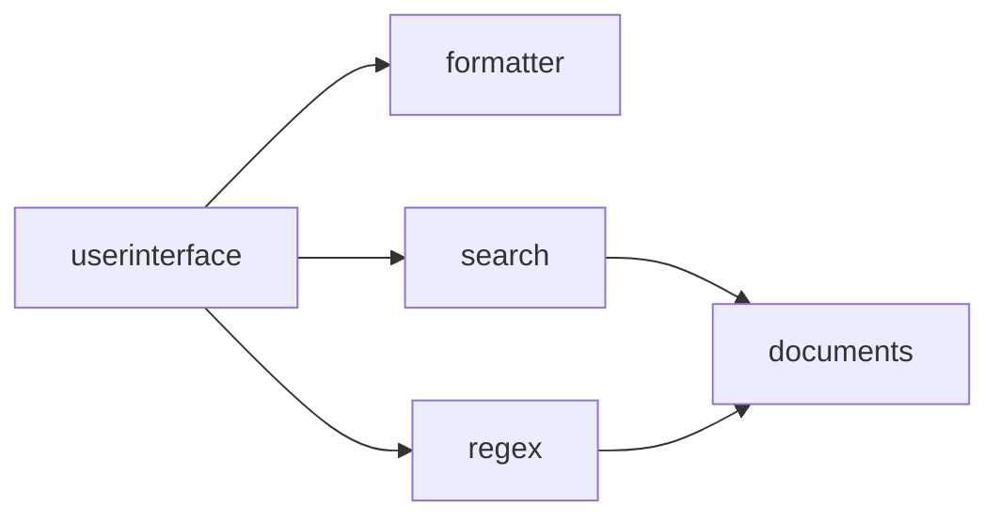
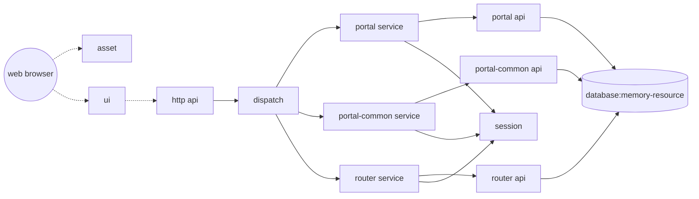
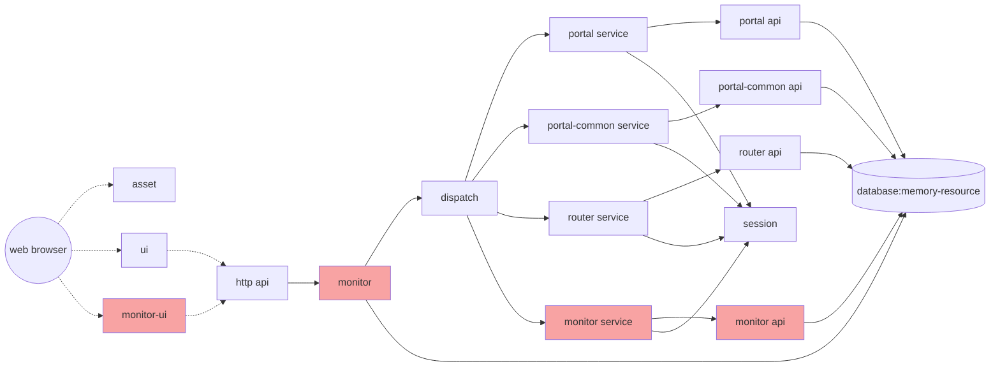
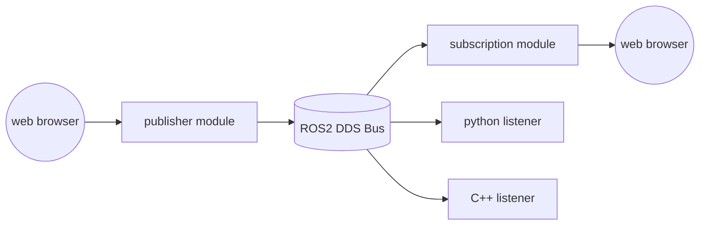
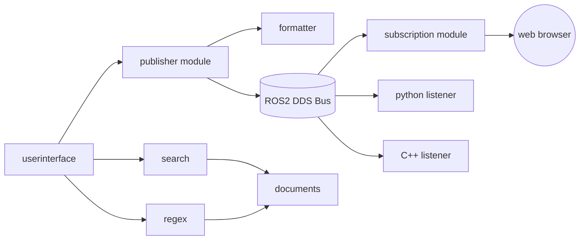
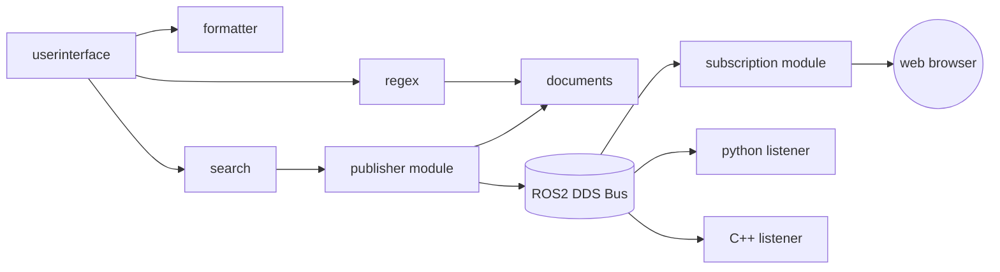
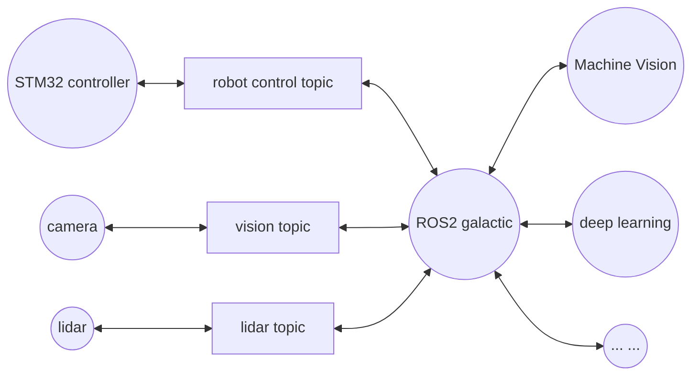

This manual is for the prototype platform and demonstration system for ICSE 2025, adhering to the Attribution 4.0 International license agreement.

EIGHT has an online version available on the internet, allowing for online deployment, updates, and management of EIGHT nodes, making usage and operation more convenient. However, due to the requirements of anonymous review, only local host operations are currently provided. This requires extracting the files from runtime.zip, where eight-seat-1.0.0.jar serves as the seat of the EIGHT platform, including the EIGHT runtime, basic libraries, and some commonly used third-party libraries. The work directory contains some pre-configured systems. The work directory also has two subdirectories, reg and reg-config, whose functions will be introduced later.

EIGHT is compatible with all versions of JAVA above JRE 1.6 and can be started using the commands in run.bat, with slight differences in configuration parameters for different environments. The essential parameters are as follows:

| Parameter | Meaning | Example | Additional Notes | 
| -- | -- | -- | -- |
| file.encoding                 | Default encoding for text in applications | file.encoding=UTF8                    | Required in Windows environment. The default code page in Windows is not UTF-8, which may cause garbled text when Java reads files. This parameter can only be set during initial startup. |
| framework.boot.init.config    | Set the parameters of initial loading modules             |                                       | The seat o EIGHT supports multiple system module loading mechanisms such as local file directory, remote web, redis, etc. The default initial loading module uses web http to connect to a remote server. Modifying this configuration can switch the loading module. |

Generally speaking, with the above configurations, a node can already be started. At this time, the node name is the IP address of the node. If you need to manually define the node name, additional parameters are required:

| Parameter | Meaning | Example | Additional Notes | 
| -- | -- | -- | -- |
| framework.boot.scanner.node   | Set the node name                          | framework.boot.scanner.node=winnt4    | Multiple EIGHT nodes can be started on one host, and nodes with the same name will share the same configuration. It is recommended to set unique and distinctive names for the nodes. |

For nodes running in the `java 1.6`{:.info} environment, the following constraints apply:

| Parameter | Meaning | Example | Additional Notes | 
| -- | -- | -- | -- |
| framework.center.useThread | Disable multi-threaded moudle loading mode | framework.center.useThread=false | This issue originates from a bug in Spring when running in the Java 1.6 environment. When multiple Spring application environments are started synchronously with multiple threads, the application that finishes starting first may forcibly terminate the application that has not yet finished starting, causing initialization failure. Disabling multi-threaded loading can avoid this issue but may slightly slow down the system loading and batch update process. |

For nodes running in the `java 17`{:.info} and above environment, since Java 17 has by default disabled third-party libraries from accessing non-public methods and member variables of the base library through reflection, additional parameters must be added:

| Parameter | Meaning | Example | Additional Notes | 
| -- | -- | -- | -- |
| --add-opens java.base/java.lang=ALL-UNNAMED | Disable the protection of java.lang | --add-opens java.base/java.lang=ALL-UNNAMED | This issue originates from Spring. A known bug in Spring 4.x (resolved in Spring 5.x, but Spring 5.x is not compatible with environments below Java 8, so it was not adopted by EIGHT) is that Spring uses cglib to directly access private functions in java.lang through reflection. |
| --add-opens java.base/java.io=ALL-UNNAMED | Disable the protection of java.io | --add-opens java.base/java.io=ALL-UNNAMED | Non-essential option. Enabling this option will optimize memory usage in EIGHT. |

An example of using Java 17:

~~~ shell
java --add-opens java.base/java.lang=ALL-UNNAMED --add-opens java.base/java.io=ALL-UNNAMED -Dfile.encoding=UTF8 -Dframework.boot.task.scanner.span=10+sec -Dframework.boot.scanner.wait=3000 -Dframework.boot.init.config=linker-boot_file_store.config@H4sIAAAAAAAAAG2MsQ6DMAwF90r9CU9Uqtgz5Ce6lgqF8EBWS9zage8nEYwdT7q7ASF5siwaZjxgsmoEXS8G3TiiHWFR-ZtZijaI5H7iD_oaVC2FBUdeSfFbWWFtcTLU_JPOD92p-bPsfL3d6FXakN6enHPlswM2j6g3lQAAAA@@file-file.config@H4sIAAAAAAAAAMvIz8_OTLFVSsvMSVXi5SpOLSrLTE7VK0rMy87MS7dVMjQwAAoXpRaWZhalFusBlZWkFhXbRivlZOZlpxYp6ShpwPSkpBYnF2UWlGTm58XYgsyL19JUikWYiSQPtQ8AcoCLpH0AAAA -jar eight-seat-1.0.0.jar 
~~~

If an `Invalid CEN header`{:.error} exception occurs, this is due to the default Zip64 extra information validation in the base library, which can be disabled in the startup parameters:

| Parameter | Meaning | Example | Additional Notes | 
| -- | -- | -- | -- |
| jdk.util.zip.disableZip64ExtraFieldValidation | Disable default Zip64 validation | jdk.util.zip.disableZip64ExtraFieldValidation=true | OpenJDK 11 and above in 64-bit environments default to enabling ExtraFieldValidation, which may cause validation exceptions for jars based on older versions. |

The above are the configurations for starting a node. Once the node is started, we will see a file in the reg directory mentioned earlier, named after the node name set earlier (if not set, it is the default IP address of the machine), containing some information about the current node. As shown (an EIGHT node running on Windows NT 4.0):

In another directory named reg-config, create a file with the same name, and write any other directory under the work directory (each directory represents a configured system) in its content. The corresponding system will then be loaded into `all nodes`{:.error} named after this file. As shown (configured with the search system):

By modifying the configuration in reg-config, nodes can switch between different systems.

The demonstration example provides several systems, introduced as follows.

# search

This example is the keyword search system mentioned in the paper. After the system is loaded, open http://127.0.0.1:7241/user/index.html to operate, and enter keywords to query. As shown:

{: width="500" }

The component structure of the SEARCH system is as follows:

The calling orders between components is:

- The userinterface component is the UI interface, which is the operation interface we see in the figure above.
- The userinterface selects to use search or regex for string retrieval based on the configuration, with different matching modes for the two algorithms.
- The search and regex components both connect to the documents component, which is responsible for providing the text needed by the former.
- The search and regex components return the retrieval results to userinterface.
- userinterface uses formatter to convert the result format and provide it to the user.

Let's look at the search system in the work directory, where we can see the corresponding components:

{: width="300" }

We can also look at the configuration (.config file), where part of the configuration is for instances (runtime of components), and part is for linkers (connections between instances).

### Changing the Search Directory

We click on the configuration of documents-documents and see that the default `test.documents.base`{:.info} parameter is configured as `scores`{:.info}. This is actually a configuration item exposed by the documents component, specifying a file directory. When configured as 'scores', it specifies the scores directory under the `running directory`{:.info}. We place text files in this directory, and these files will be retrieved and counted. We can change this configuration (e.g., to the 'docs' directory), and after the configuration is loaded, querying again will count the keywords in all files under the docs directory. Of course, other directories or text files can also be created for testing.

### Changing the Output Format

After creating the directory and placing the files, we can try a keyword, for example:

{: width="300" }

The result is output in JSON format. As mentioned earlier, the formatter component is responsible for formatting in this application. Let's modify the configuration of the instance corresponding to this component:

The instance has a configuration item `framework.formatter.mode`{:.info}, which is `true`{:.error} by default. Let's change it to `false`{:.error} and see the effect.

{: width="300" }

The same result is now output in XML format.

### Changing the Algorithm Module

Besides modifying the instance configuration parameters to change system behaviour, we can also change the linker at runtime, for example, switching it from 'search' to 'regex' module.

Then wait for a system update interval.

{: width="300" }

At this point, we can see changes in the user interface, and the query results are different. This is due to changes in the system structure, where the system uses the regex algorithm module for querying.

### Instance Script

Scripts can be attached to instances and linkers. Each trigger point can bind event handler, which can be classes or jars, or scripts (currently supporting Groovy).

We can write a script for any instance, such as:

~~~ java
package eight.service;
import net.yeeyaa.eight.ITriProcessor;
import net.yeeyaa.eight.IProcessor;

class Proxy implements ITriProcessor {
    IProcessor context
	
	def operate(Object first, Object second, Object third) { 
		println "instance[" + context.process("hookid") + "] input: " + first + " " + second + " " + third;
		def ret = ((ITriProcessor)context.process("next")).operate(first, second, third)
		println "instance[" + context.process("hookid") + "] output: " + ret
		ret
	}
}
~~~

This script is simple, printing the input parameters and output results before and after the service call, similar to the AOP functions. Therefore, when needed, we can configure this script for the corresponding modules to view the input and output of certain instances.

In the figure below, we configured scripts for 'documents' and 'formatter' to view the input and output of these two modules during each call. Of course, other instances can also be configured. When using local configuration files for configuration, parameters are base64 encoded for compatibility with various file formats, while online systems can directly write scripts. To avoid manual operation errors, the `proxy`{:.info} parameter can be uncommented directly.

After the configuration is completed, no changes will be seen, but once a request occurs, the input and output will be printed on the console or log (if the output is redirected to a log file).

From the output, we can not only see what parameters documents and formatter received and what output they provided, but also intuitively understand the calling sequence of each part of the system.

### Linker Script

The linker script is an arbitrary function running on the connection in Architecture B. If the substance maintains its own `stable kernel`{:.info}, the connection needs to be established at runtime. However, the connection between different substances is variable and should smooth out the incompatibilities between substances for coordinated operation.

Examples can be referred to in the paper and will not be elaborated here.

# Switching a System

Switching a system involves modifying the corresponding configuration content under reg-config. For example, change it to `router_management`{:.info}, and after a while, you will find that the original search system is unloaded, and the router_management system will be loaded.

The interface of the router_management system is at [http://localhost:7241/ui/index](http://localhost:7241/ui/index), which is a standard MVC application.

{: width="500" }

Click `Enter The System`{:.success} to enter the router_management system. This is a management platform, and specific functions will not be introduced in detail (this is not the focus):

{: width="80%" }

Perform some add, delete, query, and modify operations. If you find it troublesome, you can download this [configuration file](/eight/assets/images/router.config) and import it in the service management.

{: width="80%" }

Then try various operations.

### Component Structure of the Router Management System

Similarly, the router management system consists of various components, with the overall structure as follows:

- The user's browser accesses the frontend, which is the operation interface we see in the figure above.
- The frontend consists of two components, where the asset component is a shared resource containing many commonly used static resources (such as js, css, images, etc.) with no association with other components.
- The ui component is the UI interface of the system, containing the controller and view, as well as the static resources used by this module.
- The ui component does not directly connect to other components but accesses the http api component through http(s) calls. The http component opens an http port to provide api interfaces for frontend-backend separation.
- The http api component's downstream is the dispatch component, which routes requests to different service modules.
- The service component is a general service module that generates three instances: portal service, common service, and router service, corresponding to the portal, common, and router business components.
- The router business component implements the routing management center business, including service management, routing management, server management, and script management functions, while the portal and common components manage users, menus, and function permissions.
- Each service component needs to connect to the session component to store session information.
- The portal, common, and router components need to connect to memory-resource, which contains some memory storage structures and even an in-memory database to provide a complete MVC system.
- To optimize the user experience, this system does not require the user to configure a database but provides an in-memory database without enabling database persistence. Therefore, `data will be lost when the JVM is shut down and restarted`{:.error}. Users can use the `export`{:.success} menu in service management for backup.

Similarly, you can check the components and configurations of the system in the corresponding folder. In this case, the service component can better help us understand the relationship between components and instances: the general service component creates three instances in this system, namely portal service, common service, and router service, each with different parameters. These three instances are the actual running units.

A more appropriate analogy: components correspond to classes, while instances correspond to objects. Objects are running classes instantiated with parameters, while classes are the static structure of objects.

### Attaching Script to Dispatch

The router_management system has more components than the search system, and correspondingly, more modules can be configured. According to the previous system structure diagram, dispatch, as the routing distribution component, all API request inputs and outputs will pass through here. If we attach the proxy script from the previous section to this component, we can easily see the various call processes and input-output data of the entire system.

### Disabling SQL Output

Several database access components print SQL for each database access, which is convenient for debugging but also verbose. When we no longer need such output, we should disable it. Similarly, these operations are completed through instance configuration items.

For the portal, common, and router-api modules, set the configuration parameter `framework.router.api.sessionFactory.hibernate.showsql`{:.info} to `false`{:.error} to disable SQL output, and set it to `true`{:.success} to enable SQL output for debugging.

We can also see other parameters such as `framework.router.api.dataSource.driver`{:.info}, `framework.router.api.server`{:.info}, and `framework.router.api.dataSource.url`{:.info}. These parameters are Hibernate's database configuration parameters. We can modify these parameters to connect to different databases.

Many parameters are not set by default (e.g., database username and password, not set because H2 does not need them, connection pool size, connection timeout, second-level cache, etc.). These configuration items are exposed by each component as needed for flexible configuration at runtime.

After setting the parameters of each instance to false, we can see that there is no SQL output when performing operations.

### Other Configurations

Many items can be configured in each instance, such as the port of the backend API interface in the http instance. Note: `If the port number is modified, the URL of the UI should be modified accordingly`{:.error}.

In fact, the http module is a general lightweight http service with at least the following common parameters:

| Parameter | Meaning | Example | Additional Notes | 
| -- | -- | -- | -- |
| framework.http.init.context | URI occupied by the service | /api | Default is /api |
| framework.http.wss.url | URI providing web service interface |  | Default is /wsapi |
| framework.http.byte2str.charset | Character set for input and output | utf-8 |  |
| framework.http.httpServer.secure | Whether to enable https | true | Default is false |

For frontend components ui, the parameter `framework.ui.server.url`{:.info} points to the http module. If the http module modifies the port number or uses the https protocol, this parameter should be modified accordingly.

The `framework.ui.alias`{:.info} parameter is the URI of the user interface. For example, if modified to /test, the application cannot be accessed using /ui, and [http://localhost:7241/test/index](http://localhost:7241/test/index) must be used.

Other parameters are not recommended for modification by users.

The session component can configure the session timeout of the backend service (not the frontend session timeout, the frontend uses JWT, default is 1 hour, configured with `framework.ui.expire`{:.info}):

The default value is 300 seconds (5 minutes), which can be modified to other durations.

### Adding Modules
New modules can usually be added to the application by adding new components, instances, and linkers. To prevent unforeseen issues from damaging the customer system, it is not recommended to manually modify modules in the demonstration system. Instead, it is recommended to switch directly to the router_management_with_monitor_module system. This system has several additional modules compared to router_management, and only the new modules will be loaded after switching. You can compare the two directories to see which new modules have been added.

After enabling, you will find that the application menu has changed, and new modules have been loaded into the existing platform. At this point, the system structure has changed as follows:

The red sections in the diagram represent a newly added set of instances of the monitor (monitor, monitor-ui, monitor-service and monitor-api) being loaded into the system. This set of instances introduces a new feature to the system, the monitoring module.

- The core component is the monitor, which selects the most appropriate entry point in the system, embedding between http and dispatch, through which all calls pass. It also connects to the database. Its function is to record and cache the status of method calls and batch write them into the database.
- The monitor-ui serves as the monitoring management frontend, which is the new module appearing on the user interface.
- The monitor-service and monitor-api are similar to the router module, serving as the backend APIs for the monitor module's CRUD operations. 

After the system upgrade, we can perform some operations at will, and the number of these calls, their occurrence times, and durations will be recorded. We can then view the situation through the monitor interface:

{: width="500" }

When this module is no longer needed, simply delete the corresponding files.

### Others
- Once the system is loaded, it becomes a `local application`{:.success}, and all operations are conducted locally. Even if `the network is disconnected, the JVM is shut down, or the computer is restarted`{:.error}, the system remains in its `last updated state`{:.error}. 
- The above only demonstrates a small number of control functions to highlight the basic features of EIGHT. The EIGHT platform itself is more capable and flexible.
- EIGHT's architectural features involve extensive code and module reuse, making the application relatively small compared to similar systems. For example, the router_management, a complete backend management system, has an overall size of about 1.1MB, with business-related components being less than 400K, including frontend pages, controllers, business logic, and database access layers. This is advantageous for deployment and management in weak network environments.

# Applying EIGHT to ROS

ROS2 is arguably one of the most popular operating systems for embedded intelligent devices today, essentially an open-source software framework and toolset. It is widely used in fields such as robotics, drones, and smart cars, providing information perception and data processing capabilities for numerous edge devices.

We need to compile rcljava in the ROS2 environment. For the convenience of readers' evaluation, several versions of the vbox virtual machine images are available for direct download and use. On [Aliyun](https://www.aliyundrive.com/s/ZmEdH8Zj3B4), the extraction code is bvq0. The virtual machine username and password are both `ubuntu`{:.success}.

The image is a 7z compressed file, which can be directly installed as a vbox hard disk after downloading and decompressing. The minimum vm setting is 1c1g, and 2c2g is recommended to run all test projects. It is recommended to copy more than two hard disk images to deploy multiple virtual machines, and deploy them in the same hostOnly or internal subnet to allow network mutual access.

Deploying EIGHT on ROS2 is very simple, similar to other deployment modes, just running a jar file based on the Java environment. The specific hierarchical architecture is as shown in the diagram:

{:.rounded width="200px" style="display:block; margin-left:auto; margin-right:auto"}

Next, let's see what the process of developing a module in the EIGHT (rcljava) environment looks like.

~~~ java
package ros.test;

import javax.annotation.PostConstruct;
import javax.annotation.PreDestroy;

import org.ros2.rcljava.RCLJava;
import org.ros2.rcljava.node.BaseComposableNode;
import org.ros2.rcljava.publisher.Publisher;

public class Pub {
	private volatile Node node;
	private volatile boolean stop = false;

	private class Node extends BaseComposableNode {
		private int count;

		private Publisher<std_msgs.msg.String> publisher;

		public Node() {
			super("minimal_publisher");
			count = 0;
			// Publishers are type safe, make sure to pass the message type
			publisher = node.<std_msgs.msg.String> createPublisher(
					std_msgs.msg.String.class, "chatter");
		}

		public void onTimer() {
			std_msgs.msg.String message = new std_msgs.msg.String();
			message.setData("Hello, ros on eight! " + count);
			count++;
			// System.out.println("Publishing: [" + message.getData() + "]");
			publisher.publish(message);
		}

	}

	@PostConstruct
	public void initialize() {
		new Thread(new Runnable() {
			@Override
			public void run() {
				if (!RCLJava.isInitialized())
					RCLJava.rclJavaInit();
				node = new Node();
				while (RCLJava.ok()) if (stop) {
					if (node != null) {
						node.publisher.dispose();
						node.getNode().dispose();
						node = null;
					}
					break;
				} else try {
						node.onTimer();
						RCLJava.spinSome(node);
						Thread.sleep(500);
					} catch (Exception e) {
					}
			}
		}).start();
	}

	@PreDestroy
	public synchronized void destroy() {
		stop = true;
	}

	public static void main(String[] args) throws InterruptedException {
		new Sub().initialize();
	}
}
~~~
The above is a standard example of a rcljava Node. This class can run independently through the main method or be deployed in EIGHT.

It introduces a set of APIs provided by rcljava, where RCLJava is a utility class offering various operational interfaces in the ROS2 environment. BaseComposableNode is an abstract encapsulation of a node, and Publisher is a message-oriented publisher.

The code first initialises the parameters and environment using RCLJava in the initialize method, then creates and starts a Node class inheriting from BaseComposableNode, and finally starts a thread to send messages to the message bus at regular intervals until the instance is destroyed, with the stop member variable set to 0.

The Node class does two things in its constructor:

- Defines a node named minimal_publisher.

- Creates a publisher to send messages to a topic named chatter.

Then, in onTimer, it sends a message to chatter each time and increments the counter.

To use this module, you need to start the rcljava environment in a ROS2-supported environment. If you use the provided virtual machine, there is a ros2_java_ws folder on the desktop. Open the terminal console in that folder and run:

~~~ shell
. install/local_setup.sh
~~~

This script initialises the Java environment variables and introduces the rcljava library into the classpath. Then, directly input the startup script (run.bat), and then you can choose the ros2_pub or ros2_sub system. If not running in the rcljava environment, a ClassNotFoundException may occur.

Among them, ros-pub is a message publisher, and ros-sub is a subscriber. These two applications can be deployed on different ROS2 virtual machines (or different devices on the same network). After deployment, we can see that when ros-pub is started, ros-sub outputs messages at regular intervals on the console.

Also, since chatter is a topic used in the ROS2 example, we can also start a C++ or Python listener on any virtual machine in the same network.

~~~ shell
ros2 run demo_nodes_cpp listener
ros2 run demo_nodes_py listener
~~~

We can see that each listener hears the messages sent by EIGHT. The messages are transmitted across different nodes in different development language, just like when using C++ or Python.

Now, let's talk about the coding of sub. It also requires only a few lines of code.

~~~ java
package ros.test;

import javax.annotation.PostConstruct;
import javax.annotation.PreDestroy;

import org.ros2.rcljava.RCLJava;
import org.ros2.rcljava.consumers.Consumer;
import org.ros2.rcljava.node.BaseComposableNode;
import org.ros2.rcljava.subscription.Subscription;

public class Sub {
	private volatile Node node;
	private volatile boolean stop = false;

	private class Node extends BaseComposableNode {
		private Subscription<std_msgs.msg.String> subscription;

		public Node() {
		    super("minimal_subscriber");
		    subscription = node.<std_msgs.msg.String>createSubscription(std_msgs.msg.String.class, "chatter",
		        new Consumer<std_msgs.msg.String>() {
					@Override
					public void accept(std_msgs.msg.String msg) {
						System.out.println("I heard: [" + msg.getData() + "]");
					}
				});
		}
	}

	@PostConstruct
	public void initialize() {
		new Thread(new Runnable() {
			@Override
			public void run() {
				if (!RCLJava.isInitialized())
					RCLJava.rclJavaInit();
				node = new Node();
				while (RCLJava.ok()) if (stop) {
					if (node != null) {
						node.subscription.dispose();
						node.getNode().dispose();
						node = null;
					}
					break;
				} else try {
						RCLJava.spinSome(node);
						Thread.sleep(500);
					} catch (Exception e) {
					}
			}
		}).start();
	}

	@PreDestroy
	public synchronized void destroy() {
		stop = true;
	}

	public static void main(String[] args) throws InterruptedException {
		new Sub().initialize();
	}
}
~~~
The initialize method is in a loop to receive messages. The Node only needs to initialise the node name in the constructor and then instantiate a Subscription, which outputs the received messages on the console.

Then, we can dynamically update the EIGHT application as usual. For example, update the message format at runtime.

### Integrating ROS2 components into the EIGHT system

Next, let's look at a slightly more complex ROS2 application built on EIGHT: outputting the sending and receiving of messages on a web page. For message processing, the most direct solution on the web is web-socket. Here, we also pre-configured two modules, ros-pub-ui and ros-sub-ui, and modified reg-config to ros2_pub and ros2_sub, respectively. We deploy them on two virtual machines.

Then, open ip1:7241/sub/ros.html and ip2:7241/pub/ros.html。

You will see a login name is required, which is meaningless and only a requirement of the stomp protocol upon the web-socket. Fill in any name and log in.

Then, enter various messages in the publisher's message input box, and you will see the corresponding output in the subscription, which can also be seen in the C++ and Python listeners.

The overall process is simple and will not be elaborated.

Next, let's see how to dynamically embed a ROS2 module into an EIGHT system. Remember the small example of search keyword application? Its system structure is as follows:

If we cut at the junction between the userinterface and formatter components and embed a ROS2 publisher module, we can publish the results of all user queries in this system to a ROS2 topic. As follows:

This example is also pre-configured in the ros-pub-ui-with-search application. You can compare it with search application. Bind it to an EIGHT node, then open the corresponding URL: http://ip:7241/user/index.html. The familiar interface appears again.

{: width="400" }

The function is identical to the original SEARCH system, except that each time a query is made, the number of matching keywords is propagated to various systems, as shown:

Similarly, we can embed the ROS publishing module into the channel between search or regex and documents, so that the text content found in each query is published to the ROS2 DDS topic. As follows:

We did not modify any code of search and ros publisher application, just linked the two systems together through configuration and simple deployment. These systems dynamically update on the node to achieve new functions, with data between each part of the system able to communicate with the ROS message bus. This is the significance of deploying EIGHT on the ROS platform.

### Deploying EIGHT on edge devices

Considering that readers may not have the corresponding equipment and testing conditions, the following content is a brief introduction. The main equipment is as follows:

This car uses a Mecanum wheel chassis, and the STM32 controller is also deployed with the ROS system, specifically the microros branch of ROS2. The  control board CPU of the car is a quad-core with 2G memory, serving as the upper computer. The machine has several ROS and ROS2 images available. This time, we chose the galactic-version image, based on Ubuntu 20.04.5. The car is also equipped with a radar and a depth camera, which can deploy functions such as visual recognition, line following, and obstacle recognition. It also has a WiFi network for remote control. In addition, the device provides an HDMI output. After connecting a monitor, we can see the standard Ubuntu interface.

The overall structure of ROS is as follows:

As seen, ROS acts as the central nervous system, connecting various sensory devices and handing over to various algorithm modules (such as deep learning, machine vision, etc.) for processing. The data interaction in between is provided in the form of messages, propagated through topic subscriptions and publications.

The image provided by the car has already deployed the galactic version of ROS2 (some modules need to be recompiled after adjusting parameters according to hardware configuration). Next, we only need to install rcljava, the specific process can be referred to at [https://github.com/ros2-java/ros2_java](https://github.com/ros2-java/ros2_java), not detailed here.

Let's first observe what topics are provided by the car's ROS2 environment. Using the command provided by ROS:

~~~ shell
ros2 topic list
/parameter_events
/rosout
~~~

Initially, only parameter_events and rosout topics are present. Next, we open the chassis communication. The following topics appear:

~~~ shell
/PowerVoltage
/cmd_vel
/diagnostics
/joint_states
/mobile_base/sensors/imu_data
/none
/odom
/odom_combined
/robot_description
/robotpose
/robotvel
/set_pose
/tf
/tf_static
~~~

These topics involve voltage, chassis control, diagnostics, sensors, position integration, and other aspects. Then, open the camera, and the following topics appear:

~~~ shell
/camera/color/camera_info
/camera/color/image_raw
/camera/color/image_raw/compressed
/camera/color/image_raw/compressedDepth
/camera/depth/camera_info
/camera/depth/color/points
/camera/depth/image_raw
/camera/depth/image_raw/compressed
/camera/depth/image_raw/compressedDepth
/camera/depth/points
/camera/extrinsic/depth_to_color
~~~

We have already developed control programs for these message queues, details not elaborated.

{:.rounded width="360px" style="display:block; margin-left:auto; margin-right:auto"}

As in the previous chapter, we find a ros2_java_ws folder on the car's desktop, open the terminal console in that folder, and run:

~~~ shell
. install/local_setup.sh
~~~

This loads the Java ROS environment variables, then run the EIGHT seat, select the ros2_controller system, and open`http://car_ip:7241/sub/ros.html`{:.info}. We will see the following interface:

Try controlling the car. After connecting to the websocket, the car's camera transmits the car's perspective, and the perspective follows the movement when controlling the car.

{:.rounded width="640px" style="display:block; margin-left:auto; margin-right:auto"}

It looks good, everything is as expected.

### Deploying EIGHT on openstick

This device is as follows:：

{:.rounded width="720px" style="display:block; margin-left:auto; margin-right:auto"}

This device is based on the Snapdragon 410 (MSM8916), Cortex-A53 architecture, quad-core 1.2g, Qualcomm's first 64-bit ARM processor, released at the end of 2013. The configuration is poor, equipped with 512M memory and 4G ROM, barely enough. Openstick is based on Debian 11 (bullseye), with about 2.5G of space left after flashing, and comes with openjdk 1.8. The device has almost no expansion interface and can only be used as a WiFi hotspot.

Considering that ROS is essentially `a domain controller for a network bus`{:.error}, as long as there is a network, it can drive all ROS peripherals within the same subnet. At the same time, the device comes with a WiFi subnet and 4G network, so it can serve as a central node for remotely controlling ROS devices.

We have compiled the ROS2 humble + rcljava image for this device. Those with this device can download and use it, the flashing process is not detailed([Aliyun](https://www.alipan.com/s/CNNV8nrJzsa), extraction code is unr9). After flashing, you can extract the EIGHT environment and examples to this device.

At this point, you can already start the robot car, let it join the device's hotspot, then open the chassis and camera, and use ros2 topic list to see the available message queues in the current subnet.

~~~ shell
root@openstick:~# ros2 topic list
/PowerVoltage
/camera/color/camera_info
/camera/color/image_raw
/camera/color/image_raw/compressed
/camera/color/image_raw/compressedDepth
/camera/depth/camera_info
/camera/depth/color/points
/camera/depth/image_raw
/camera/depth/image_raw/compressed
/camera/depth/image_raw/compressedDepth
/camera/depth/points
/camera/extrinsic/depth_to_color
/cmd_vel
/diagnostics
/joint_states
/mobile_base/sensors/imu_data
/none
/odom
/parameter_events
/robot_description
/robotpose
/robotvel
/rosout
/set_pose
/tf
/tf_static
~~~

If the above topics do not appear, it may be because you have not set the appropriate ROS_DOMAIN_ID, which needs to be set to be consistent with the car in the .bashrc file.

Then `source /root/ros2_java/install/local_setup.bash`{:.info}, and then you can start EIGHT. Similarly, select the ros2_controller system, and open `http://stick_ip:7241/sub/ros.html`{:.info}。

{:.rounded width="720px" style="display:block; margin-left:auto; margin-right:auto"}

Finally, let's look at the resource usage of EIGHT. Running all services fully only uses more than 200M of memory, the performance of Snapdragon 410 CPU is enough, and EIGHT runs smoothly. The high single-core occupancy is caused by the polling used in the previous code. 
{:.rounded width="720px" style="display:block; margin-left:auto; margin-right:auto"}

The scenario of this stick is still quite meaningful.

{:.rounded width="1280px" style="display:block; margin-left:auto; margin-right:auto"}

As shown, it actually provides a wide-area robot devices deployment and control mode.

- The WiFi stick, after deploying ROS2, is equivalent to the central nervous hub, capable of controlling all ROS devices within the same subnet (often its hotspot).

- Other devices within the subnet do not need to possess significant computational power; they only require low-cost microcontrollers that can connect to the network and deploy micro-ROS, thereby transferring control to the neural hub. This not only reduces costs but also facilitates unified coordination by the hub.

- Upon deploying EIGHT, the stick can use its built-in 4G (or other networking methods) to connect to the central control system on the internet within the coverage area of the mobile network. Consequently, the central control system (the brain) gains supreme control over the distributed neural hubs, enabling it to manage the operation of each peripheral nerve (edge node).

- Since EIGHT is a dynamically deployable system with a very small size (modules are often in the range of tens to hundreds of KB) and can continue to operate even when disconnected from the network, it is suitable for scenarios with poor bandwidth and unstable network conditions (such as mobile networks).

- The advantage of dynamically deploying the system, rather than running it in the cloud and simultaneously uploading data, is that it significantly reduces bandwidth requirements and prevents network-induced system failures, while ensuring that business logic can adapt to on-site conditions at any time. This is essential for applications based on unstable network environments.

- After the system is deployed, it runs locally at the deployment point, reducing bandwidth usage, creating a more secure and stable command system, enhancing on-site response speed, and avoiding interference.

- The command hub (stick) generally has a certain level of performance (CPU, GPU, RAM, etc.) and can run complex algorithms (such as machine vision and pattern recognition based on OpenCV). This allows for the full utilisation of the computational capabilities at the deployment point for on-site command.

- Only specific data that needs to be collected and submitted is filtered and processed before submission, reducing server load and network overhead.

In essence, with a single stick, we can establish a remote control system anywhere in the world in just a few seconds. This system can operate autonomously, be remotely controlled, and adapt at any time.
