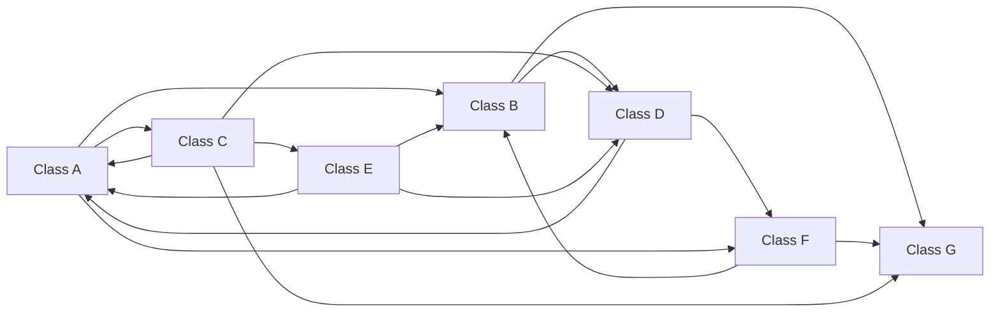
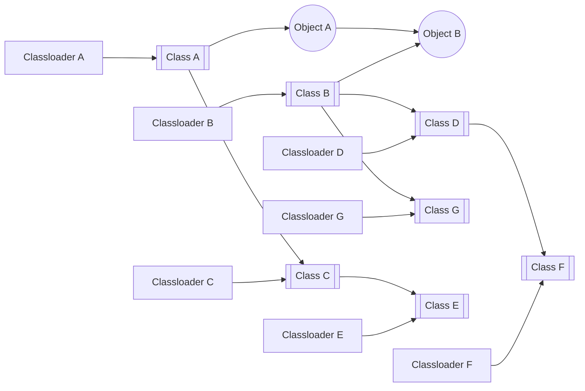
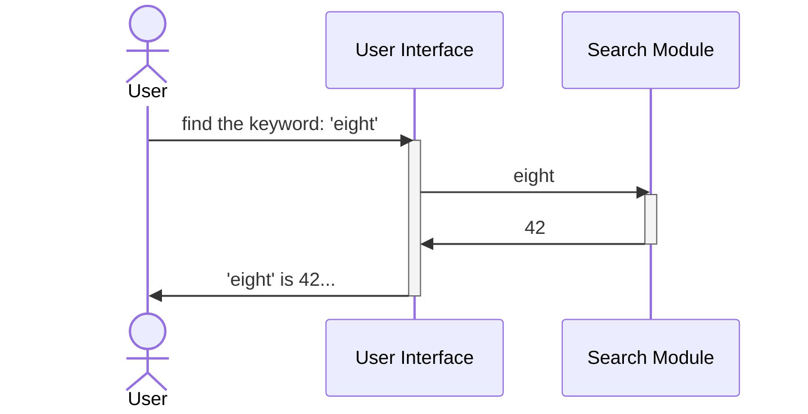
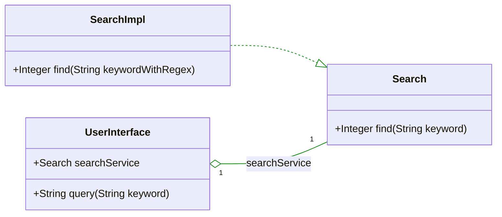
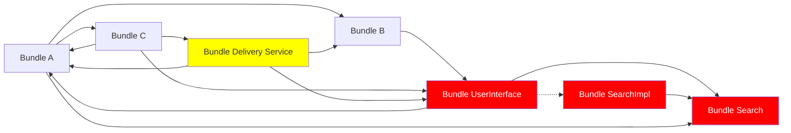
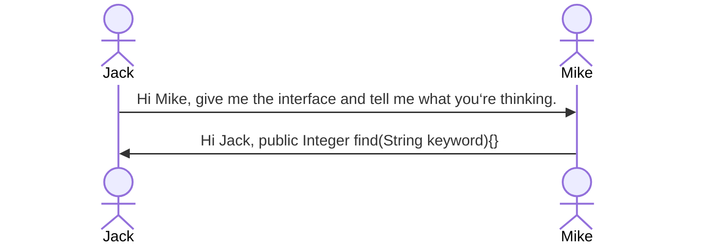

本章开始，我们会通过一些简单的例子，逐渐接触到eight的理念，体会eight与众不同之处，理解她的概念与世界观，同时也初步了解她的基本的设计与开发模式。

### 动态系统为何难以实现
eight的一个特点就是全然的动态化，系统可以收放自如，随意改变。这让人印象深刻，也衍生出了新的系统形态。当然，这只是它独特理念的外在表现之一。

这里有一个有趣的小问题：既然这种形态的系统相当有效，为何以往却没有实现呢？究竟是什么阻碍了我们构建一种如此动态的系统？

说起模块的动态加载，我们会想起一种古老的技术，它曾盛行于20年前。不错，OSGi，这也是eight平台实现动态化的核心技术组成之一。这种技术目前仍然在一些领域被使用，比如IDE（没错，就是eclipse），应用服务器（WebSphere、Geronimo、GlassFish等等），但气数已大不如前，更无法与如今盛行的服务化和容器化潮流中的新兴技术相提并论。当今流行的诸如goLang、rust等技术面向着快速开发与便捷部署服务而生，因为更适应于容器的生态环境，而成为业务层开发的显学。OSGi已经逐渐淡出了人们的记忆。

那么如果OSGi这类的动态模块化技术能够获得前章所描绘的那种效果，为何她会沉沦到被人遗忘呢？更进一步，OSGi比现在盛行的技术历史悠久很多，如果她足够解决`问题`{:.error}，随后那些技术原本没有存在的必要呀。

要谈论这件事情，还是先简单列一下上面提到的这个`问题`{:.error}所指为何：它指的是系统走向服务化并催生出容器化的动因，不外乎这样几点：
- 系统越来越庞大复杂，需要大量人员并行开发，各模块的业务领域和迭代规律不一，不太可能以传统的组织管理方式统筹，必须进行切割与分治；
- 业务迅速变化，则系统需要迅速响应变化，整体化的系统难以因局部的变化而更新，必须进行切割；
- 系统所面对的计算规模庞大且难以预估，必须便于动态伸缩，而系统中计算的热点并不均衡，所以必须切割出来，以便随需伸缩；
- 业务和数据需要相互贯通，分割成服务后，能够方便不同的业务共享相同的服务和数据。

其它原因还有很多，但归结下来最主要的无外乎以上这几条。以上这几条，就是在不断强调切割、切割、切割，于是系统就被切割成为一堆堆的服务；而为了方便服务组装成整体系统，于是催生出了容器化技术；而为了能够在容器环境中多快好省的开发服务，于是就有了goLang，rust这类的开发语言。

这一切都是数十年互联网化大潮下，系统与数据不断膨胀带来的盛况。这就是关于`问题`{:.error}和`解决方案`{:.success}的`故事`{:.info}。

但如果模块的动态加载技术能够如前章所述那样实现，`问题`{:.error}原本就不该存在。如果系统本身就能够随意切割、甚至切割成更为微小的颗粒；如果这些颗粒可以迅速传染到成百上千的节点中，又可以在下一秒就消失；如果系统无须容器环境支撑也能组装，还能够节省服务调用的大量网络流量，简化了服务链追踪问题的苦恼；如果系统可以跟随业务变化，割出来哪怕几行代码的模块，花上一个小时去迭代，再花上几十毫秒去更新；如果一个动态环境能够加载运行多种业务模块，那么多个业务间的服务调用也就等同于模块间的相互调用。。。

如果`问题`{:.error}开始就不存在，随后的`故事`{:.info}也就不会发生。

那么，到底是哪儿出了毛病呢？究竟是什么阻止了动态系统的实现？

### 真正的***问题***
让我们再回头来看OSGi，或者与其类似的技术（比如，呃...jigsaw），它们都是在追求模块化进而·动态化的系统。但如果你要向一个开发者打听为何不会选择这些东西，得到的答案往往会大同小异：
- 概念有点过于复杂了，学习曲线比较高，一些技术细节不易把控（当然对于技术人员而言，如果获得的收益足够大，这些根本不是问题，想想看前面那些为了解决`问题`{:.error}而付出的代价）；
- 玩了这么复杂的东西，却发现解决不了任何`问题`{:.error}，这才是让人痛恨的。理念固然美好，技术看起来也似乎无懈可击，但是模块化却始终是海市蜃楼，动态化就更是无从谈起。

这是怎么一回事呢？接下来我们能够听到一堆堆的抱怨：
- 类加载机制太复杂啦；
- 对象与对象之间，类与类之间，类加载器（Classloader）与类加载器之间很快就纠结成`一团乱麻`{:.error}啦；
- 模块化没得鸟用，一旦模块接口改变，所有依赖它的模块都得跟着改，跟绑在一起也大差不差啦；
- 动态加载实在没法玩，被依赖的接口变了，依赖方必须跟着重载，然后依赖于依赖方的也要跟着重载，再考虑到上面那一团乱麻？？那重载的规模可就真不小了。更严重的，如果不知道其它哪个模块里持有这团乱麻中任意一个Object呢，那整团麻都没法释放啦；
- 最后不得不整体重启拉倒！

这就是那团乱麻。OSGi追求的动态模块技术，是建立在自定义的Classloader的基础之上的，她定义的Classloader不再遵从先父载入的加载顺序，而是以单个模块（OSGi里面称为bundle）为单位，所有bundle的Classloader相互之间是对等关系。OSGi构筑这样的世界观，来将类与类之间的关系由树状改造成平行的网状，以助于能够将某一部分的bundle动态的载入系统以及动态的更新和卸载。所以，其实是这样：

如果bundle与bundle之间能够像人与人之间那样相互依赖与合作又同时保持距离，在缺乏对方时也能生存下去，那么这个模型也就完美了。然而可惜，这做不到。bundle与bundle之间必须建立起某种关联，这种关联在Java里面具有两个层面的意味：
- 类层面。一个bundle需要使用另一个bundle，就必须引用它的类或接口。Classloader在加载类时，首先需要resolve它所引用的类。同样如果被引用的类变化后需要重新载入，必须将所有引用它的类全部清理和重载。传统的树状类依赖结构动一个类就动一颗子树，遇上交叉持有或循环依赖基本无解。尽管OSGi将类加载改造成了网状，不必牵一发而动全身，但这个网上的一点变化，必然也将影响周边的一片，而周边的一片变化必然会影响到周边一片的一片。这种波动很快扩散开来，其实也是另一种牵一发而动全身了；
- 对象层面。即便一个bundle并没有引用另一个bundle的类或接口，但在运行时它的一个对象通过层层引用持有了另一个bundle的对象的句柄（Reference），由于任何一个对象其实握有它的类的句柄，而类又握有Classloader的句柄。Java里面对象有活动引用是不会被回收和释放的，而类被释放和重新载入的原则是其Classloader被释放后再次载入这个类，而由于Classloader被它所加载的所有类所引用，而每一个类又被所有它的实例对象所引用（想想看`getClass().getClassloader()`{:.warning}意味着什么），这也就决定了只要这个Classloader所载入的所有类生成的所有对象有任何一个被其它活跃对象所持有，类和对象的动态载入就难以进行下去（至少不会被释放）。

所以如果有某一个Object A引用了一个Object B，实际情况可能是这样的，我们可以看到事情有多严重了。

为了一个最细微的调整，最终大概率还是得要重新编译和重启整个系统，这与没用到模块化技术又有何区别？除了徒增开发的难度外几乎无所收益。

要把锅甩给OSGi框架吗？是她组织起了这样复杂的依赖之网？或者干脆甩给Java，是它的面向对象体系和类加载机制出了问题？甩锅容易但并不公平，毕竟这么多年过去，也没见谁提出更好的框架或者设计出更好的语言能够在这方面做到更赞。或者某种程度上大家都心照不宣，所谓动态化系统不过是镜花水月，原本就该放弃这种幻想。微操作是不太可能成功的，世界改变的太快来不及精雕细琢，不如把推倒重来做的越快越好。最终人们不得不另寻出路，由应用内切割转向应用外切割，由追求模块化开发动态化部署转向追求敏捷开发快速部署（俗称快糙猛）来应对变化。于是新生代的程序设计把关注点放在了如何能尽可能快的构建一个可以随处run的服务用后即抛（很消费主义不是吗？），不再强调怎么模块化，连面向对象也不怎么感冒了。

但是，我们能够再进一步吗？这一切都是怎么发生的呢？为什么最后会是这样呢？真是Java语言出现了问题吗？还是面向对象的程序设计思想本身就有病？

### 乱麻是怎样炼成的
接下来的探索从一个简单的例子开始吧。

假想我们开发一个检索服务：用户输入一个关键词，然后服务去查询一个目录下存放的所有文件，在文件中搜索该关键词，统计出现的次数并且输出给用户。

好吧这很简单。出于基本的业务划分，我们将这个功能划成两部分，一部分负责与用户交互的输入输出，一部分则负责检索文件目录。前一部分通过接口调用后一部分的功能。

就目前而言，一切OK。Search Module只需要定义一个方法就足够了，例如：
~~~ java
public class Search
	public Integer find(String keyword){
		do something search...
	}
}
~~~

接下来业务有了点变化，用户需要输入正则表达式来进行检索。Wuuuuu...其实没有啥，正则表达式也是一个String，方法的定义可以不用变，只需要把实现方式改一下：
~~~ java
	public Integer find(String keywordWithRegex){
		do something regex...
	}
~~~

对于静态编译的系统，这样也就够了。但对于一个动态系统，由于User Interface模块持有一个class Search的引用，Search模块释放不了，也就无法动态的更新实现方式。这个也不算太难，既然public Integer find(String keyword)是不变的，就面向接口编程好了。

定义出一个接口：
~~~ java
public interface Search {
	public Integer find(String keyword){}
}
~~~
然后再去实现：
~~~ java
public class SearchImpl implements Search {
	public Integer find(String keywordWithRegex){
		do something regex...
	}
}
~~~
UserInterface再也不用直接与SearchImpl打交道了，它只需要了解Search这个接口就可以。SearchImpl模块的实现方式变化也就影响不了它。对于动态框架而言，这意味着定义出三个模块，UserInterface引用Search模块，而SearchImpl则实现了Search模块。变化的是SearchImpl，没有谁在类依赖上引用它，所以可以动态的加载卸载。

等等，有个问题！UserInterface不是还持有一个SearchImpl的Object吗？尽管对于它来说，它只知道那是一个Search，但实际上它是SearchImpl啊。Wuuuuu...这算是一个问题。那么这样好了，我们OSGi框架提供面向Interface的Service注册与获取，SearchImpl向OSGi容器注册一个Search的Service，而UserInterface向容器请求getServiceByInterface(Search.class)，就可以得到一个动态注册的SearchImpl。

记住，UserInterface使用find查询完毕后，必须丢掉这个对象句柄，下次需要再取（当然，后来的OSGi实现中往往通过成员变量的动态绑定由容器集中管理，不必这样麻烦，但实质还是一样，更新时会断开所有的引用）。这样SearchImpl就可以动态载入了。

这就是为何OSGi会要求面向接口和服务编程的原因了。是不是看到了一些熟悉的东西？service、服务注册与发现、容器、更新与发布。这些概念原来来源于这里，现在的容器化技术，其实是摆脱了类依赖和对象依赖的大号OSGi的实现，只不过成本更为昂贵罢了。

看上去有点麻烦，但毕竟解决了问题。我们可以随时把regex功能加载到处理流程中去了不是吗？貌似完美？大家都知道接下来我要说什么了吧？是呀，如果Search这个Interface改变了呢？业务有所调整，Search服务不仅给UserInterface提供检索，还为其他服务也提供，不同服务检索的文件分目录存放。于是Search服务需要传入一个额外的参数，来确定在哪个目录下检索。就像这样：
~~~ java
public interface Search {
	public Integer find(String keyword, String dir){}
}
~~~

那么SearchImpl也需要相应调整。实现并不困难，但是如何上线呢？Search接口参数已经变了，这时候UserInterface、Search和SearchImpl都需要释放再载入了。相当于这个小系统重启了一次。好在这种更新只波及了这三个模块，影响还不算太大。但如果系统是这样呢？

就跟前面说的那样，重载一个Class，意味着重载一个Classloader，意味着重载这个Classloader加载的整个bundle中的所有Class，意味着所有直接或间接继承或引用过这些Class的模块均要重载，意味着所有直接或间接继承或引用过这些重载的模块的所有的Class的模块均要重载，意味着。。。整个过程就像经历了一场海啸。这下，麻烦大了。我仅仅不过想要改个查询目录而已，却发现连给我老妈送外卖的快递员都得要停工了。
{:.rounded width="720px" style="display:block; margin-left:auto; margin-right:auto"}

事情到了这个地步，还有什么意思呢?

### 依赖的实质
那么，既然如此，除非给每个Class定义一个Classloader，也没有什么能够有效控制变化的扩散了吧？仔细想想其实给每个Class定义一个Classloader也没用，只不过稍微好点。所以，采用了OSGi框架的系统一遇上更新也是要重启的（没错，说的正是eclipse）。

看起来是真走投无路了。但是，再给一分钟！让我多问几个为什么。

>为什么对Search的修改需要影响到UserInterface呢？
>>那不是很显然吗？UserInterface需要使用Search的服务啊。我们定义出了这个接口，然后UserInterface和SearchImpl分别集成了它，结果现在业务一变，玩完。

>那么为什么UserInterface需要使用Search的服务就一定要定义个接口给它呢？什么都不给它不就没这事了吗？

到这里估计大家已经对浪费掉的这一分钟感到后悔了。

>>什么都不告诉它，它怎么知道该如何调用呢？

好了，再等等，就快到关键点了。这个过程其实是这样的：

到这里事情就很清楚了，这种依赖从最开始就已经注定了，那个时候还没有代码呢。

技术框架也好，程序设计语言也好，都不过是替罪羊。`所谓语言，不过是人们的主观思维对于客观世界的表达，它并没有把人们对世界的认知变得更简单或是更复杂`{:.info}。所以，事实其实很明白，这种依赖并不是植根在Class上、Classloader上、bundle上、Java上、面向对象的程序设计上，而是`植根在我们的思维和认知`{:.error}中。我们的思维依赖着其他人，我们的代码也会这样；其他人思维的变化影响着我们，我们的代码也会这样；我们的思维变化又继续影响着更多的人，我们的代码也会这样。锅，是我们自己的。

这一下，上升到认识论的高度了，可事情看起来还是无解。那又能够怎么办呢？人与人就是这样相互依赖啊，UserInterface依赖着Search服务那也是客观事实啊。

好了，这一分钟就剩最后一个问题了：必须相互依赖才能生存下去吗？