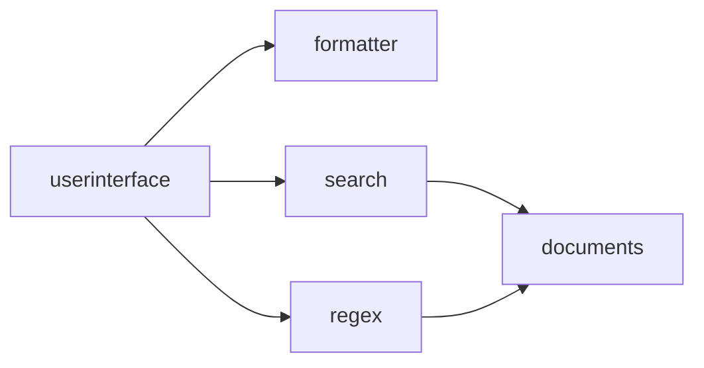

### SEARCH应用
还记得前面那个关于查询关键字的小例子吗？让我们把SEARCH应用加载下来看看。

部署了SEARCH应用后，让我们打开本地的[http://localhost:7241/user/index.html](http://localhost:7241/user/index.html),注意默认端口是7241。

关于http(s)服务的端口，有如下几个启动参数可以设置。

| 参数 | 含义 | 例子 | 补充说明 | 
| -- | -- | -- | -- |
| org.apache.felix.https.enable | 是否启动https协议 | org.apache.felix.https.enable=true | 默认不启动，设置启动后默认端口7240。 |
| org.apache.felix.http.enable | 是否启动http协议 | org.apache.felix.http.enable=false | 默认启动，可以设置关闭。 |
| org.osgi.service.http.port.secure | https服务端口 | org.osgi.service.http.port.secure=9999 | 默认7240，可以手动设置。 |
| org.osgi.service.http.port | http服务端口 | org.osgi.service.http.port=8888 | 默认7241，可以手动设置。 |

随后，我们可以看到SEARCH这个小应用的功能界面。

SEARCH系统的组件结构如下：

组件间的调用逻辑是：
- userinterface组件是界面UI，也即上图我们看到的操作界面
- userinterface根据配置，选择使用search或是regex来进行字符串检索，两种算法匹配模式不同
- search和regex则共同连接documents模块，此模块负责提供前者需要的文本
- search和regex将检索的结果返回给userinterface
- userinterface将使用formatter对结果格式转化后，提供给用户

让我们在应用管理中看看SEARCH系统，可以见到组件的一一对应

同样可以看一看配置，这里的配置一部分是实例（组件的运行时），一部分则是连接（实例间的联系）。组件对应于前章所述的component，实例对应与instance，而连接则对应与前章的联系（linker）。

可以看到，除了实例和连接外，还可以对系统环境进行配置，比如又开放了两个http端口。

我们点击documents的配置`参数`{:.info}可以看到，默认的`test.documents.base`{:.info}参数配置为`scores`{:.info}。这其实是documents组件开放出来的配置项，指定的是一个文件目录。
当配置为scores,也就指定了`运行目录`{:.info}下的scores目录。我们将文本文件放置在该目录下，这些文件就会被检索和统计。你可以修改该目录名称，并在运行目录下创建该目录。

注意，由于更新频率限制，这些修改会在5分钟内生效。届时，你会看到控制台有组件关闭和重启的输出。

### 更改输出格式

创建目录放置好文件，我们可以尝试一个关键词，例如：

以xml格式输出了1这个结果。刚才我们说过，该应用中负责格式的是formater这个组件，让我们修改一下这个组件对应实例的配置：

该实例有一个配置项`framework.formatter.mode`{:.info}默认是false，将其修改为true看看效果。

同样的结果，输出格式突然变成了json。

### 更改算法模块

除了修改实例的配置参数来改变系统行为，我们也能够在运行时修改连接，例如把它从search指向regex。

此时可见用户界面有所变化，查询结果也不一样。这是系统结构发生变化导致的，系统会用正则算法模块进行查询。

### 更改服务端口

我们可以访问 https://localhost:9696/user/index.html https://localhost:9898/user/index.html 来使用该应用，因为我们开启了2个https端口。
演示系统并没有提供修改端口配置的操作，但我们可以通过对http-9696和http-9898的启用和禁用来操作它。

当我们禁用这两个实例中的一个后，我们会发现，对应的端口已经无法访问了。

### 实例脚本

最后，演示系统还开放了一部分的脚本接口。脚本可以附着于实例与连接之上。目前实例有10个脚本触发点，对应实例的若干状态和事件，连接则有10个触发点。每个出发点均可以绑定事件处理模块，这些模块可以是编译好的class或jar包，也可以是脚本（目前支持groovy）。

演示系统仅提供一处实例与一处连接的脚本，分别对应于`接口调用`{:.warning}事件。并且演示系统目前不支持上传class和jar，但是允许直接编写groovy脚本。

我们可以为任意实例（instance）编写一个脚本，如：

~~~ java
package eight.service;
import net.yeeyaa.eight.ITriProcessor;
import net.yeeyaa.eight.IProcessor;

class Proxy implements ITriProcessor {
    IProcessor context
	
	def operate(Object first, Object second, Object third) { 
		println "instance[" + context.process("hookid") + "] input: " + first + " " + second + " " + third;
		def ret = ((ITriProcessor)context.process("next")).operate(first, second, third)
		println "instance[" + context.process("hookid") + "] output: " + ret
		ret
	}
}
~~~

这个脚本很简单，就是在服务调用发生前后，将输入参数和输出结果打印出来，类似于aop切入的功能。所以，在需要的时候，我们可以给相应的模块均配置该脚本，以查看当前某些组件的输入输出。

下图中，我们在应用管理的配置界面里，给documents和formatter配置了脚本，来查看每一次调用时，这两个部分的输入输出情况。当然其它实例也是可以配置的。

配置完成后看不到任何变化，但是一旦请求发生，我们可以在底座的控制台或log（如果将输出重定向到log文件中）看到输入输出被打印出来。

从输出中，我们不仅可以看见documents和formatter这两部分分别接受了什么参数和提供了什么输出结果，甚至也能直观理解系统各个部分的调用顺序。

原则上，这个脚本可以在代理接口访问过程中做任意的事情，甚至取代原有的模块功能。但一般来说，该作用点常用于记录、跟踪、调试、触发关联操作，也用于在系统开发时提供`桩模块`{:.info}。

### 连接脚本

连接（linker）的脚本则具有非比寻常的意义。对于linker来说，其代理的接口并不固定，取决于linker两端实例的使用方式，看起来会更加灵活和难以把握一些。但这正是linker（联系）的最重要作用。

还记得前章提到的事物间联系的变化吗？如果要事物保持自身稳定的`内核`{:.info}，则联系需要在运行时建立。然而不同事物与事物之间联系是多变的，联系应当要`抹平`{:.error}事物间互不相容的棱角，它们才能协调运作。

回忆一下，关于之前那个关于search的例子，如果组件发生改变，需要提供一个额外的参数`dir`{:.info}来告知需要查询的目录那该怎么办？
通过之前的分析，我们得出结论是这个dir既不能在userinterface里传过来，也不能由search提供。这个参数存在于它们两者联系之中。
在这里，我们就终于有了合适的位置来容纳这种变化。

假定我们的search组件是由另一个团队开发的，它们设计查询目录这个参数并不是如我们上面介绍的采用配置参数，而是要求上游组件来提供。那么，我们可以在linker里附加如下脚本：

~~~ java
package eight.service;
import net.yeeyaa.eight.IBiProcessor;
import net.yeeyaa.eight.IProcessor;

class Proxy implements IProcessor {
    IProcessor context
	
	def process(Object keyword) { 
		def dir = "searchPath"
		def ret = ((IBiProcessor)context.process("next")).perfrom(keyword, dir)
		ret
	}
}
~~~

非常直观的转化，将两个格格不入又息息相通的组件连接在一起。这两个`事物`{:.info}彼此不兼容，仅仅是因为后者设计时默认需要提供查询目录这个参数，所以它使用了二元过程接口。
而linker向上代理为一元过程，只输入keyword就行。在发生联系的运行时，我们实时提供的脚本将dir参数值`searchPath`{:.info}传入就可以向下调用。

`这个例子虽小，但是意义非比寻常。它意味着我们可以将无数独立开发，互不了解的组件融合成一个整体系统，也意味着大规模分布开发的组件仓库成为可能。`{:.error}

下一节，让我们来看一个相对完整的系统。