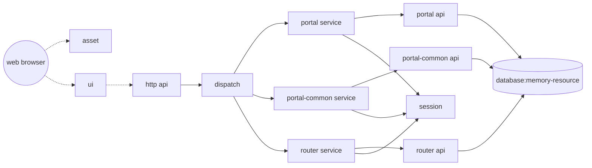

### 切换应用
Eight底座切换系统是很简单的，在节点管理（或应用管理中）修改一下应用就可以了。比如我们将应用切换为demo：

稍等片刻，你会发现原来SEARCH的用户界面已经无法访问，此时，原有的SEARCH相关模块已经被卸载，DEMO系统模块则被加载，当前系统已经变成全新的应用了。

DEMO系统的界面在[http://localhost:7241/ui/index](http://localhost:7241/ui/index)，界面风格与线上系统一脉相承：

感谢我家人对Eight的鼎力支持。banner区是我七岁女儿为Eight设计的logo，原作在此（已授权:blush:）：

点击`进入系统`{:.success}，就可以进入到DEMO系统中。这是一个后端管理平台，实质上就是线上演示平台的一部分，具体功能不多介绍了（这不是重点）：

把这个应用当成crud做些增删查改吧，如果觉得麻烦，可以下载这个[配置文件](/eight/assets/images/router.config)，然后在服务管理中导入。

然后试着做做各项操作。同样的，DEMO系统由各种组件构成，其大体的结构如下：

系统大体结构是：
- 用户浏览器访问前端，也即上图我们看到的操作界面
- 前端两个组件，其中asset组件是通用共享资源，包含大量前端常用静态资源（如js,css，图片等），与其它组件并无关联
- ui组件则是业务系统的ui界面，包含controller和view，以及本模块会用到的静态资源
- ui组件并不直接连接其它组件，而是通过http(s)调用，访问http api组件，该组件会开放一个http端口，向外提供api接口，以实现前后端分离
- http api组件下游是dispatch组件，它根据请求路由到不同的服务模块
- service组件是通用服务模块，它生成三个实例：portal service、portal-common service和router service，分别对应portal、portal-common和router三个业务组件
- router业务组件实现的就是路由管理中心这套业务，包含前述服务管理、路由管理、服务器管理和脚本管理等功能，而portal和portal-common则是进行用户、菜单和功能权限管理的业务（不提供操作界面）
- 各个service组件需要连接session组件来存取会话信息
- portal、portal-common和router需要对接memory-resource，memory-resource包含一些内存的存储结构，甚至还有一套内存数据库，用来提供一套完整的mvc业务系统
- 为了优化用户体验，DEMO不需要用户配置数据库，而是自行提供了一套内存数据库。本着不向用户环境丢垃圾的原则，没有开启数据库的持续化存储功能。所以用户关闭jvm虚拟机再重启后，`之前数据将丢失`{:.error}，用户可以使用服务管理的`导出`{:.success}菜单进行备份。

同样可以查看DEMO系统的组件和配置。

下面的是配置，包含实例与连接。本案例中，service这个组件可以更好的帮助我们理解组件与实例的关系：service这个通用组件，在本系统中创建了3个实例，分别是portal service、portal-common service和router service，参数各不相同。这三个实例才是真正的运行单位。

比较恰当的比喻：组件对标于class而实例对标于object，object是参数实例化后的运行着的class，是动态概念，而class则是object的静态结构。

下一节，我们将通过各种配置操作，来控制这个系统。