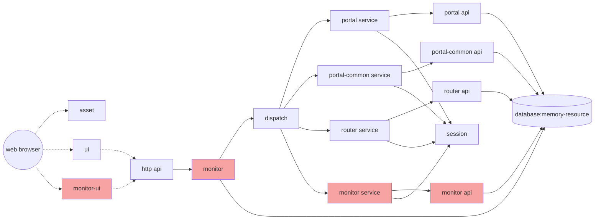

### 给dispatch附加脚本
DEMO的组件比之SEARCH要多不少，相应的可以配置的模块也更多。根据前面的系统结构图可知，dispatch作为路由分发组件，所有的api请求输入与输出都将从这里经过。
如果我们将上一节的实例脚本附加到该组件，我们就能够查看到各个服务的查询请求和调用结果。

给demo-dispatch绑定脚本后，我们很容易看到整个系统的各种调用流程以及输入输出的数据。

### 关闭sql输出
几个数据库访问组件都会打印每次数据库访问时的sql，这对于调试应用很方便，但同时也很冗长。当我们不再需要此类输出时，我们应该关闭它。同样，这些操作通过实例的配置项来完成。

对于portal、portal-common和router-api这几个模块，将配置参数里的framework.router.api.sessionFactory.hibernate.showsql设置为false，则关闭sql输出，设置为true，则打开sql输出以供调试。

我们还可以看见，除此之外还有framework.router.api.dataSource.driver、framework.router.api.server和framework.router.api.dataSource.url等几个参数，这些参数明显是hibernate的数据库配置参数。我们修改这些参数，可以连接到不同的数据库。

其实还有很多参数并没有默认设置（如数据库用户名密码，由于h2不需要就没有设置，再如连接池大小、连接超时、二级缓存等等），这些配置项由各个组件按需要暴露出来，以供运行时灵活配置。

再看看配置参数的约定：
- Eight默认约定参数前缀为framework，以与其它系统参数名称相区别
- 二级命名空间为当前组件的唯一名称（可简写），如router-api使用router.api为二级前缀
- 之后名称为组件内命名空间，可由组件自行约定。建议的命名为:bean名称->bean内参数名称
- 以上命名法则确保了所有参数的唯一性和可识别性。但其实Eight并不要求不同组件间的参数命名必须唯一，`事实上相同的参数名称并不影响Eight的组件配置与更新`{:.success}。
- 参数命名唯一的好处在于，所有这些参数其实是`可以在运行时通过启动参数设置的（前面讨论过用启动参数来影响应用），并且启动参数设置的优先级高于组件配置中设置`{:.error}。但是启动参数需要各个参数相互区别，所以还是建议使用规范的命名空间。

我们将各个实例的参数设置为false，再进行操作时，可以看见已经没有sql输出了。

### 其它配置
通过配置管理页面，我们可以看到各个实例里可以配置的项目很多，如demo-http实例可以配置后端api接口的port（端口号）。注意：`如果修改端口号，则需要修改demo-ui的url（服务路径与之对应）`{:.error}。

事实上demo-http是一个通用的轻量级http服务，它至少还有以下常用参数：

| 参数 | 含义 | 例子 | 补充说明 | 
| -- | -- | -- | -- |
| framework.http.init.context | 服务占用的uri | /api | 默认是/api |
| framework.http.wss.url | 提供webservice服务接口的uri |  | 默认是/wsapi |
| framework.http.byte2str.charset | 输入输出字符集 | utf-8 |  |
| framework.http.httpServer.secure | 是否启用https | true | 默认是false |

对于前端组件demo-ui，其参数可见：

其中，framework.ui.server.url是指向demo-http的，如果demo-http修改了端口号或使用https协议，则此处应相应修改。

而framework.ui.alias则是用户界面的uri。例如将其修改为/test，则原先使用/ui已经无法访问该应用，需要使用[http://localhost:7241/test/index](http://localhost:7241/test/index)来访问、

其余的参数不建议用户修改。

而demo-session则可以配置后端服务的会话超时（不是前端超时，前端使用jwt，默认1小时，使用framework.ui.expire配置）：

默认300秒（也就是5分钟），可以修改成其他时长。

### 增加功能模块
通常可以通过向应用中增加新的组件、实例和连接来增添新的模块。为了防止不可预知的问题损坏客户系统，演示系统不开放让用户自行上传和增删组件，但可以通过组件或实例的禁用/启用来模拟增删。

在DEMO中，已经配置了几个组件，但被禁用了。我们可以在组件管理中启动它。

启用完毕后，会发现应用菜单发生了变化，新的功能模块被加载到现有的平台中。此时，系统结构已经发生了变化，如下：

图中红色部分是新增的monitor的一组实例（monitor、monitor-ui、monitor-service、monitor-api）被加载到系统中。这组实例为系统带来了新的功能——监控模块。

- 最核心的组件是monitor，它在系统中选取了一个最为合适的切入点：嵌入到http与dispatch之间，所有的系统调用均经过此处。它同时也连接database。它的功能是记录并缓存方法调用的状况，并将其批量写入数据库。
- monitor-ui为监控管理前端，也即新出现在用户操作界面上的功能模块。
- monitor-service、monitor-api与router类似，也就是monitor模块进行增删查改的后台api。

系统升级完毕后，我们可以随便进行些操作，这些调用的次数、发生时间和持续时长会被记录下来。然后，我们可通过monitor界面查看其情况：

当我们不需要该模块时，我们可以通过禁用组件，或者在配置管理中禁用对应的demo-monitor.ui、demo-service.monitor、demo-monitor等来禁用这些功能。注意，如果仅仅是卸载功能界面而继续保持监控，则可以不卸载monitor这个核心组件。

### 其它
- 另外的一套系统example，实际上就是SEARCH+DEMO的组合。部署后同一节点上同时运行SEARCH和DEMO两套功能。原则上，节点与业务系统是不同层面的概念，`一个节点可以运行多套业务，而一个业务可以在多个节点上分布`{:.success}。
- 一旦系统被加载，其就成为一个`纯粹的本地应用`{:.success}，所有业务在本地进行，而即便`断开网络、关闭jvm，或者关闭电脑硬件重启`{:.error}，其系统仍保持在`最后一次联网时状态，直至再次连接到服务器进行更新`{:.error}。
- 在线平台仅展示少量的受限控制功能，以突出Eight的基本特征。Eight平台本身具备的能力更为丰富和灵活。
- Eight的架构特征鼓励大量复用代码和模块，所以应用相较同类系统很小。例如DEMO，作为一套完整的后台管理系统，其整体体积在1.1M左右，除去通用静态资源（asset），业务相关的组件仅不到400K，包括前端页面、controller、业务逻辑、数据库访问层等。这有利于在弱网络环境下的部署与管理。

