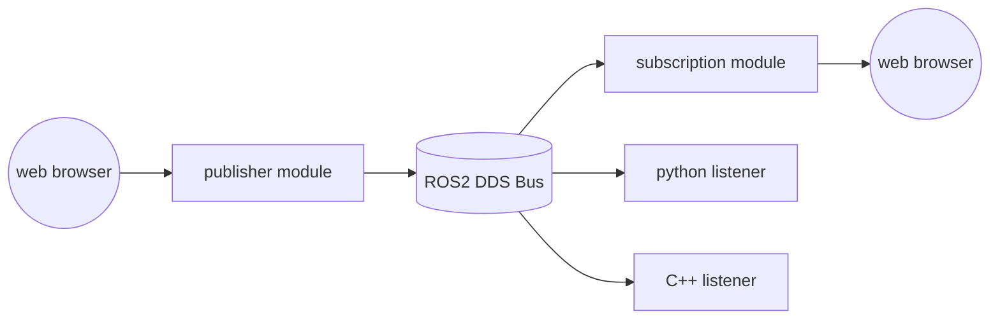
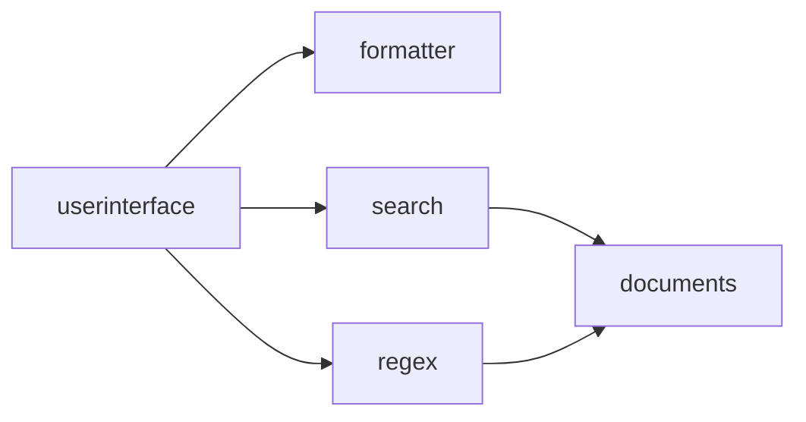
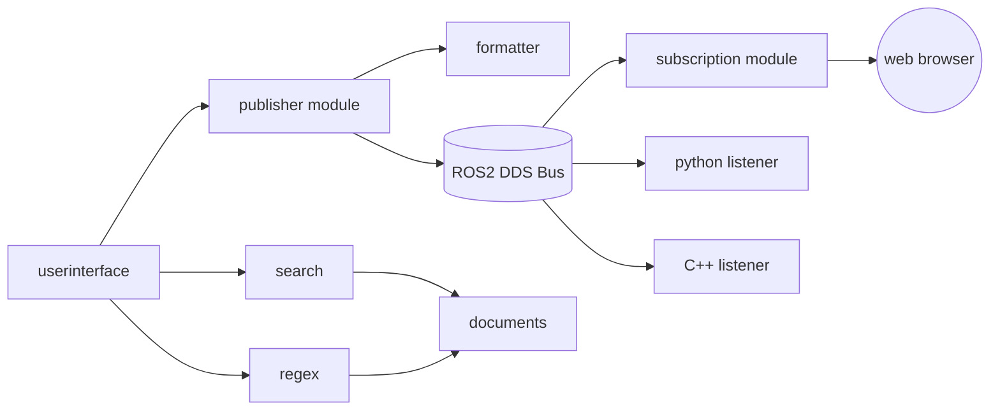
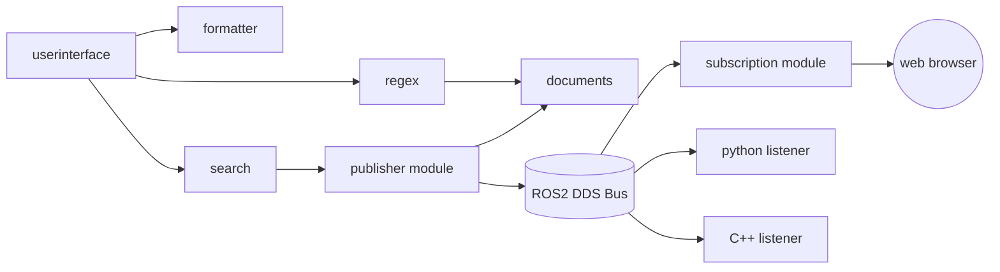

本章将简单介绍eight在ROS2（Robot Operating System）平台上的应用，并提供几个示例

### 简单了解ROS2
ROS2应该是当前最为热门的嵌入式智能设备操作系统之一，实际上是一套开源的软件框架和工具集。它被广泛应用于机器人、无人机、智能汽车等应用领域，为诸多边缘设备提供信息感知和数据处理能力。在以自动驾驶汽车为代表的应用场景对于中间层和开发框架在实时性、可靠性、伸缩性、跨平台可移植等提出了相当高的要求，而ROS2则为之提供了成熟稳定的解决方案，因而被大量的在现代智能设备中使用。

ROS自2007年发布以来，为机器人社区提供了整套相对完善的中间层、工具、软件乃至通讯的接口和标准，可以说，凭借ROS，机器人工业领域的开发者能够快速开发系统原型并做测试和验证。而ROS2是第二代的Robot Operating System，ROS1的升级版本，最早发行于2017年的Arden版本中，解决了ROS1存在的一些问题。

相比ROS，ROS2高效稳定，功能也更加丰富，能够满足商业化场景的需求。ROS2的核心特性如下：

- 支持多种操作系统：ROS2是跨平台的，支持：Linux (Ubuntu / Debian / Fedora / ...) 、Windows、Mac OS、RTOS等。
- 支持多开发语言：ROS2原生支持c++和python的开发环境，通过社区和芬酯项目，支持java、Rust、c#乃至更多的开发语言和环境。
- 分布式通信架构：DDS规范。ROS1最初设计时是单机机器人操作系统，使用的是Master-Slave架构，所有的子节点 (Slave) 都直接与主节点 (Master) 建立通信。 当主节点出现问题时，就会导致所有功能不能正常运行。ROS2对ROS1中的通信架构做了重大的改进，使用的是分布式多对多的数据交换的DDS规范 (Data Distribution Service) 。DDS最早应用于美国海军，解决舰船复杂网络环境中大量软件升级的兼容性问题，目前已经成为美国国防部的强制标准，同时广泛应用于国防、民航、工业控制等领域，成为分布式实时系统中数据发布/订阅的标准解决方案。在ROS2 Humble发行版中默认使用的是Fast DDS。Fast DDS是DDS规范的一个C++语言实现版本，能够为实时系统提供高效可靠的数据分发功能。Fast DDS的底层使用的是实时发布订阅协议RTPS (Real Time Publish Subscribe) 。
- 实时内核：ROS2加入了Linux实时内核的支持，也能运行在QNX与vxWorks等原生实时系统上，可以提高机器人控制的时效性。
- 数据安全：智能设备运行过程中，数据安全是很重要的。ROS2基于DDS采用了DDS-Security规范，规范是在DDS规范的基础上针对数据安全进行了拓展。在ROS2里面添加了身份验证 (Authentication) 、访问控制 (Access control) 、加密 (Cryptographic) 三个数据安全服务插件接口 (Service Plugin Interface) ，全面而健全的保护好设备中的数据信息。

智能设备中间层需要解决的最核心问题是通讯，也就是整体设备的各个分支系统获取的信号和数据的传递和交互。不管是机器人还是汽车，整备都包含大量的传感器和分支系统（汽车中成为域），这些系统获得的信息上传和指令下达是其运行的最核心任务。而ROS这类的中间层就如同人体的神经网络，将各域的信号串流在通讯通道中进行即时、有效、节省的传播，汇总到核心系统进行综合处理，而又将得到的指令和反馈下达到各个控制部件。

ROS2比之与ROS，其基础架构有了较大改变。信息层采用了去中心化的DDS总线，能够保证在总线网络上任意增减设备进行消息传递，不影响其他在线节点。各个节点可以通过DDS节点相互发现，各个节点是平等的，可以实现一对一、一对多、多对多的通信。 使用DDS进行通信后，可靠性和稳定性得到了增强。

上图左侧是ROS，右侧是ROS2的架构。可以看见ROS2对比ROS在应用层去掉了master节点，在中间件层采用了DDS总线，在操作系统平台上兼容windows，macos以及QNX等RTOS系统。

上图是ROS消息系统架构，下图则是ROS2的。ROS2采用数据分发服务DDS(Data Distribution Service一种专门为实时系统设计的数据分发/订阅标准)，实质上是组建了一个对等的无主消息网络，每一个参与者都可以在其加入的网络中共享所有的topic，向其收发信息。

### 搭建ROS2环境

官方推荐的ROS2环境搭建是基于ubuntu系统的，并且推荐的不同版本的ROS2对应不同版本的ubuntu，具体如下。

| ROS2版本 | 发布时间 | 维护截止时间 | Ubuntu版本 | 
| -- | -- | -- | -- |
| Ardent Apalone | 2017.12 | 2018.12 | Ubuntu 16.04（Xenial Xerus） |
| Bouncy Bolson | 2018.7 | 2019.7 | Ubuntu 16.04（Xenial Xerus）、Ubuntu 18.04 (Bionic Beaver) |
| Crystal Clemmys | 2018.12 | 2019.12 | Ubuntu 18.04 (Bionic Beaver) |
| Dashing Diademata | 2019.5 | 2021.5 | Ubuntu 18.04 (Bionic Beaver) |
| Eloquent Elusor | 2018.12 | 2019.12 | Ubuntu 18.04 (Bionic Beaver) |
| Foxy Fitzroy | 2020.6 | 2023.5 | Ubuntu 20.04 (Focal Fossa) |
| Galactic Geochelone | 2021.5 | 2022.11 | Ubuntu 20.04 (Focal Fossa) |
| Humble Hawksbill | 2022.5 | 2027.5 | Ubuntu 22.04 (Jammy Jellyfish) |
| Iron Irwini | 2023.5 | 2024.11 | Ubuntu 22.04 (Jammy Jellyfish) |

目前最新版本是Iron Irwini，运行于Ubuntu 22.04。常用版本则是Galactic和Humble，其中Humble是一个推荐的LTS release。当然ROS2是可以部署在windows、macos以及fedora等系统上，也可以不按照推荐版本进行安装。只是由于依赖库存在差异，可能会给安装带来额外的麻烦。所以建议测试环境还是遵从官方的要求。

我们可以选择制定版本操作系统的虚拟机来安装ROS2,具体安装教程在其官方文档中。对于不同版本安装略有差异，如安装Foxy，其教程在 [https://docs.ros.org/en/foxy/Installation.html](https://docs.ros.org/en/foxy/Installation.html) 上。

ROS2原生支持的只有c++和python 3开发环境，需要使用eight，则必须部署rcljava，rcljava使用jni将ROS的功能和服务接口（主要是消息接口）封装到java库中，使用rcljava就可以在eight平台上与ROS2的DDS总线上的其它节点进行交互。

rcljava的项目地址在[https://github.com/ros2-java/ros2_java](https://github.com/ros2-java/ros2_java)上，同样也有安装配置说明，就在项目落地页上。注意，对于不同的ROS2版本，rcljava有不同的分支，需要切换不同分支下载和编译，安装方式也有所不同，参见不同分支的readme。

本文重点不在于介绍如何安装和配置ROS2环境，所以在此不详细介绍安装步骤。为方便读者评测，已经做好几个版本的vbox虚拟机镜像，直接可以下载使用。

在[百度云盘](https://pan.baidu.com/s/1n36sOWviHADT4HxKs9jFfw)上，提取码为 bo5c 。有ros_a_16.04，ros_g_20.04，ros_h_22.04三个版本的虚拟机，分别对应ROS2的Ardent，Galactic和Humble版本，注意Ardent版本由于历史悠久，已经不能与最新版本的消息节点进行交互，不推荐使用。

在[阿里云盘](https://www.aliyundrive.com/s/ZmEdH8Zj3B4)上，提取码为 bvq0 。有ros_g_20.04。阿里云下载相对较快Galactic是推荐的部署环境，推荐读者下载该镜像。

镜像为7z压缩文件，下载解压后直接安装为vbox硬盘即可。vbox最低设置1c1g，推荐2c2g即可运行所有的测试项目。推荐拷贝两份以上的硬盘镜像部署多台虚拟机，在将这些虚拟机都部署在同一个hostOnly或内部子网中使其相互能够网络互访。推荐使用hostOnly或bridge网络，因为后续运行eight节点需要访问外网。

虚拟机用户名密码均为ubuntu。打开虚拟机后，开启一个控制台，然后运行官方示例
~~~ shell
ros2 run demo_nodes_py talker
~~~
这是用python环境启动了一个talker。然后再打开另一台同网络的虚拟机，运行
~~~ shell
ros2 run demo_nodes_cpp listener
~~~
这则是基于cpp开发的一个listener。此时应该能够看到双方控制台均输出了顺序的消息信息。

上图是talker，下图是listener，可见，消息在不同的主机系统的不同开发语言环境中顺畅交互，这就是ROS2提供的能力。

### 在ROS2环境中运行eight

我们先理解一下ROS2的开发架构，如图

可见ROS2的结构相当简洁：
- 下层是rmw (ros middleware interface)，为相对底层的接口层，直接和DDS交互，C语⾔实现。提供了基于FastRTPS，RTI Conntext等诸多环境下的接口，能够在不同的操作系统环境中进行消息交互。

- 中间层是rcl (ros cliend libraries)，是对rmw相对层的抽象，c/c++实现，为上层提供了Services,Time,Logging等诸多规范统一的抽象服务接口。

- 上层是各种开发语言对下层服务接口的封装，使得可以使用各种语言开发消息总线的程序。用户程序则基于这些api进行开发。

- 此外还有一个ros_to_dds组件，该组件主要为应用层直接访问DDS层提供接口。

以上是ROS2消息开发的模型。可见ROS2开发时，是围绕消息进行的。根据支持的数据type，定义好消息格式，再在各个语言环境中使用generator生成对应的消息的格式库，然后就可以在对应的语言中进行开发。ROS2总体上是面向消息开发的系统，这也是智能设备开发应用的一大特色。

接下来我们看看在eight（rcljava）环境中开发一个模块会是怎样的一个过程。示例代码尽量做到简洁明了，突出重点。
~~~ java
package ros.test;

import javax.annotation.PostConstruct;
import javax.annotation.PreDestroy;

import org.ros2.rcljava.RCLJava;
import org.ros2.rcljava.node.BaseComposableNode;
import org.ros2.rcljava.publisher.Publisher;

public class Pub {
	private volatile Node node;
	private volatile boolean stop = false;

	private class Node extends BaseComposableNode {
		private int count;

		private Publisher<std_msgs.msg.String> publisher;

		public Node() {
			super("minimal_publisher");
			count = 0;
			// Publishers are type safe, make sure to pass the message type
			publisher = node.<std_msgs.msg.String> createPublisher(
					std_msgs.msg.String.class, "chatter");
		}

		public void onTimer() {
			std_msgs.msg.String message = new std_msgs.msg.String();
			message.setData("Hello, ros on eight! " + count);
			count++;
			// System.out.println("Publishing: [" + message.getData() + "]");
			publisher.publish(message);
		}

	}

	@PostConstruct
	public void initialize() {
		new Thread(new Runnable() {
			@Override
			public void run() {
				if (!RCLJava.isInitialized())
					RCLJava.rclJavaInit();
				node = new Node();
				while (RCLJava.ok()) if (stop) {
					if (node != null) {
						node.publisher.dispose();
						node.getNode().dispose();
						node = null;
					}
					break;
				} else try {
						node.onTimer();
						RCLJava.spinSome(node);
						Thread.sleep(500);
					} catch (Exception e) {
					}
			}
		}).start();
	}

	@PreDestroy
	public synchronized void destroy() {
		stop = true;
	}

	public static void main(String[] args) throws InterruptedException {
		new Sub().initialize();
	}
}
~~~
以上就是一个rcljava的Node的标准示例，这个类可以通过main方法独立运行，也可以部署到eight中运行。

它引入了一堆rcljava提供的api库，其中RCLJava是个工具类，提供了诸多ROS2环境下的操作接口。BaseComposableNode则是一个节点的抽象封装，Publisher则是一个面向消息的发布者。

代码首先在initialize方法里用RCLJava初始化了参数和环境，然后创建并启动一个继承了BaseComposableNode的Node类，然后启动一个线程以持续的间隔向消息总线发送消息，直到该实例被销毁，stop成员变量设置为0。

Node类在构造函数里做了两件事情：

- 定义了一个名为minimal_publisher的节点

- 创建了一个publisher，向名为chatter的topic发送消息。

然后，在onTimer中，每次都会向chatter发送一条消息，同时将计数器加一。

要使用该模块，需要在虚拟机中启动rcljava环境。在桌面有一个ros2_java_ws文件夹，在该文件夹中打开终端控制台，然后运行

~~~ shell
. install/local_setup.sh
~~~

这个脚本初始化了java环境变量，引入了本地的rcljava的库到classpath中，然后就可以如运行一个普通java程序一样运行上面的类。如

~~~ shell
. java ros.test.Pub
~~~

当使用eight环境运行时，基本上与前面章节介绍的方法一致，下载eight的底座，然后同样需要初始化classpath：

~~~ shell
. install/local_setup.sh
~~~

然后跟前面介绍的一样，直接输入底座的启动参数。

~~~ shell
java -Dframework.boot.scanner.node=nodeName -Dfile.encoding=UTF8 -Dframework.web.user=xxxx -Dframework.web.password=pppp -Dframework.web.url=https://www.yeeyaa.net/api -Djdk.util.zip.disableZip64ExtraFieldValidation=true -cp eight-seat-1.0.0.jar:$CLASSPATH aQute.launcher.pre.EmbeddedLauncher
~~~

我们在线上的eight管理平台中已经预制了几套应用，读者可以登录自己的账号，将对应系统导入应用管理，然后再绑定到运行中的节点即可。其中ros-publisher是一个消息的发布者，而ros-subscription则是一个订阅者。可以分别在不同的虚拟机上下发这两套应用。

应用下发后我们可以看到，当ros-publisher启动完毕后，ros-subscription在控制台定时输出消息。

同时，因为这个chatter是ROS2的示例使用的topic，我们同样可在任一同网的虚拟机中启动c++或python的listener。

~~~ shell
ros2 run demo_nodes_cpp listener
ros2 run demo_nodes_py listener
~~~

可以看到各个listener都听见了eight发出的消息。可见消息与之前使用c++或python的一样，跨越了各个节点在不同的开发语言环境中传播。

这里再说一下subscription的编码。与publisher其实相差不大，只需要寥寥几行代码。

~~~ java
package ros.test;

import javax.annotation.PostConstruct;
import javax.annotation.PreDestroy;

import org.ros2.rcljava.RCLJava;
import org.ros2.rcljava.consumers.Consumer;
import org.ros2.rcljava.node.BaseComposableNode;
import org.ros2.rcljava.subscription.Subscription;

public class Pub {
	private volatile Node node;
	private volatile boolean stop = false;

	private class Node extends BaseComposableNode {
		private Subscription<std_msgs.msg.String> subscription;

		public Node() {
		    super("minimal_subscriber");
		    subscription = node.<std_msgs.msg.String>createSubscription(std_msgs.msg.String.class, "chatter",
		        new Consumer<std_msgs.msg.String>() {
					@Override
					public void accept(std_msgs.msg.String msg) {
						System.out.println("I heard: [" + msg.getData() + "]");
					}
				});
		}
	}

	@PostConstruct
	public void initialize() {
		new Thread(new Runnable() {
			@Override
			public void run() {
				if (!RCLJava.isInitialized())
					RCLJava.rclJavaInit();
				node = new Node();
				while (RCLJava.ok()) if (stop) {
					if (node != null) {
						node.subscription.dispose();
						node.getNode().dispose();
						node = null;
					}
					break;
				} else try {
						RCLJava.spinSome(node);
						Thread.sleep(500);
					} catch (Exception e) {
					}
			}
		}).start();
	}

	@PreDestroy
	public synchronized void destroy() {
		stop = true;
	}

	public static void main(String[] args) throws InterruptedException {
		new Pub().initialize();
	}
}
~~~

initialize方法基本相同，都是在循环接受消息。Node只需要在构造函数里初始化节点名称，然后实例化一个Subscription，这个订阅者accept消息后在控制台输出。main方法是给该类单独运行时用的，在eight平台上运行不需要这个入口。`使用eight接入ROS2环境是一件干净方便的事情`{:.error}。

然后，我们可以像以往任何一套eight应用一样，进行动态更新。线上系统提供了两套publisher和subscription，分别是ros-publisher和ros-publisher2，以及ros-subscription和ros-subscription2。功能基本一致，仅仅输出信息的内容有少许差异以提示进行了更新。我们可以把ros-publisher替换为ros-publisher2，把ros-subscription替换为ros-subscription2，只需要在线上管理平台将当前节点绑定上不同应用即可。

可见，当publisher升级后，subscription输出的内容发生了改变。

### 集成ROS2组件到eight系统之中

接下来，我们看看一个建立在eight上的稍微复杂的ROS2应用：将消息的收发在网页上输出。对于消息处理，web上最为直接的方案就是web-socket。这里，我们同样预制了收发两个模块，分别是ros-pub-ui和ros-sub-ui，我们同样将其分别部署到两台虚拟机上。

然后分别打开ip1:7241/sub/ros.html和ip2:7241/pub/ros.html。

可以看到需要一个登录名称，这个没啥意义，仅仅是web-socket上stomp协议的要求罢了。随便填写一个名称后登录。

然后在publisher的message输入框中输入各种消息，则在subscription中可以看到对应输出，同样也能在c++和python的listener里看见输出。

整体流程如下，很简单不再赘述。

然后，我们看看如何把一个ros2的模块动态嵌入到eight的组件化系统之中。还记得那个查询关键字的小例子吗？它的系统结构如下：

如果我们在userinterface与formatter组件的衔接点切开，嵌入一个ROS2的publisher模块进去，就可以把这个系统中所有用户查询的结果发布到ROS2的某个topic里去。如下：

这个示例也已经预制，在ros-pub-ui-with-search应用中，将其绑定到某个eight节点上，然后打开对应的url：http://你节点的ip:7241/user/index.html 。又出现熟悉的界面。

功能与原先的SEARCH系统一模一样，只不过每次进行查询后，匹配的关键字数量会传播到各个系统中，如图：

同样我们也能把ROS的信息发布模块嵌入到search或regex到documents的通道中间，这样每次查询到的文本内容就会被发布到ROS2的DDS网络topic中。如图：

我们没有修改任何search和ros publisher的代码，仅仅通过配置就将两套毫无关联的系统串联到一起，并且仅仅进行简单的部署，这些系统就动态更新到节点上实现了新的功能。这就是在ros平台上部署eight的意义所在。
