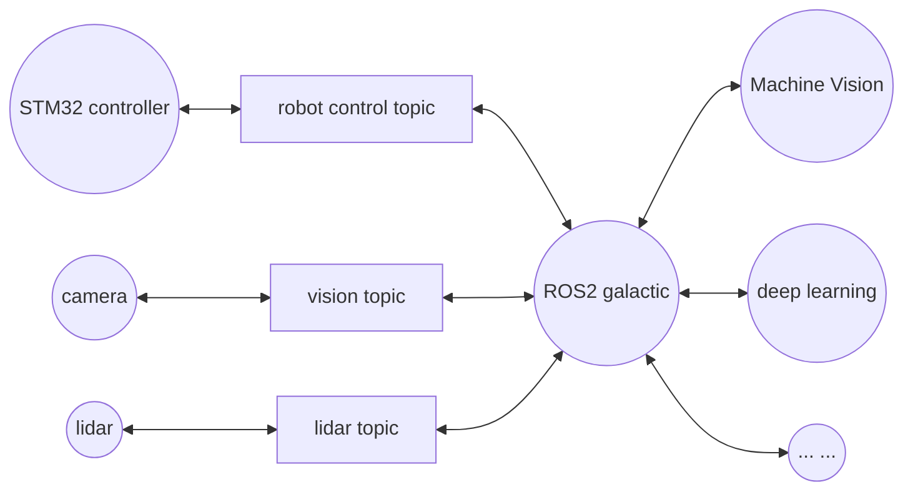
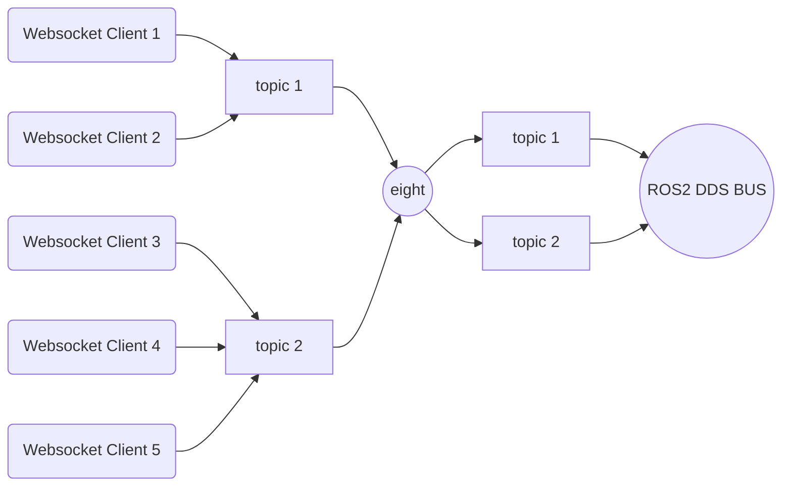
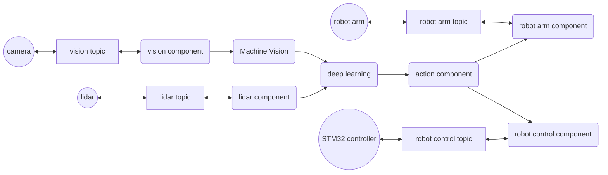

本章将在一款智能小车上实机部署eight系统，让我们首先来看看这次的主角

### 设备简介和系统部署

该款国产无人小车采用麦轮底盘，配备的STM32控制器上也部署了ros系统，具体说来是ros2的microros分支。该车核心控制板基于一款国产cpu（具体品牌不透露了），为4核心2g内存，承担上位机功能。该机有ros和ros2等多个镜像可用。这次我们选择了基于galactic的镜像，基于ubuntu的20.04.5。

顺带一提的是该款cpu还配置有gpu核心，可以本机执行一些深度学习算法，只不过性能并不怎样，尤其在编译ros2和rcljava时显得吃力。倒是运行eight非常流畅，毕竟eight对资源需求不高(eight是能够在win98的64M内存上顺畅运行的物种)。2g内存看似不高，但是运行整套ros系统以及eight环境也绰绰有余了。这就是它的真容。

可以见到该车配置有一款雷达和深度相机，可以部署视觉识别，巡线，障碍物识别等功能。也有wifi网络可以联网控制。

然后再看看侧面，除了显眼的10000mAh锂电以外，最显眼的就是一排网卡和usb接口了。usb接口一共四个，其中三个已经被占用，分别接往STM32底盘下位机，雷达和摄像头，剩余一个空位可以接机械臂或其它辅助设备，扩展性算是够用。STM32采用ch9102串口与上位机通讯，而雷达则是ch2102串口，摄像头干脆是uvc了。除此之外，设备还提供一个hdmi输出。连接显示器后，我们可以看见标准的ubuntu界面。

ros整体上就是一种面向消息处理的操作系统。在本机中，大体结构如下。

可见ros起到的作用是中枢神经系统，将各种知觉设备连接起来，然后交给大脑的各种算法模块（如深度学习、机器视觉等）处理，中间的数据交互都是以消息方式提供的，通过topic的订阅和发布进行传播。

小车提供的镜像已经部署了ros2的galactic版本（部分模块需要根据硬件配置做些参数调整后重新编译，此处不表），接下来只需要安装rcljava即可，具体过程参考[https://github.com/ros2-java/ros2_java](https://github.com/ros2-java/ros2_java)，基本上没有什么障碍，也就不再详述。

与前一章一样，我们在桌面上建立一个ros2_java_ws文件夹，在该文件夹中打开终端控制台，然后运行

~~~ shell
. install/local_setup.sh
~~~

就载入了java的ros环境变量，然后同样运行eight底座，联往线上平台，再发布上一节的ros-pub-ui-with-search应用。

打开小车的浏览器，嗯，eight运行起来了。

### 在ROS2环境上开发eight组件

我们先观察一下ROS2环境提供了些什么topic。使用ros提供的命令：

~~~ shell
ros2 topic list
/parameter_events
/rosout
~~~

初始只有parameter_events和rosout两个topic。接下来我们打开底盘通讯。出现了

~~~ shell
/PowerVoltage
/cmd_vel
/diagnostics
/joint_states
/mobile_base/sensors/imu_data
/none
/odom
/odom_combined
/robot_description
/robotpose
/robotvel
/set_pose
/tf
/tf_static
~~~

等一系列topic，涉及电压、底盘控制、诊断、传感器、位置积算等诸多方面。再打开摄像头，出现了

~~~ shell
/camera/color/camera_info
/camera/color/image_raw
/camera/color/image_raw/compressed
/camera/color/image_raw/compressedDepth
/camera/depth/camera_info
/camera/depth/color/points
/camera/depth/image_raw
/camera/depth/image_raw/compressed
/camera/depth/image_raw/compressedDepth
/camera/depth/points
/camera/extrinsic/depth_to_color
~~~

这一组摄像头主题。现在我们可以尝试写写程序来控制它。先试着采集一些数据。继续上一节监听消息的例子，我们做一个简单的模块来监听这些topic

~~~ java
public class RosSub implements IProcessor<Object, Void>, IBiProcessor<Object, Object, Void> {
	private final ConcurrentHashMap<String, Node> map = new ConcurrentHashMap<String, Node>();
	private volatile boolean stop = false;
	private IProcessor<Object, IBiProcessor<Object, Object, Object>> preProcessor;
	
	public void setPreProcessor(IProcessor<Object, IBiProcessor<Object, Object, Object>> preProcessor) {
		this.preProcessor = preProcessor;
	}

	private class Node extends BaseComposableNode {
		private final Set<IBiProcessor<Object, Object, Object>> set = Collections.newSetFromMap(new ConcurrentHashMap<IBiProcessor<Object, Object, Object>, Boolean>());
		private final Subscription<std_msgs.msg.String> subscription;
		
		public Node(final String topic) {
		    super("eight_" + topic.replace('/', '_') + "_subscriber");
		    subscription = node.<std_msgs.msg.String>createSubscription(std_msgs.msg.String.class, topic,
		        new Consumer<std_msgs.msg.String>() {
					@Override
					public void accept(std_msgs.msg.String msg) {
						System.out.println("eight_" + topic + "_subscriber: [" + msg.getData() + "]");
						Iterator<IBiProcessor<Object, Object, Object>> itr = set.iterator();
						while (itr.hasNext()) {
							IBiProcessor<Object, Object, Object> handler = itr.next();
							if (Boolean.TRUE.equals(handler.perform(null, "open"))) handler.perform("text", "eight_" + topic + "_subscriber receive: [" + msg.getData() + "]");
							else itr.remove();
						}
					}
				});
		}
	}

	@PostConstruct
	public void initialize() {
		if (!RCLJava.isInitialized()) RCLJava.rclJavaInit();
	}

	@PreDestroy
	public synchronized void destroy() {
		stop = true;
		map.clear();
	}

	public static Map<String, LinkedList<String>> splitQuery(URI url) {
		try {
		  final Map<String, LinkedList<String>> query_pairs = new LinkedHashMap<String, LinkedList<String>>();
		  final String[] pairs = url.getQuery().split("&");
		  for (String pair : pairs) {
		    final int idx = pair.indexOf("=");
		    final String key = idx > 0 ? URLDecoder.decode(pair.substring(0, idx), "UTF-8") : pair;
		    if (!query_pairs.containsKey(key)) {
		      query_pairs.put(key, new LinkedList<String>());
		    }
		    final String value = idx > 0 && pair.length() > idx + 1 ? URLDecoder.decode(pair.substring(idx + 1), "UTF-8") : null;
		    query_pairs.get(key).add(value);
		  }
		  return query_pairs;
		} catch (Exception e) {
			throw new PlatformException(PlatformError.ERROR_IO, e);
		}
	}
	
	@Override
	public synchronized Void process(Object object) {
		IBiProcessor<Object, Object, Object> session = preProcessor == null ? (IBiProcessor<Object, Object, Object>) object : preProcessor.process(object);
		Map<String, LinkedList<String>> parameters = splitQuery((URI) session.perform(null, "uri"));
		LinkedList<String> names = parameters.get("username");
		if (names != null && names.size() > 0) {
			String name = names.getFirst();
			Node node = map.get(name);
			if (node == null	) {
				node = new Node(name);
				map.put(name, node);
				final Node n = node;
				new Thread(new Runnable() {
					@Override
					public void run() {
						while (RCLJava.ok()) if (stop || n.set.isEmpty()) {
							n.subscription.dispose();
							n.getNode().dispose();
							break;
						} else try {
							RCLJava.spinSome(n);
						} catch (Exception e) {}
					}
				}).start();
			}
			node.set.add(session);
		}
		return null;
	}

	@Override
	public synchronized Void perform(Object object, Object para) {
		IBiProcessor<Object, Object, Object> session = preProcessor == null ? (IBiProcessor<Object, Object, Object>) object : preProcessor.process(object);
		Map<String, LinkedList<String>> parameters = splitQuery((URI) session.perform(null, "uri"));
		LinkedList<String> names = parameters.get("username");
		if (names != null && names.size() > 0) {
			String name = names.getFirst();
			Node node = map.get(name);
			if (node != null) {
				node.set.remove(session);
				if (node.set.isEmpty()) map.remove(name);
			}
		}
		return null;
	}
}
~~~

例子并不复杂，大意是当建立websocket连接时（process方法）传递一个参数告知监听哪个topic，模块将其纳入topic的监听组。如果之前没有监听该topic，则打开一个线程进行监听。当该topic收到消息，则向所有监听该topic的websocket客户端发送消息（Node的accept方法）。如果websocket连接关闭，则从监听队列里移除会话，如果某topic的会话清空，则关闭对topic的监听。大体结构如下：

在管理平台上将这个模块绑定到小车的节点上。然后我们监听一个topic看看效果。打开http://小车ip:7241/sub/ros.html。 在topic中输入chatter，然后运行ros2 run demo_nodes_py talker。跟之前一样，我们可以看见输出：

是不是这样就可以监听所有的topic消息内容呢？我们试着连接一下tf主题，tf主题是关于位置变换transforms的信息，连接以后没有任何输出。

这里要强调一点，`ros的消息队列是由topic与消息格式唯一确定的，相同的主题而不同的消息格式被视为不同的订阅，是无法相互通讯的`{:.error}。我们可以通过ros2 topic info来查看topic的格式：

~~~ shell
ros2 topic info /chatter
Type: std_msgs/msg/String
Publisher count: 0
Subscription count: 1

ros2 topic info /tf
Type: tf2_msgs/msg/TFMessage
Publisher count: 4
Subscription count: 1
~~~

可见，chatter的消息Type是std_msgs/msg/String，而tf则是tf2_msgs/msg/TFMessage。所以很遗憾，上面的模块并不能监听所有的topic，我们必须为tf再开发一个模块，采用TFMessage：

~~~ java
	public String formatTFMessage(TFMessage msg) {
		StringBuilder sb = new StringBuilder();
		for (TransformStamped ts : msg.getTransforms()) {
			sb.append(ts.getChildFrameId()).append(": \r\n");
			Quaternion r = ts.getTransform().getRotation();
			Vector3 v = ts.getTransform().getTranslation();
			sb.append("  Rotation : \r\n");
			sb.append("    x : ").append(r.getX()).append("\r\n");
			sb.append("    y : ").append(r.getY()).append("\r\n");
			sb.append("    z : ").append(r.getZ()).append("\r\n");
			sb.append("    w : ").append(r.getW()).append("\r\n");
			sb.append("  Vector : \r\n");
			sb.append("    x : ").append(v.getX()).append("\r\n");
			sb.append("    y : ").append(v.getY()).append("\r\n");
			sb.append("    z : ").append(v.getZ()).append("\r\n");
		}
		return sb.toString();
	}
	
	private class Node extends BaseComposableNode {
		private final Set<IBiProcessor<Object, Object, Object>> set = Collections.newSetFromMap(new ConcurrentHashMap<IBiProcessor<Object, Object, Object>, Boolean>());
		private final Subscription<TFMessage> subscription;
		
		public Node(final String topic) {
		    super("eight_" + topic.replace('/', '_') + "_subscriber");
		    subscription = node.<TFMessage>createSubscription(TFMessage.class, topic,
		        new Consumer<TFMessage>() {
					@Override
					public void accept(TFMessage msg) {
						Iterator<IBiProcessor<Object, Object, Object>> itr = set.iterator();
						while (itr.hasNext()) {
							IBiProcessor<Object, Object, Object> handler = itr.next();
							if (Boolean.TRUE.equals(handler.perform(null, "open"))) handler.perform("text", "eight_" + topic + "_subscriber receive: [" + formatTFMessage(msg) + "]");
							else itr.remove();
						}
					}
				});
		}
	}
~~~

区别之处在于TFMessage是一个复合数据结构，需要格式化一下再输出。我们将其打包后绑定到小车上，此时再打开上面的链接，输入tf主题，这次能够看到传感器不断的输出了：

同样的方式，我们能够订阅小车摄像头的图像采集，本款摄像头提供了两组图像输出，分别是color（rgb彩图）和depth（深度），对应格式也分普通（raw）和压缩（compressed）、深度压缩（DepthCompressed）等几种，数据格式有所不同。我们先订阅一下sensor_msgs/msg/CompressedImage压缩格式的彩色图像：

~~~ java
	private class Node extends BaseComposableNode {
		private final Set<IBiProcessor<Object, Object, Object>> set = Collections.newSetFromMap(new ConcurrentHashMap<IBiProcessor<Object, Object, Object>, Boolean>());
		private final Subscription<CompressedImage> subscription;
		
		public Node(final String topic) {
		    super("eight_" + topic.replace('/', '_') + "_subscriber");
		    subscription = node.<CompressedImage>createSubscription(CompressedImage.class, topic,
		        new Consumer<CompressedImage>() {
					@Override
					public void accept(CompressedImage msg) {
						Iterator<IBiProcessor<Object, Object, Object>> itr = set.iterator();
						while (itr.hasNext()) {
							IBiProcessor<Object, Object, Object> handler = itr.next();
							List<Byte> data = msg.getData();
							byte[] image = new byte[data.size()];
							int i = 0;
							for (Byte b : data) {
								image[i] = b;
								i ++;
							}
							if (Boolean.TRUE.equals(handler.perform(null, "open"))) handler.perform("text", Base64Utils.encodeToString(image));
							else itr.remove();
						}
					}
				});
		}
	}
~~~

Node与tf的区别很小，只是数据结构的处理有所不同。压缩格式是jpg的，我们把data的Byte数据存入数组后用Base64编码输出。前端接收到消息后用canvas画出图像：

嗯，小车摄像头采集的图片顺利出现在页面上。随着小车转动，图片也跟随视角转动。由于/camera/depth/image_raw/compressed格式与color的一样，我们无需更换模块直接输入主题，可以看到深度图像：

最后，我们再来尝试操纵小车移动。这个topic是由底盘提供的，叫cmd_vel，对应的消息格式是geometry_msgs/msg/Twist，它有angular和linear两组参数，angular表示转角，linear表示线速度。由于publisher和subscriber实现上有区别，这里把完整代码提供出来。

~~~ java
public class RosPub implements IBiProcessor<String, IBiProcessor<Object, Object, Object>, Object> {
	private volatile Node node;
	public enum Cmd {
		FRONT,
		BACK,
		LEFT,
		RIGHT,
		STOP
	}
	
	private class Node extends BaseComposableNode {
		private Publisher<Twist> publisher;

		public Node() {
			super("eight_control_publisher");
			publisher = node.<Twist> createPublisher(Twist.class, "cmd_vel");
		}

		public void send(Cmd msg, Double speed) {
			if (RCLJava.ok()) {
				System.out.println(msg);
				System.out.println(speed);
				Twist message = new Twist();
				Vector3 linear = new Vector3();
				Vector3 angular = new Vector3();
				switch(msg) {
					case FRONT : linear.setX(speed);
					break;
					case BACK : linear.setX(-speed);
					break;
					case LEFT : linear.setY(speed);
					break;
					case RIGHT : linear.setY(-speed);
				}
				message.setAngular(angular);
				message.setLinear(linear);
				publisher.publish(message);
				RCLJava.spinSome(node);
			}
		}
	}

	@PostConstruct
	public void initialize() {
		if (!RCLJava.isInitialized()) RCLJava.rclJavaInit();
		node = new Node();
	}

	@PreDestroy
	public synchronized void destroy() {
		if (node != null) {
			node.publisher.dispose();
			node.getNode().dispose();
			node = null;
		}
	}
	
	@Override
	public Void perform(String msg, IBiProcessor<Object, Object, Object> session) {
		Map<String, LinkedList<String>> parameters = splitQuery((URI) session.perform(null, "uri"));
		LinkedList<String> ss = parameters.get("speed");
		if (ss != null && ss.size() > 0) {
			String speed = ss.getFirst();
			node.send(Cmd.valueOf(msg), Double.parseDouble(speed));
		}
		return null; 
	}
	
	public static Map<String, LinkedList<String>> splitQuery(URI url) {
		try {
		  final Map<String, LinkedList<String>> query_pairs = new LinkedHashMap<String, LinkedList<String>>();
		  final String[] pairs = url.getQuery().split("&");
		  for (String pair : pairs) {
		    final int idx = pair.indexOf("=");
		    final String key = idx > 0 ? URLDecoder.decode(pair.substring(0, idx), "UTF-8") : pair;
		    if (!query_pairs.containsKey(key)) {
		      query_pairs.put(key, new LinkedList<String>());
		    }
		    final String value = idx > 0 && pair.length() > idx + 1 ? URLDecoder.decode(pair.substring(idx + 1), "UTF-8") : null;
		    query_pairs.get(key).add(value);
		  }
		  return query_pairs;
		} catch (Exception e) {
			throw new PlatformException(PlatformError.ERROR_IO, e);
		}
	}
}
~~~

代码依然很简单，建立websocket连接时，会话给出一个speed参数，表示本次连接控制的速度。然后每次发送的websocket消息带上front、back、left、right和stop这几种命令之一（perform方法），操纵小车方向。将该命令转为对应的Twist消息发布到cmd_vel主题，小车就按指定的速度和方向前进。

{:.rounded width="360px" style="display:block; margin-left:auto; margin-right:auto"}

Eight是动态系统，每一个组件功能都可以随时更替，我们可以在小车运行时替换其各种模块，比如给小车增加角度转向功能，更新视觉跟随算法等。这里我们再将camera组件跟control组件结合，这样我们就可以一边跟随小车的视角观察环境，一边指挥小车前进了。发布到小车上，几秒过后刷新界面，变成这样。

这个界面一目了然就不多说了，尝试控制一下小车.连接上websocket后，小车的摄像头就传来了小车的视角，操纵小车移动，视角就跟随变化。

{:.rounded width="640px" style="display:block; margin-left:auto; margin-right:auto"}

好的，看起来不错，一切符合预期，都成功了。

### 在边缘设备上部署eight的优势

从上面这段介绍来看，似乎一切很简单，轻轻松松就能够操纵小车的各个部位。事实上就是这样，在部署好ros和eight后，整个开发的感觉就是得心应手，几个案例不到一天就全部写完调好了。看看代码本身也就寥寥几行，就能完成各种操控。

其实eight的组件化结构是非常适用于ros这样的消息系统的。ros系统是由不同的消息交互所驱动的，这些消息随着环境的变化在不断发生变化。而eight这种具备动态更新能力的组件化系统可以跟随消息的种类和格式变化不断变化其对接组件，并将其与诸如神经网络算法、机器视觉、模式学习等系统模块衔接起来，共同构造一个整体的系统。这种模块组件对接，即便单从系统结构上来说，对于机器人系统也是完美的。而动态的组件发布平台，则让机器智能化如虎添翼、

如上图所示，系统的任何一部分都是能够实时替换的，这便于我们灵活的根据环境变化调整机器人的各种功能。

当运行在这类系统中时，采用eight方案将具备额外的优势

- `克服应用无法无缝更新的问题`{:.success}
	- 当前主流的车机和无人设备普遍采用SOA架构，进行应用更新时，大多仍采用传统OTA模式，少量采用更为灵活的容器化服务镜像。无论哪种都不能不中断当前进程而进行更新。即便启用热备进程，也意味着运行中的事务无法无缝转接，这对汽车、无人机这种高安全敏感的实时响应系统是致命的，所以现在的车机系统更新仅能在驻车时执行。如果能够在开动时实时更新应用，将极大扩充这些设备的应用场景。
	- 而Eight是进程内动态组件系统，在单一进程内执行组件更新。能够动态加载、卸载、修改、配置小至一个局部模块，大到整套应用。Eight在执行这些操作时不会中止当前进程也不会丢失状态，整个操作是无缝的。当一个已执行业务尚在运行旧的代码时，新的业务已经在使用新代码。旧的代码模块直到之前的业务执行完毕才被释放，能够完美的满足无缝动态更新的业务需求。
	
- `克服对网络依赖高，带宽消耗大的问题`{:.success}
	- 当前机器人设备和智能汽车的OTA与手机类似，需要下载动辄数百MB仍至数GB的固件。即便使用5g网络，也要求较高网络质量，考虑到这些设备使用环境复杂，网络未必持续稳定，这个过程执行不易。而且巨大的升级包也意味着漫长的升级过程。在未来实时更新、持续更新、跟随环境变化智能更新的时代，这种落后的更新模式将成为汽车等新生态的桎梏。
	- 相比之下，Eight的更新非常轻量，常见的单个组件在几十到几百KB之间，即便是较大的应用系统整体上通常也在数MB以内。而且Eight的组件式架构使得绝大部分更新局限于发生变化的局部领域，一般单次更新常在数百KB以内，即便使用2g网络也能在数秒内载入完毕。Eight不仅体积小，更新更是线程内操作，不必重启进程，更无须重启操作系统。通常在毫秒至亚秒内完成，执行过程也不会中断服务。
	- 并且Eight运行在本地，运行时无须持续联网。因为以上优点，Eight真正能够做到联网就更新，断网能运行。
	
- `克服资源消耗大的问题`{:.success}
	- 如上所述，ros是一种面向各种各样消息的系统，天然的碎片化，需要启动各种模块对接各种变化的信息。而这些模块也会不断变化，需要在线持续部署。当前在资源有限的嵌入式设备中进行动态部署的架构不多，比较有名如k3s，其实是k8s的简化版，仍采用k8s的容器化技术。即便进行过简化，资源消耗仍非常严重，k3s建议至少在1g以上内存运行，这也仅仅只是考虑其自身服务运行的需要，并不包括底层操作系统服务和上层应用。
	- k3s仍采用docker进程作为最低调度单元，采用进程间的网络通讯和串行化作为模块间数据传输方式。这些臃肿的操作在资源受限的边缘设备上尤显低效。需要为每个服务开启一到多个进程，如果需要运行热备则会有更多进程，而对任何操作系统来说进程都是昂贵的资源，频繁的进程切换也会带来沉重的负担。
	- 与企业云不同，车载计算资源有限，不能动态扩容，而且部分系统对实时性要求很高，更不允许有太多进程争用。这意味着系统受限于资源消耗，其能容纳和运行的服务和业务是很受限的，这将对未来诸如汽车、机器人的生态构成制约。
	- 而Eight是单进程容器，采用聚合架构。与docker等容器化技术不同，Eight的所有组件都运行在同一个进程之中，极大节省系统资源。系统运行和更新也无须任何进程切换。在一个Eight进程中可以同时加载和运行多套服务和应用，这大大提升了系统的业务容量，丰富了未来的生态空间。
	
由此，基于eight平台开发和部署边缘设备应用，将成为诸多智能边缘设备企业的理想选择。