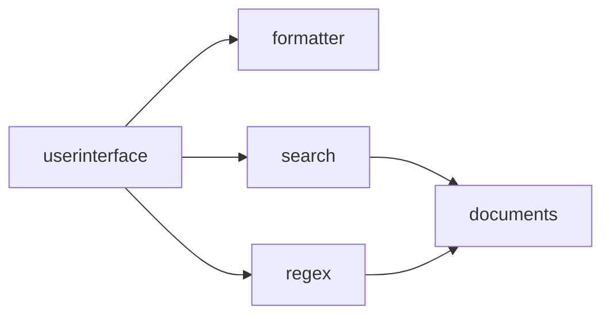
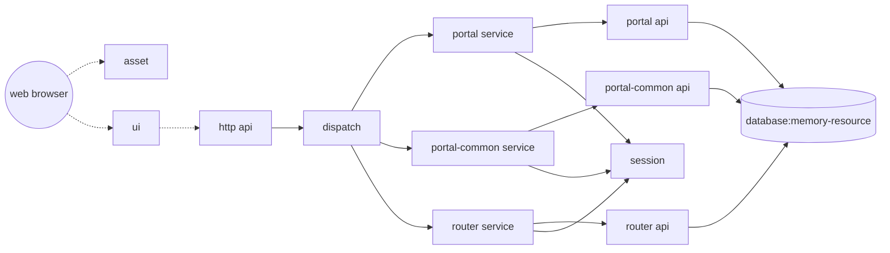
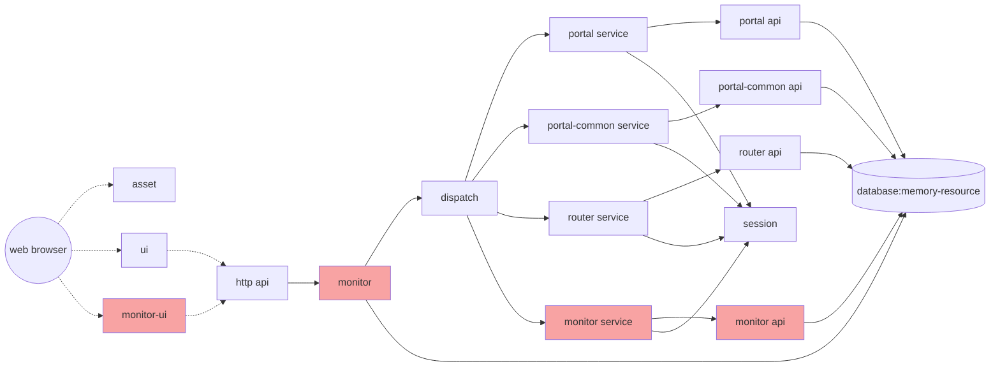
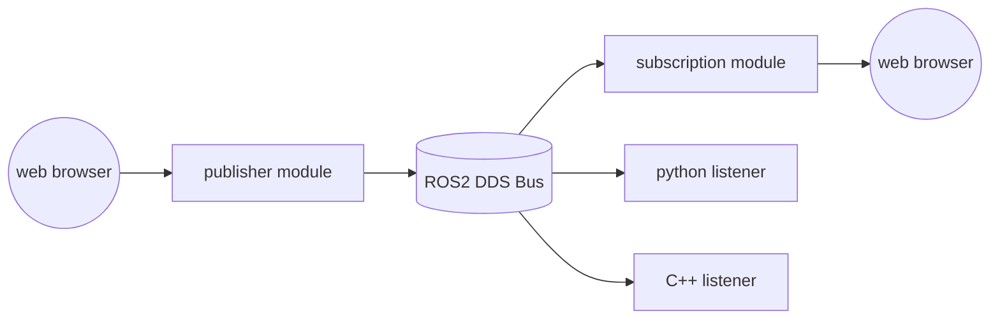
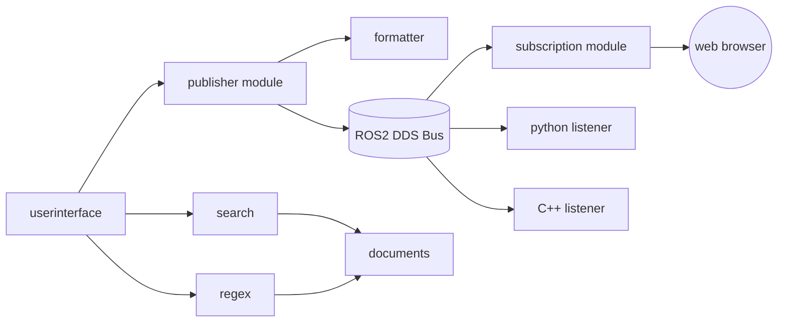
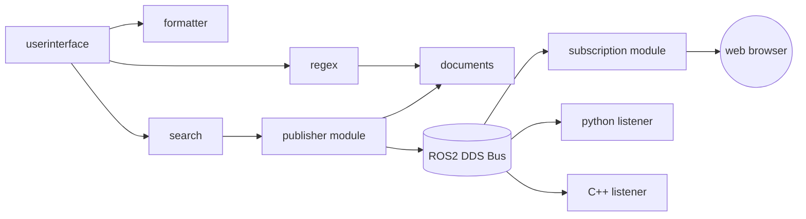
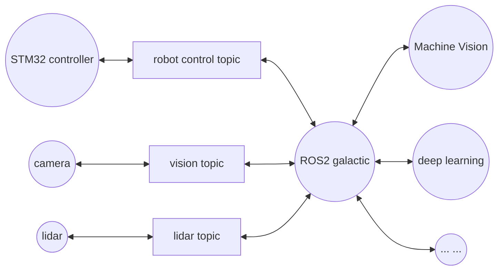

本手册用于ICSE 2025的原型平台和演示系统说明，版权遵守 Attribution 4.0 International许可协议。

EIGHT有在线版本的网站，可以在线部署、更新和管理EIGHT节点，使用和操作更为方便。但由于匿名评审的要求，现在仅提供本地目录的操作演示。这需要解压runtime.zip下的文件，其中eight-seat-1.0.0.jar为EIGHT平台的底座，包括EIGHT运行时、基础库和一些常用的第三方库。work目录下则是一些已经配置好的系统。work目录下还有两个目录，分别为reg和reg-config，其作用将在后面介绍。

EIGHT兼容JRE 1.6以上的所有JAVA版本，可以使用run.bat内的命令启动，不同环境下配置参数略有不同。必不可少的参数仅仅只有以下这些：

| 参数 | 含义 | 例子 | 补充说明 | 
| -- | -- | -- | -- |
| file.encoding | 各种应用内文本的默认编码方式 | file.encoding=UTF8 | 在windows环境下需要。windows默认的code page并不是utf-8，会导致java读入文件时出现乱码，且此参数只能在初始启动时设置。 |
| framework.boot.init.config | 设置初始化加载模块 | | EIGHT底座支持本地文件目录、远程web、redis等多种系统模块加载机制，默认的EIGHT底座使用web http方式连接远程服务器，修改此项配置可以切换加载模块。 |

通常说来，通过以上配置，就已经可以启动一个节点了。此时的node名称为该节点默认网卡的ip地址。如果需要手工定义该节点名称，则需要提供额外的参数：

| 参数 | 含义 | 例子 | 补充说明 | 
| -- | -- | -- | -- |
| framework.boot.scanner.node | 设置节点名称 | framework.boot.scanner.node=winnt4 | 可以在一台主机上启动多个EIGHT节点，相同名称的节点会共享相同配置。建议为节点设置独立的有特点的名称 |

对于使用`java 1.6`{:.info}运行环境的节点，有以下约束：

| 参数 | 含义 | 例子 | 补充说明 | 
| -- | -- | -- | -- |
| framework.center.useThread | 关闭多线程组件加载模式 | framework.center.useThread=false | 此问题来源是spring在java 1.6环境中运行时存在bug，当多线程同步启动多个spring applicaion环境时，先启动完毕的applicaiton可能会强行结束尚未启动完毕的application，导致初始化失败。关闭多线程加载可以回避该问题，但可能会稍微减缓系统加载与批量更新过程 |

对于使用`java 17`{:.info}及以上运行环境的节点，由于java 17已经默认关闭了第三方库通过反射（reflection）机制访问基础库的非公开方法和成员变量，所以必须增加额外的参数：

| 参数 | 含义 | 例子 | 补充说明 | 
| -- | -- | -- | -- |
| --add-opens java.base/java.lang=ALL-UNNAMED | 开放java.lang的成员保护 | --add-opens java.base/java.lang=ALL-UNNAMED | 此问题来源是spring。spring 4.x中的已知bug（spring 5.x已解决，但spring 5.x不兼容java 8以下的环境，所以未被eight所采用），源头是spring使用的cglib通过反射直接访问java.lang中私有函数，目前仍没有解决，所以必须开放此包的成员保护模式 |
| --add-opens java.base/java.io=ALL-UNNAMED | 开放java.io的成员保护 | --add-opens java.base/java.io=ALL-UNNAMED | 非必要选项，开启该选项后，eight会对内存使用有所优化 |

使用java 17的一个例子：

~~~ shell
java --add-opens java.base/java.lang=ALL-UNNAMED --add-opens java.base/java.io=ALL-UNNAMED -Dfile.encoding=UTF8 -Dframework.boot.task.scanner.span=10+sec -Dframework.boot.scanner.wait=3000 -Dframework.boot.init.config=linker-boot_file_store.config@H4sIAAAAAAAAAG2MsQ6DMAwF90r9CU9Uqtgz5Ce6lgqF8EBWS9zage8nEYwdT7q7ASF5siwaZjxgsmoEXS8G3TiiHWFR-ZtZijaI5H7iD_oaVC2FBUdeSfFbWWFtcTLU_JPOD92p-bPsfL3d6FXakN6enHPlswM2j6g3lQAAAA@@file-file.config@H4sIAAAAAAAAAMvIz8_OTLFVSsvMSVXi5SpOLSrLTE7VK0rMy87MS7dVMjQwAAoXpRaWZhalFusBlZWkFhXbRivlZOZlpxYp6ShpwPSkpBYnF2UWlGTm58XYgsyL19JUikWYiSQPtQ8AcoCLpH0AAAA -jar eight-seat-1.0.0.jar 
~~~

如果出现提示`Invalid CEN header`{:.error}的异常，这是由于基础库默认进行了Zip64的额外信息校验造成的，启动参数里关闭即可

| 参数 | 含义 | 例子 | 补充说明 | 
| -- | -- | -- | -- |
| jdk.util.zip.disableZip64ExtraFieldValidation | 关闭默认Zip64校验 | jdk.util.zip.disableZip64ExtraFieldValidation=true | openjdk11以上在64bit环境下默认启动ExtraFieldValidation，对于基于老版本的jar包可能会校验异常 |

以上就是启动节点的配置。当节点启动完毕后，我们将在前面提到的reg目录下看到一个文件，其文件名为前面设置的节点名称（如果没有设置，就是本机的默认ip地址），内容为当前节点的一些信息。如图（是一个运行于windows NT 4.0的EIGHT节点）：

在另一个名为reg-config的目录下，创建一个同名的文件，其内容写上work目录下任一其它的目录（每个目录代表一个配置好的系统），则对应的系统将被加载到`所有`{:.error}名称为该文件名的节点中。如图（配置了search系统）：

通过修改reg-config中的配置，可以让节点在不同系统间切换。

演示示例提供了若干个系统,以下分别进行介绍：

# search

这个例子就是论文中提及的关键字查询系统。当系统加载后，打开http://127.0.0.1:7241/user/index.html进行操作，输入关键字可以查询。如图：

{: width="500" }

SEARCH系统的组件结构如下：

组件间的调用逻辑是：
- userinterface组件是界面UI，也即上图我们看到的操作界面
- userinterface根据配置，选择使用search或是regex来进行字符串检索，两种算法匹配模式不同
- search和regex则共同连接documents模块，此模块负责提供前者需要的文本
- search和regex将检索的结果返回给userinterface
- userinterface将使用formatter对结果格式转化后，提供给用户

让我们在work目录里看看search系统，可以见到组件的一一对应:

{: width="300" }

同样可以看一看配置(.config文件)，这里的配置一部分是实例（组件的运行时），一部分则是linker（实例间的联系）。

### 更改查询目录

我们点击documents-documents的配置`参数`{:.info}可以看到，默认的`test.documents.base`{:.info}参数配置为`scores`{:.info}。这其实是documents组件开放出来的配置项，指定的是一个文件目录。
当配置为scores,也就指定了`运行目录`{:.info}下的scores目录。我们将文本文件放置在该目录下，这些文件就会被检索和统计。我们可以更改这个配置（如改成docs目录），则配置被加载后，再次查询，会统计docs目录下的所有文件内的关键字。
当然，也可以创建其它目录或放置其它文本文件进行测试。

### 更改输出格式

创建目录放置好文件，我们可以尝试一个关键词，例如：

{: width="300" }

以json格式输出了5这个结果。刚才我们说过，该应用中负责格式的是formatter这个组件，让我们修改一下这个组件对应实例的配置：

该实例有一个配置项framework.formatter.mode默认是true，将其修改为false看看效果。

{: width="300" }

同样的结果，输出格式变成了xml。

### 更改算法模块

除了修改实例的配置参数来改变系统行为，我们也能够在运行时修改连接，例如把它从search指向regex。

然后等待一个系统更新的间隔。

{: width="300" }

此时可见用户界面有所变化，查询结果也不一样。这是系统结构发生变化导致的，系统会用正则算法模块进行查询。

### 实例脚本

最后，演示系统还开放了一部分的脚本接口。脚本可以附着于实例与连接之上。每个触发点均可以绑定事件处理模块，这些模块可以是编译好的class或jar包，也可以是脚本（目前支持groovy）。

我们可以为任意实例（instance）编写一个脚本，如：

~~~ java
package eight.service;
import net.yeeyaa.eight.ITriProcessor;
import net.yeeyaa.eight.IProcessor;

class Proxy implements ITriProcessor {
    IProcessor context
	
	def operate(Object first, Object second, Object third) { 
		println "instance[" + context.process("hookid") + "] input: " + first + " " + second + " " + third;
		def ret = ((ITriProcessor)context.process("next")).operate(first, second, third)
		println "instance[" + context.process("hookid") + "] output: " + ret
		ret
	}
}
~~~

这个脚本很简单，就是在服务调用发生前后，将输入参数和输出结果打印出来，类似于aop切入的功能。所以，在需要的时候，我们可以给相应的模块均配置该脚本，以查看当前某些组件的输入输出。

下图中，我们在应用管理的配置界面里，给documents和formatter配置了脚本，来查看每一次调用时，这两个部分的输入输出情况。当然其它实例也是可以配置的。在使用本地配置文件配置时为了兼容各种文件格式，参数是压缩后的base64编码，而使用线上系统可以直接编写脚本。为了避免手工操作错误，可以直接去掉proxy参数前的注释。

配置完成后看不到任何变化，但是一旦请求发生，我们可以在底座的控制台或log（如果将输出重定向到log文件中）看到输入输出被打印出来。

从输出中，我们不仅可以看见documents和formatter这两部分分别接受了什么参数和提供了什么输出结果，也能直观理解系统各个部分的调用顺序。

### 连接脚本

连接（linker）的脚本就是Architecture B中那个运行在connection上的任意函数。如果要substance保持自身稳定的`内核`{:.info}，则connection需要在运行时建立。然而不同事物与事物之间connection是多变的，应当要`抹平`{:.error}事物间互不相容的棱角，它们才能协调运作。

常见的例子可以参考论文中的示例，在此不再赘述。

# 切换一个系统

切换系统就是修改reg-config下对应的配置内容。如改成router_management，稍等片刻，你会发现原来search的用户界面已经无法访问，则原来的search系统会被卸载，而router_management系统会被加载。

router_management系统的界面在[http://localhost:7241/ui/index](http://localhost:7241/ui/index),是一个标准的MVC应用。

{: width="500" }

点击`Enter The System`{:.success}，就可以进入到router_management系统中。这是一个后端管理平台，具体功能不多介绍了（这不是重点）：

{: width="80%" }

做些增删查改吧，如果觉得麻烦，可以下载这个[配置文件](/eight/assets/images/router.config)，然后在服务管理中导入。

{: width="80%" }

然后试着做做各项操作。

### Router管理系统的模块结构

同样的，Router管理系统由各种组件构成，其大体的结构如下：

- 用户浏览器访问前端，也即上图我们看到的操作界面
- 前端两个组件，其中asset组件是通用共享资源，包含大量前端常用静态资源（如js,css，图片等），与其它组件并无关联
- ui组件则是业务系统的ui界面，包含controller和view，以及本模块会用到的静态资源
- ui组件并不直接连接其它组件，而是通过http(s)调用，访问http api组件，该组件会开放一个http端口，向外提供api接口，以实现前后端分离
- http api组件下游是dispatch组件，它根据请求路由到不同的服务模块
- service组件是通用服务模块，它生成三个实例：portal service、common service和router service，分别对应portal、common和router三个业务组件
- router业务组件实现的就是路由管理中心这套业务，包含前述服务管理、路由管理、服务器管理和脚本管理等功能，而portal和common则是进行用户、菜单和功能权限管理的业务（不提供操作界面）
- 各个service组件需要连接session组件来存取会话信息
- portal、common和router需要对接memory-resource，memory-resource包含一些内存的存储结构，甚至还有一套内存数据库，用来提供一套完整的mvc业务系统
- 为了优化用户体验，本系统不需要用户配置数据库，而是自行提供了一套内存数据库，并且没有开启数据库的持续化存储功能。所以用户关闭jvm虚拟机再重启后，`之前数据将丢失`{:.error}，用户可以使用服务管理的`导出`{:.success}菜单进行备份。

同样可以到对应文件夹查看系统的组件和配置。本案例中，service这个组件可以更好的帮助我们理解组件与实例的关系：service这个通用组件，在本系统中创建了3个实例，分别是portal service、common service和router service，参数各不相同。这三个实例才是真正的运行单位。

比较恰当的比喻：组件对标于class而实例对标于object，object是参数实例化后的运行着的class，是动态概念，而class则是object的静态结构。

### 给dispatch附加脚本
router_management的组件比之search要多不少，相应的可以配置的模块也更多。根据前面的系统结构图可知，dispatch作为路由分发组件，所有的api请求输入与输出都将从这里经过。
如果我们将上一节的实例脚本那段proxy参数附加到该组件，绑定脚本后，我们很容易看到整个系统的各种调用流程以及输入输出的数据。

### 关闭sql输出
几个数据库访问组件都会打印每次数据库访问时的sql，这对于调试应用很方便，但同时也很冗长。当我们不再需要此类输出时，我们应该关闭它。同样，这些操作通过实例的配置项来完成。

对于portal、common和router-api这几个模块，将配置参数里的framework.router.api.sessionFactory.hibernate.showsql设置为false，则关闭sql输出，设置为true，则打开sql输出以供调试。

我们还可以看见，除此之外还有framework.router.api.dataSource.driver、framework.router.api.server和framework.router.api.dataSource.url等几个参数，这些参数是hibernate的数据库配置参数。我们修改这些参数，可以连接到不同的数据库。

其实还有很多参数并没有默认设置（如数据库用户名密码，由于h2不需要就没有设置，再如连接池大小、连接超时、二级缓存等等），这些配置项由各个组件按需要暴露出来，以供运行时灵活配置。

我们将各个实例的参数设置为false，再进行操作时，可以看见已经没有sql输出了。

### 其它配置
通过配置管理页面，我们可以看到各个实例里可以配置的项目很多，如http实例可以配置后端api接口的port（端口号）。注意：`如果修改端口号，则需要修改ui的url（服务路径与之对应）`{:.error}。

事实上http模块是一个通用的轻量级http服务，它至少还有以下常用参数：

| 参数 | 含义 | 例子 | 补充说明 | 
| -- | -- | -- | -- |
| framework.http.init.context | 服务占用的uri | /api | 默认是/api |
| framework.http.wss.url | 提供webservice服务接口的uri |  | 默认是/wsapi |
| framework.http.byte2str.charset | 输入输出字符集 | utf-8 |  |
| framework.http.httpServer.secure | 是否启用https | true | 默认是false |

对于前端组件ui，其参数framework.ui.server.url是指向http模块的，如果http模块修改了端口号或使用https协议，则此处应相应修改。

而framework.ui.alias则是用户界面的uri。例如将其修改为/test，则使用/ui无法访问该应用，需要使用[http://localhost:7241/test/index](http://localhost:7241/test/index)来访问、

其余的参数不建议用户修改。

而session模块则可以配置后端服务的会话超时（不是前端会话超时，前端使用jwt，默认1小时，使用framework.ui.expire配置）：

默认300秒（也就是5分钟），可以修改成其他时长。

### 增加功能模块
通常可以通过向应用中增加新的组件、实例和连接来增添新的模块。为了防止不可预知的问题损坏客户系统，演示系统不建议手动修改模块，建议直接切换到router_management_with_monitor_module系统中。该系统比router_management多了几个模块，切换后只有新增的模块会被加载，可以对比这两个目录来看看新增的模块有哪些。

启用完毕后，会发现应用菜单发生了变化，新的功能模块被加载到现有的平台中。此时，系统结构已经发生了变化，如下：

图中红色部分是新增的monitor的一组实例（monitor、monitor-ui、monitor-service、monitor-api）被加载到系统中。这组实例为系统带来了新的功能——监控模块。

- 最核心的组件是monitor，它在系统中选取了一个最为合适的切入点：嵌入到http与dispatch之间，所有的系统调用均经过此处。它同时也连接database。它的功能是记录并缓存方法调用的状况，并将其批量写入数据库。
- monitor-ui为监控管理前端，也即新出现在用户操作界面上的功能模块。
- monitor-service、monitor-api与router类似，也就是monitor模块进行增删查改的后台api。

系统升级完毕后，我们可以随便进行些操作，这些调用的次数、发生时间和持续时长会被记录下来。然后，我们可通过monitor界面查看其情况：

{: width="500" }

当我们不需要该模块时，删除对应的模块即可。

### 其它
- 一旦系统被加载，其就成为一个`本地应用`{:.success}，所有业务在本地进行，而即便`断开网络、关闭jvm，或者关闭电脑硬件重启`{:.error}，其系统仍保持在`最后一次更新状态`{:.error}。
- 以上仅展示少量控制功能，以突出EIGHT的基本特征。EIGHT平台本身具备的能力更为丰富和灵活。
- EIGHT的架构特征大量复用代码和模块，所以应用相较同类系统很小。例如router_management，作为一套完整的后台管理系统，其整体体积在1.1M左右，除去通用静态资源（asset），业务相关的组件仅不到400K，包括前端页面、controller、业务逻辑、数据库访问层等。这有利于在弱网络环境下的部署与管理。

# 将EIGHT应用于ROS

ROS2应该是当前最为热门的嵌入式智能设备操作系统之一，实际上是一套开源的软件框架和工具集。它被广泛应用于机器人、无人机、智能汽车等应用领域，为诸多边缘设备提供信息感知和数据处理能力。

EIGHT需要在ROS2环境中编译rcljava。为方便读者评测，已经做好几个版本的vbox虚拟机镜像，直接可以下载使用。在[aliyun](https://www.aliyundrive.com/s/ZmEdH8Zj3B4)上，提取码为 bvq0 。有ros_g_20.04，推荐读者下载该镜像。`虚拟机用户名密码均为ubuntu。`{:.success}

镜像为7z压缩文件，下载解压后直接安装为vbox硬盘即可。vbox最低设置1c1g，推荐2c2g即可运行所有的测试项目。`推荐拷贝两份以上的硬盘镜像部署多台虚拟机，在将这些虚拟机都部署在同一个hostOnly或内部子网中使其相互能够网络互访。`{:.success}

EIGHT部署于ROS2上时是非常简单的，跟其它部署模式没什么区别，仅仅就是基于java环境运行一个jar包。具体层次架构如图：

{:.rounded width="200px" style="display:block; margin-left:auto; margin-right:auto"}

接下来我们看看在EIGHT（rcljava）环境中开发一个模块会是怎样的一个过程。

~~~ java
package ros.test;

import javax.annotation.PostConstruct;
import javax.annotation.PreDestroy;

import org.ros2.rcljava.RCLJava;
import org.ros2.rcljava.node.BaseComposableNode;
import org.ros2.rcljava.publisher.Publisher;

public class Pub {
	private volatile Node node;
	private volatile boolean stop = false;

	private class Node extends BaseComposableNode {
		private int count;

		private Publisher<std_msgs.msg.String> publisher;

		public Node() {
			super("minimal_publisher");
			count = 0;
			// Publishers are type safe, make sure to pass the message type
			publisher = node.<std_msgs.msg.String> createPublisher(
					std_msgs.msg.String.class, "chatter");
		}

		public void onTimer() {
			std_msgs.msg.String message = new std_msgs.msg.String();
			message.setData("Hello, ros on eight! " + count);
			count++;
			// System.out.println("Publishing: [" + message.getData() + "]");
			publisher.publish(message);
		}

	}

	@PostConstruct
	public void initialize() {
		new Thread(new Runnable() {
			@Override
			public void run() {
				if (!RCLJava.isInitialized())
					RCLJava.rclJavaInit();
				node = new Node();
				while (RCLJava.ok()) if (stop) {
					if (node != null) {
						node.publisher.dispose();
						node.getNode().dispose();
						node = null;
					}
					break;
				} else try {
						node.onTimer();
						RCLJava.spinSome(node);
						Thread.sleep(500);
					} catch (Exception e) {
					}
			}
		}).start();
	}

	@PreDestroy
	public synchronized void destroy() {
		stop = true;
	}

	public static void main(String[] args) throws InterruptedException {
		new Sub().initialize();
	}
}
~~~
以上就是一个rcljava的Node的标准示例，这个类可以通过main方法独立运行，也可以部署到EIGHT中运行。

它引入了一堆rcljava提供的api库，其中RCLJava是个工具类，提供了诸多ROS2环境下的操作接口。BaseComposableNode则是一个节点的抽象封装，Publisher则是一个面向消息的发布者。

代码首先在initialize方法里用RCLJava初始化了参数和环境，然后创建并启动一个继承了BaseComposableNode的Node类，然后启动一个线程以持续的间隔向消息总线发送消息，直到该实例被销毁，stop成员变量设置为0。

Node类在构造函数里做了两件事情：

- 定义了一个名为minimal_publisher的节点

- 创建了一个publisher，向名为chatter的topic发送消息。

然后，在onTimer中，每次都会向chatter发送一条消息，同时将计数器加一。

要使用该模块，需要在支持ros2的环境中启动rcljava环境。如果使用上面提供的虚拟机，在桌面有一个ros2_java_ws文件夹，在该文件夹中打开终端控制台，然后运行：

~~~ shell
. install/local_setup.sh
~~~

这个脚本初始化了java环境变量，引入了本地的rcljava的库到classpath中。然后直接输入底座的启动参数(run.bat)，可以选择ros2_pub或ros2_sub环境，如果没有在rcljava环境下运行，则可能会报ClassNotFoundException。

其中ros-pub是一个消息的发布者，而ros-sub则是一个订阅者。可以分别在不同的ros2虚拟机（或同网段的物理设备）上部署这两套应用。应用部署后我们可以看到，当ros-pub启动完毕后，ros-sub在控制台定时输出消息。

同时，因为这个chatter是ROS2的示例使用的topic，我们同样可在任一同网的虚拟机中启动c++或python的listener。

~~~ shell
ros2 run demo_nodes_cpp listener
ros2 run demo_nodes_py listener
~~~

可以看到各个listener都听见了EIGHT发出的消息。可见消息与之前使用c++或python的一样，跨越了各个节点在不同的开发语言环境中传播。

这里再说一下sub的编码。也只需要寥寥几行代码。

~~~ java
package ros.test;

import javax.annotation.PostConstruct;
import javax.annotation.PreDestroy;

import org.ros2.rcljava.RCLJava;
import org.ros2.rcljava.consumers.Consumer;
import org.ros2.rcljava.node.BaseComposableNode;
import org.ros2.rcljava.subscription.Subscription;

public class Sub {
	private volatile Node node;
	private volatile boolean stop = false;

	private class Node extends BaseComposableNode {
		private Subscription<std_msgs.msg.String> subscription;

		public Node() {
		    super("minimal_subscriber");
		    subscription = node.<std_msgs.msg.String>createSubscription(std_msgs.msg.String.class, "chatter",
		        new Consumer<std_msgs.msg.String>() {
					@Override
					public void accept(std_msgs.msg.String msg) {
						System.out.println("I heard: [" + msg.getData() + "]");
					}
				});
		}
	}

	@PostConstruct
	public void initialize() {
		new Thread(new Runnable() {
			@Override
			public void run() {
				if (!RCLJava.isInitialized())
					RCLJava.rclJavaInit();
				node = new Node();
				while (RCLJava.ok()) if (stop) {
					if (node != null) {
						node.subscription.dispose();
						node.getNode().dispose();
						node = null;
					}
					break;
				} else try {
						RCLJava.spinSome(node);
						Thread.sleep(500);
					} catch (Exception e) {
					}
			}
		}).start();
	}

	@PreDestroy
	public synchronized void destroy() {
		stop = true;
	}

	public static void main(String[] args) throws InterruptedException {
		new Sub().initialize();
	}
}
~~~

initialize是在循环接受消息。Node只需要在构造函数里初始化节点名称，然后实例化一个Subscription，这个订阅者accept消息后在控制台输出。

然后，我们可以像以往任何一套EIGHT应用一样，进行动态更新。比如运行时更新消息格式。

### 集成ROS2组件到EIGHT系统之中

接下来，我们看看一个建立在EIGHT上的稍微复杂的ROS2应用：将消息的收发在网页上输出。对于消息处理，web上最为直接的方案就是web-socket。这里，我们同样预制了收发两个模块，分别是ros-pub-ui和ros-sub-ui，对应修改reg-config为ros2_pub和ros2_sub。我们同样将其分别部署到两台虚拟机上。

然后分别打开ip1:7241/sub/ros.html和ip2:7241/pub/ros.html。

可以看到需要一个登录名称，这个没有意义，仅仅是web-socket上stomp协议的要求罢了。随便填写一个名称后登录。

然后在publisher的message输入框中输入各种消息，则在subscription中可以看到对应输出，同样也能在c++和python的listener里看见输出。

整体流程如下，很简单不再赘述。

然后，我们看看如何把一个ros2的模块动态嵌入到EIGHT的组件化系统之中。还记得那个查询关键字的小例子吗？它的系统结构如下：

如果我们在userinterface与formatter组件的衔接点切开，嵌入一个ROS2的publisher模块进去，就可以把这个系统中所有用户查询的结果发布到ROS2的某个topic里去。如下：

这个示例也已经预制，在ros-pub-ui-with-search应用中，可以比较它与search的区别。将其绑定到某个EIGHT节点上，然后打开对应的url：http://ip:7241/user/index.html 。又出现熟悉的界面。

{: width="400" }

功能与原先的SEARCH系统一模一样，只不过每次进行查询后，匹配的关键字数量会传播到各个系统中，如图：

同样我们也能把ROS的信息发布模块嵌入到search或regex到documents的通道中间，这样每次查询到的文本内容就会被发布到ROS2的DDS网络topic中。如图：

我们没有修改任何search和ros publisher的代码，仅仅通过配置就将两套系统串联到一起，并且仅仅进行简单的部署，这些系统就动态更新到节点上实现了新的功能，`系统的每一个部分间的数据都能与ROS消息总线互通`{:.error}。这就是在ros平台上部署EIGHT的意义所在。

### 在边缘设备上部署EIGHT

考虑到读者可能没有相应的设备和测试条件，后面仅作简单的介绍。主要设备如下：

该款小车采用麦轮底盘，配备的STM32控制器上也部署了ros系统，具体说来是ros2的microros分支。该车核心控制板cpu为4核心2g内存，承担上位机功能。该机有ros和ros2等多个镜像可用。这次我们选择了基于galactic的镜像，基于ubuntu的20.04.5。该车还配置有一款雷达和深度相机，可以部署视觉识别，巡线，障碍物识别等功能。也有wifi网络可以联网控制。除此之外，设备还提供一个hdmi输出。连接显示器后，我们可以看见标准的ubuntu界面。

ros整体上就是一种面向消息处理的操作系统。在本机中，大体结构如下。

可见ros起到的作用是中枢神经系统，将各种知觉设备连接起来，然后交给大脑的各种算法模块（如深度学习、机器视觉等）处理，中间的数据交互都是以消息方式提供的，通过topic的订阅和发布进行传播。

小车提供的镜像已经部署了ros2的galactic版本（部分模块需要根据硬件配置做些参数调整后重新编译，此处不表），接下来只需要安装rcljava即可，具体过程参考[https://github.com/ros2-java/ros2_java](https://github.com/ros2-java/ros2_java)，不再详述。

我们先观察一下小车ROS2环境提供了些什么topic。使用ros提供的命令：

~~~ shell
ros2 topic list
/parameter_events
/rosout
~~~

初始只有parameter_events和rosout两个topic。接下来我们打开底盘通讯。出现了

~~~ shell
/PowerVoltage
/cmd_vel
/diagnostics
/joint_states
/mobile_base/sensors/imu_data
/none
/odom
/odom_combined
/robot_description
/robotpose
/robotvel
/set_pose
/tf
/tf_static
~~~

等一系列topic，涉及电压、底盘控制、诊断、传感器、位置积算等诸多方面。再打开摄像头，出现了

~~~ shell
/camera/color/camera_info
/camera/color/image_raw
/camera/color/image_raw/compressed
/camera/color/image_raw/compressedDepth
/camera/depth/camera_info
/camera/depth/color/points
/camera/depth/image_raw
/camera/depth/image_raw/compressed
/camera/depth/image_raw/compressedDepth
/camera/depth/points
/camera/extrinsic/depth_to_color
~~~

我们已经对这些消息队列开发了控制程序，细节不再赘述。

{:.rounded width="360px" style="display:block; margin-left:auto; margin-right:auto"}

与前一章一样，我们在小车的桌面上建立一个ros2_java_ws文件夹，在该文件夹中打开终端控制台，然后运行

~~~ shell
. install/local_setup.sh
~~~

就载入了java的ros环境变量，然后同样运行EIGHT底座，选择ros2_controller系统，然后打开`http://小车ip:7241/sub/ros.html`{:.info}。我们将看见以下界面：

尝试控制一下小车。连接上websocket后，小车的摄像头就传来了小车的视角，操纵小车移动，视角就跟随变化。

{:.rounded width="640px" style="display:block; margin-left:auto; margin-right:auto"}

看起来不错，一切符合预期。

### 在openstick上部署EIGHT

此款设备如下：

{:.rounded width="720px" style="display:block; margin-left:auto; margin-right:auto"}

该款设备基于Snapdragon 410(MSM8916)，Cortex-A53架构，四核1.2g，是高通第一款64位arm处理器，上市于2013年底。配置不高，搭载了512m内存和4g的rom，勉强算够用。openstick是基于debian 11（bullseye）的，刷机后剩余2.5g左右空间，自带了openjdk 1.8。该设备几乎没有扩展接口，仅能作为wifi热点使用。

考虑到`ROS实质上是个网络总线的域控制器`{:.error}，只要有网络，就能将同一子网内的所有ROS外设们驱动起来。同时该设备自带wifi子网和4g网络，所以可以将该设备作为远程控制ros设备的中枢节点。

我们已经编译了该款设备的ROS2 humble+rcljava镜像，有该款设备的可以下载使用，刷机过程不再赘述（[阿里云盘](https://www.alipan.com/s/CNNV8nrJzsa)，提取码为 unr9）。刷机后可以将EIGHT环境和示例解压到该设备上。

这时候已经可以打开机器人小车了，让它加入该设备的热点中，然后，同样开启底盘和摄像头，就可以ros2 topic list看看当前子网内的可用消息队列。
~~~ shell
root@openstick:~# ros2 topic list
/PowerVoltage
/camera/color/camera_info
/camera/color/image_raw
/camera/color/image_raw/compressed
/camera/color/image_raw/compressedDepth
/camera/depth/camera_info
/camera/depth/color/points
/camera/depth/image_raw
/camera/depth/image_raw/compressed
/camera/depth/image_raw/compressedDepth
/camera/depth/points
/camera/extrinsic/depth_to_color
/cmd_vel
/diagnostics
/joint_states
/mobile_base/sensors/imu_data
/none
/odom
/parameter_events
/robot_description
/robotpose
/robotvel
/rosout
/set_pose
/tf
/tf_static
~~~

如果没有出现以上的topic，也许是因为你没有设置合适的ROS_DOMAIN_ID，需要在.bashrc里设置与小车一致。

然后再source /root/ros2_java/install/local_setup.bash，之后就可以启动EIGHT了。同样选择ros2_controller系统，然后打开`http://小车ip:7241/sub/ros.html`{:.info}。

{:.rounded width="720px" style="display:block; margin-left:auto; margin-right:auto"}

最后，再看看EIGHT的资源用量，完全跑起所有的服务也只用了200多M内存，Snapdragon 410 cpu性能还是可以的，EIGHT运行的很顺畅。至于单核占用率太高则是前面代码使用了轮询造成的。
{:.rounded width="720px" style="display:block; margin-left:auto; margin-right:auto"}

棒子的这个场景还是颇具意义的。

{:.rounded width="1280px" style="display:block; margin-left:auto; margin-right:auto"}

如图，它其实提供了一种广域的系统部署和机器人设备操纵模式。

- wifi棒子在部署了ROS2后，等同于神经中枢，能够控制同一子网（往往就是其热点）内的各种ROS设备

- 子网内其它设备无须具备强大的计算能力，只须成本低廉的单片机，能够联网和部署microros，即可将控制权移交给神经中枢。既可以降低成本，也便于中枢统一协调运行

- 在部署EIGHT后，棒子可以通过自带的4g（或其它联网方式），在移动网络覆盖的范围内联系到互联网上的中央控制系统。由是，中央控制系统（大脑）便掌控了分布于各地的中枢神经的最高控制权，也就可以控制各个末梢神经（边缘节点）的运行（但并不必须现场指挥）

- 由于EIGHT是动态部署系统，而且体积极小（模块往往在数十至数百KB范围内），一旦部署脱网仍可运行。所以很适合网络带宽差，网络条件不稳定的场景（如移动网络）

- 将系统动态下发，而不是采取系统运行在云端，同时进行数据上交的好处是在保证业务逻辑随时根据现场状况而变的前提下，大大降低带宽需求，避免网络造成系统失能的影响。这对基于不稳定网络环境的应用场景是必须的

- 系统下发后在部署点上本地运行，既减少带宽占用，又构造了更为安全稳定的指挥体系，提高了现场反应速度，也避免了干扰

- 指挥中枢（棒子）一般具备一定的性能（cpu，gpu，ram等），可以运行一些复杂的算法（如基于opencv的机器视觉、模式识别等），这样可以充分利用部署点的计算能力来现场指挥

- 只有特定的，需要采集上交的数据才过滤处理后提交，减轻了服务端压力和网络开销

也就是，我们能够通过一根棒子，在世界任何一个地方，在数公顷范围内，花几秒钟就能搭建起一套远程控制体系，既能自动运作，又能远程管控，还能随时变化。
